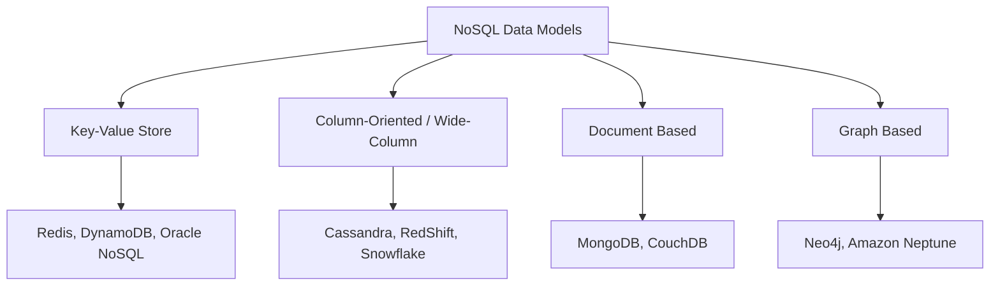
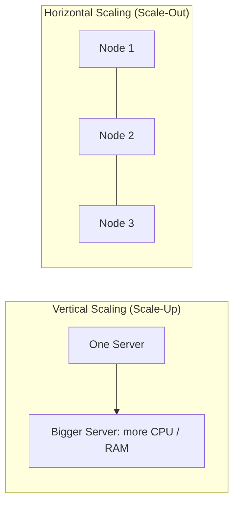

# 12 — NoSQL (LEC-15)

## What is NoSQL?

**NoSQL** databases (aka "not only SQL") are non-tabular databases that store data differently than relational tables. They come in a variety of types based on their data model — the main types are **document**, **key-value**, **wide-column**, and **graph**. They provide flexible schemas and scale easily with large amounts of data and high user loads.

Key characteristics:

- **Schema free** — no schema needs to be defined in advance.
- **Non-tabular structures** — data structures are more flexible and can adjust dynamically.
- **Big data** — can handle huge amounts of data.
- **Open source and horizontally scalable** — most NoSQL databases are open source and capable of horizontal scaling.
- **Non-relational storage** — it simply stores data in some format other than relational.

## History Behind NoSQL

NoSQL databases emerged in the late 2000s as the cost of storage dramatically decreased. Gone were the days of needing to create a complex, difficult-to-manage data model just to avoid data duplication. Developers (rather than storage) were becoming the primary cost of software development, so NoSQL databases optimized for developer productivity.

The main drivers were:

- **Unstructured data** — as data became more unstructured, defining a schema in advance became costly. NoSQL let developers store huge amounts of unstructured data with a lot of flexibility.
- **Rapid iteration** — teams needed to adapt quickly to changing requirements and iterate all the way down to the database. NoSQL gave them this flexibility.
- **Cloud computing** — developers began hosting applications and data on public clouds. They wanted to distribute data across multiple servers and regions to make applications resilient, to scale out instead of up, and to intelligently geo-place data. Databases like MongoDB provide these capabilities.

## Types of NoSQL Data Models

The four main NoSQL data models and representative databases.

### Key-Value Stores

The simplest type of NoSQL database. Every data element is stored as a **key-value pair** consisting of an attribute name (the "key") and a value. In a sense, it is like a relational database with only two columns: the key (such as `state`) and the value (such as `Alaska`).

A key-value database associates a value — anything from a number or simple string to a complex object — with a key used to track the object. In its simplest form it is like a dictionary/array/map that exists in most programming paradigms, but stored persistently and managed by a DBMS. These stores use compact, efficient index structures to locate a value by its key quickly and reliably, making them ideal for systems that need to find and retrieve data in constant time.

Optimal use cases:

- **Real-time random access** — e.g. user session attributes in online gaming or finance applications.
- **Caching** — frequently accessed data or configuration retrieved by key.
- **Simple key-based queries** — applications designed around lookups by key.
- **Common use cases** — shopping carts, user preferences, and user profiles.

Examples: Oracle NoSQL, Amazon DynamoDB, Redis (MongoDB also supports key-value storage).

### Column-Oriented / Wide-Column Stores

Data is stored such that each row of a column sits next to other rows from that same column. While a relational database stores data in rows and reads row by row, a **column store** is organized as a set of columns.

This means that when you want to run analytics on a small number of columns, you can read those columns directly without consuming memory on unwanted data. Columns are often of the same type and benefit from more efficient compression, making reads even faster. Columnar databases can quickly aggregate the value of a given column (for example, adding up total sales for the year). The primary use case is **analytics**.

Examples: Cassandra, RedShift, Snowflake.

### Document Based Stores

These store data in documents similar to **JSON** (JavaScript Object Notation) objects. Each document contains pairs of fields and values, where values can be a variety of types — strings, numbers, booleans, arrays, or objects.

Document stores support **ACID** properties, making them suitable for transactions. Use cases include e-commerce platforms, trading platforms, and mobile app development across industries.

Examples: MongoDB, CouchDB.

### Graph Based Stores

A graph database focuses on the **relationships** between data elements. Each element is stored as a **node** (such as a person in a social media graph), and the connections between elements are called **links** or **relationships**. In a graph database, connections are first-class elements stored directly; in relational databases, links are only implied, using data to express relationships.

A graph database is optimized to capture and search connections between data elements, overcoming the overhead associated with JOINing multiple tables in SQL. Very few real-world business systems can survive solely on graph queries, so graph databases usually run alongside other, more traditional databases.

Use cases include fraud detection, social networks, and knowledge graphs.

Examples: Neo4j, Amazon Neptune.

### Data Model Comparison

| Model | Stores data as | Best for | Examples |
| --- | --- | --- | --- |
| **Key-Value** | Key-value pairs | Constant-time lookups, caching, sessions | Redis, DynamoDB |
| **Wide-Column** | Columns grouped together | Analytics, predictable query patterns | Cassandra, HBase |
| **Document** | JSON-like documents | General purpose, transactions | MongoDB, CouchDB |
| **Graph** | Nodes and edges | Traversing connected relationships | Neo4j, Amazon Neptune |

## Advantages of NoSQL

### Flexible Schema

RDBMS has a pre-defined schema, which becomes an issue when you do not yet have all the data or you need to change the schema. Changing a schema on the go is a huge task. NoSQL avoids this by being schema free.

### Horizontal Scaling

**Horizontal scaling** (scale-out) refers to bringing on additional nodes to share the load. This is difficult with relational databases because of the difficulty in spreading related data across nodes. With non-relational databases it is simpler, since collections are self-contained and not coupled relationally — they can be distributed across nodes more simply because queries do not have to "join" them together across nodes. Horizontal scaling is achieved through **sharding** or **replica-sets**.

### High Availability

NoSQL databases are highly available due to their **auto-replication** feature — whenever a failure happens, data replicates itself to the preceding consistent state. If a server fails, the data can still be accessed from another server, because in NoSQL data is stored on multiple servers.

### Easy Insert and Read Operations

Queries in NoSQL can be faster than in SQL. Data in SQL databases is typically normalized, so queries for a single object require joining data across multiple tables, and as tables grow those joins become expensive. NoSQL data is typically stored in a way optimized for queries — the rule of thumb in MongoDB is that **data accessed together should be stored together**. Queries typically do not require joins, so they are very fast. However, delete and update operations are more difficult.

### Other Advantages

- **Caching mechanism** — built-in support for caching frequently accessed data.
- **Cloud fit** — the NoSQL use case is more oriented toward cloud applications.

## When to Use NoSQL?

- Fast-paced Agile development.
- Storage of structured and semi-structured data.
- Huge volumes of data.
- Requirements for scale-out architecture.
- Modern application paradigms like micro-services and real-time streaming.

## Common Misconceptions

- **"Relationship data is best suited only for relational databases."** — NoSQL databases *can* store relationship data; they just store it differently. Many find modeling relationships in NoSQL easier, because related data does not have to be split across tables — NoSQL data models allow related data to be nested within a single structure.
- **"NoSQL databases don't support ACID transactions."** — Some NoSQL databases, such as MongoDB, do in fact support ACID transactions.

## Disadvantages of NoSQL

- **Data redundancy** — models are optimized for queries rather than reducing duplication, so NoSQL databases can be larger than SQL databases. Storage is cheap enough that most consider this minor, and some NoSQL databases support compression to reduce the footprint.
- **Costly updates and deletes** — update and delete operations are expensive.
- **No single model fits everything** — depending on the type you choose, you may not achieve all use cases in one database. For example, graph databases excel at analyzing relationships but may not handle everyday retrieval such as range queries. A general-purpose database like MongoDB is sometimes the better option.
- **No general ACID support** — ACID properties are not supported in general (except in databases like MongoDB).
- **No consistency constraints** — does not support data entry with consistency constraints.

## ACID vs BASE

Relational databases favor **ACID** guarantees, while most NoSQL databases relax them in favor of **BASE** to gain availability and horizontal scale.

| Property | ACID (SQL) | BASE (NoSQL) |
| --- | --- | --- |
| Full form | Atomicity, Consistency, Isolation, Durability | Basically Available, Soft state, Eventually consistent |
| Consistency | Strong — data is valid immediately after every transaction | Eventual — replicas converge to a consistent state over time |
| Availability | May sacrifice availability to stay consistent | Prioritizes availability, even during partial failures |
| Scaling fit | Suits vertical scaling and strong integrity needs | Suits horizontal scaling and distributed systems |
| Typical use | Banking, transactions, integrity-critical data | Big data, high-traffic, geo-distributed workloads |

## Scaling: Vertical vs Horizontal

Vertical scaling adds power to a single machine; horizontal scaling adds more machines to share the load.

| Aspect | Vertical (Scale-Up) | Horizontal (Scale-Out) |
| --- | --- | --- |
| Method | Add more CPU/RAM to one machine | Add more nodes/servers |
| Typical DB | SQL / relational | NoSQL |
| Limit | Capped by a single machine's ceiling | Near-limitless, add commodity servers |
| Complexity | Simpler, single node | Needs sharding / replica-sets |

## SQL vs NoSQL

| Aspect | SQL Databases | NoSQL Databases |
| --- | --- | --- |
| **Data storage model** | Tables with fixed rows and columns | Document: JSON documents; Key-value: key-value pairs; Wide-column: tables with rows and dynamic columns; Graph: nodes and edges |
| **Development history** | Developed in the 1970s, focused on reducing data duplication | Developed in the late 2000s, focused on scaling and rapid application change driven by Agile and DevOps |
| **Examples** | Oracle, MySQL, Microsoft SQL Server, PostgreSQL | Document: MongoDB, CouchDB; Key-value: Redis, DynamoDB; Wide-column: Cassandra, HBase; Graph: Neo4j, Amazon Neptune |
| **Primary purpose** | General purpose | Document: general purpose; Key-value: large data with simple lookups; Wide-column: large data with predictable query patterns; Graph: analyzing and traversing relationships |
| **Schemas** | Fixed | Flexible |
| **Scaling** | Vertical (scale-up) | Horizontal (scale-out across commodity servers) |
| **ACID properties** | Supported | Not supported, except in databases like MongoDB |
| **JOINs** | Typically required | Typically not required |
| **Data-to-object mapping** | Requires object-relational mapping (ORM) | Many do not require ORMs; MongoDB documents map directly to data structures in most popular languages |
