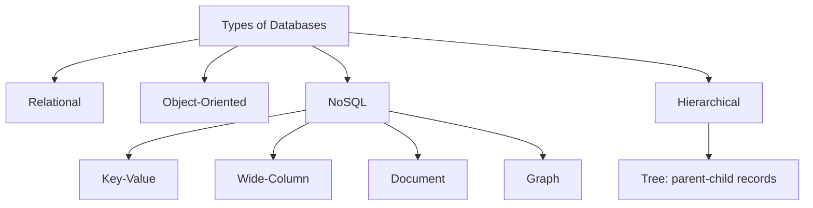

# 13 — Types of Databases (LEC-16)

## Overview

Databases can be organized into several families based on how they model and store data. The major categories are relational, object-oriented, NoSQL, and hierarchical.

A map of the main database categories, with NoSQL and hierarchical models expanded.

## Relational Databases

Based on the **relational model**. Relational databases — also known as relational database management systems (RDBMS) — have been popular since the 1970s and commonly use **Structured Query Language (SQL)** for creating, reading, updating, and deleting data.

They store information in discrete **tables** that can be JOINed together by fields known as **foreign keys**. For example, a `User` table containing information about all your users can be joined to a `Purchases` table containing information about the purchases they have made. MySQL, Microsoft SQL Server, and Oracle are relational databases.

Characteristics:

- **Ubiquitous** — a steady user base since the 1970s.
- **Structured data** — highly optimized for working with structured data.
- **Normalization** — provides a stronger guarantee of data normalization.
- **Standard query language** — uses the well-known SQL.
- **Scalability issues** — horizontal scaling is difficult.
- **Complexity at scale** — as data becomes huge, the system becomes more complex.

## Object-Oriented Databases

The **object-oriented data model** is based on the object-oriented-programming paradigm. Key OOP concepts that have found applications in data modeling include **inheritance**, **object identity**, and **encapsulation** (information hiding), with methods providing an interface to objects. The model also supports a rich type system, including structured and collection types. While inheritance and, to some extent, complex types are also present in the E-R model, **encapsulation** and **object identity** distinguish the object-oriented data model from the E-R model.

Data is treated as an **object**: all information comes in one instantly available object package instead of being spread across multiple tables. This is helpful because a database with multiple relations can become very complex, and maintaining relationships between them can be tedious.

### Advantages

- Data storage and retrieval is easy and quick.
- Can handle complex data relations and a wider variety of data types than standard relational databases.
- Relatively friendly for modeling advanced real-world problems.
- Works with the functionality of OOP and object-oriented languages.

### Disadvantages

- High complexity causes performance issues — read, write, update, and delete operations are slowed down.
- Not much community support, as it isn't as widely adopted as relational databases.
- Does not support views like relational databases.

Examples: ObjectDB, GemStone.

## NoSQL Databases

NoSQL databases (aka "not only SQL") are non-tabular databases that store data differently than relational tables. They come in a variety of types based on their data model — the main types are **document**, **key-value**, **wide-column**, and **graph** — and they provide flexible schemas and scale easily with large amounts of data and high user loads.

Characteristics:

- **Schema free.**
- **Flexible structures** — non-tabular structures able to adjust dynamically.
- **Big data** — can handle huge amounts of data.
- **Open source and horizontally scalable** — most are open source with horizontal-scaling capability.
- **Non-relational storage** — stores data in some format other than relational.

> For full details on NoSQL data models, advantages, and SQL vs NoSQL, refer to the LEC-15 notes.

## Hierarchical Databases

As the name suggests, the **hierarchical database model** is most appropriate for use cases in which information gathering is based on a concrete hierarchy — such as several individual employees reporting to a single department at a company.

The schema is defined by its **tree-like organization**: there is typically a root "parent" directory of data stored as records that links to various subdirectory branches, and each subdirectory branch (child record) may link to further branches.

The structure dictates that while a **parent record can have several child records, each child record can have only one parent record**. Data within records is stored in the form of **fields**, and each field can contain only one value.

## Use Cases by Database Type

| Database Type | Best Suited For | Examples |
| --- | --- | --- |
| **Relational** | Structured data with strong normalization and SQL queries | MySQL, SQL Server, Oracle |
| **Object-Oriented** | Complex real-world objects, OOP-driven applications | ObjectDB, GemStone |
| **NoSQL** | Big data, unstructured data, scale-out cloud applications | MongoDB, Cassandra, Redis, Neo4j |
| **Hierarchical** | Data with a concrete tree-like parent-child hierarchy | IMS-style tree structures |
