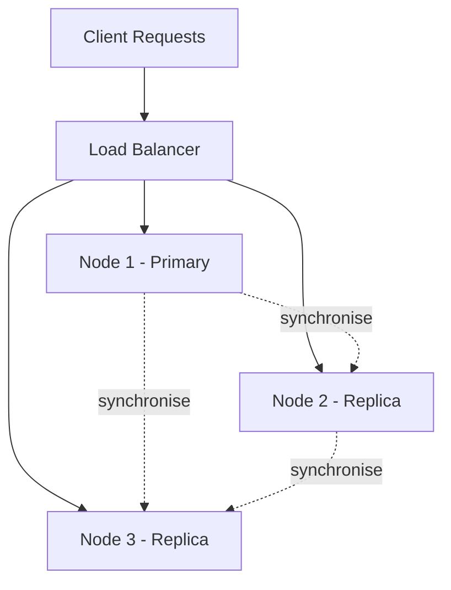

# 14 — Clustering in DBMS (LEC-17)

## What is Database Clustering?

**Database clustering** (also called making *replica-sets*) is the process of combining more than one server or instance so that they connect to a single database. Sometimes one server is not adequate to manage the amount of data or the number of requests — that is when a **data cluster** is needed.

The terms *database clustering*, *SQL server clustering*, and *SQL clustering* are closely associated, since SQL is the language used to manage the database information.

The core idea is simple: **replicate the same dataset on different servers**.

> Do not confuse this data redundancy with harmful repetition that leads to anomalies. The redundancy that clustering offers is required and is kept consistent through synchronisation.

## Cluster Topology

A load balancer spreads incoming requests across the primary and replica nodes, while all nodes stay in sync holding the same dataset.

## Advantages

### Data Redundancy

Clustering stores the same data on multiple servers, which gives dependable **data redundancy**. The copies are kept certain and consistent through synchronisation. If any server fails for any reason, the data is still available on the other servers.

### Load Balancing

**Load balancing** (and scalability) does not come with a database by default — it has to be brought about by clustering and maintained regularly, and it depends on the setup. Load balancing allocates the workload among the different servers that form the cluster. This means more users can be supported, and if a huge spike in traffic appears there is a higher assurance the system will handle it, because one machine does not receive all the hits. This enables seamless scaling and links directly to high availability. Without it, a single machine could get overworked, traffic would slow down, and throughput could drop toward zero.

### High Availability

Being able to access a database means it is **available**. High availability refers to the amount of time a database is considered available. How much availability you need depends greatly on the number of transactions you run and how often you run analytics on your data. With clustering — thanks to load balancing and extra machines — extremely high levels of availability can be reached. Even if one server shuts down, the database remains available.

## How Does Clustering Work?

In a cluster architecture, all requests are split across many computers, so an individual user request is executed and produced by a number of computer systems. Clustering is made serviceable by the combination of **load balancing** and **high availability**. If one node collapses, the request is handled by another node. Consequently, there are few or no possibilities of an absolute system failure.
