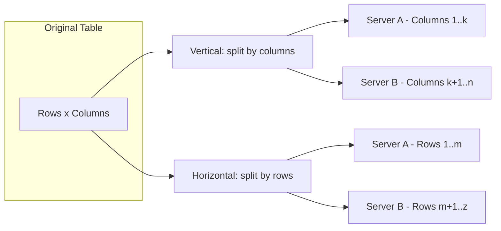
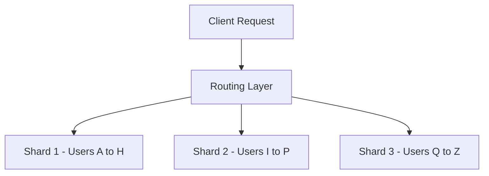

# 15 — Partitioning & Sharding (LEC-18)

## What is Partitioning?

A big problem is solved easily when it is chopped into several smaller sub-problems — that is exactly what **partitioning** does. It divides a big database (containing data metrics and indexes) into smaller, handy slices of data called **partitions**. The partitioned tables are used directly by SQL queries without any alteration. Once the database is partitioned, the Data Definition Language can work easily on the smaller partitioned slices instead of handling the giant database as a whole. This is how partitioning cuts down the difficulty of managing large database tables.

Partitioning is the technique used to divide stored database objects into separate servers. This increases **performance** and **controllability** of the data, letting us manage huge chunks of data optimally. When we horizontally scale our machines/servers, relational databases become challenging because their relations are tough to maintain. But if we apply partitioning to a database that is already scaled out (equipped with multiple servers), we can partition the database among those servers and handle big data easily.

## Vertical vs Horizontal Partitioning

| Aspect | Vertical Partitioning | Horizontal Partitioning |
| --- | --- | --- |
| Slicing direction | Column-wise (slices the relation vertically) | Row-wise (slices the relation horizontally) |
| What is stored where | Different columns of a tuple sit on different servers | Independent chunks of data tuples are stored on different servers |
| Access note | Need to access different servers to reconstruct complete tuples | Each server holds whole tuples for its own subset of rows |

Vertical partitioning distributes columns across servers; horizontal partitioning distributes rows across servers.

## When is Partitioning Applied?

- When the dataset becomes so huge that managing and dealing with it becomes a tedious task.
- When the number of requests grows large enough that a single DB server access takes a lot of time, making the system's response time high.

## Advantages of Partitioning

- **Parallelism** — work can run on multiple partitions at once.
- **Availability** — a failure in one partition does not take down the whole dataset.
- **Performance** — queries touch smaller slices of data.
- **Manageability** — smaller partitions are easier to administer.
- **Reduce Cost** — avoids expensive scaling-up (vertical scaling), which can be costly.

## Distributed Database

A **distributed database** is a single logical database that is spread across multiple locations (servers) and logically interconnected by a network.

It is the product of applying DB optimisation techniques such as **Clustering**, **Partitioning**, and **Sharding**. It is needed for the same reasons partitioning is applied (huge datasets and high request volumes).

## Sharding

**Sharding** is a technique to implement horizontal partitioning. The fundamental idea is that instead of having all the data sit on one DB instance, we split it up and introduce a **routing layer** so that requests are forwarded to the right instances that actually contain the data.

The routing layer inspects the request and forwards it to the shard that holds the relevant data.

### Pros

| Pro | Description |
| --- | --- |
| Scalability | Data and load are spread across many DB instances, so the system scales out. |
| Availability | A problem on one shard does not necessarily bring down the others. |

### Cons

| Con | Description |
| --- | --- |
| Complexity | Requires partition mapping and a routing layer in the system; non-uniform growth creates the need for **re-sharding**. |
| Poor for analytics | Not well suited for analytical queries because data is spread across different DB instances (the **scatter-gather problem**). |
