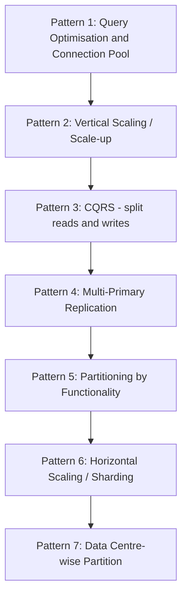
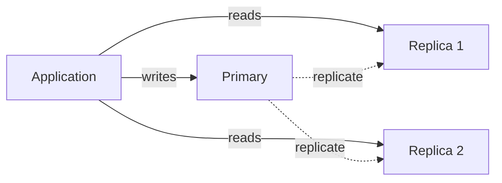
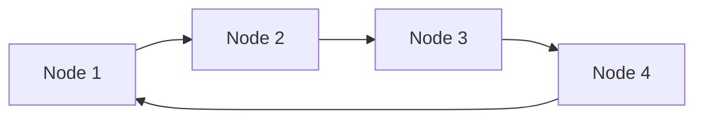
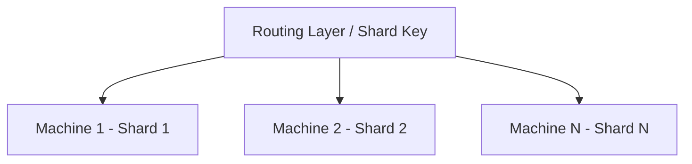
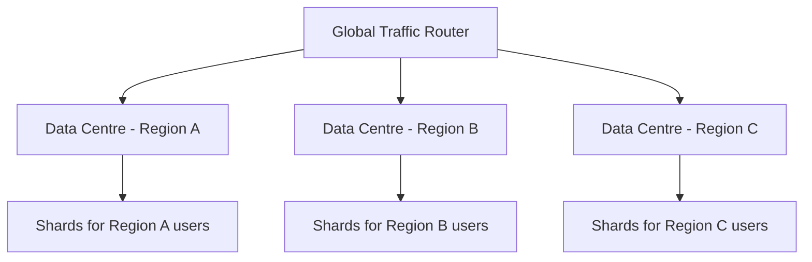

# 16 — Database Scaling Patterns (LEC-19)

## What Will You Learn?

- A **step-by-step** approach to deciding *when* to choose *which* scaling option.
- Which scaling option is feasible practically at the moment for a given load.

## A Case Study — Cab Booking App

Imagine a tiny startup:

- A tiny startup with about **10 customers** onboard.
- A single small machine DB stores all customers, trips, locations, booking data, and customer trip history.
- Roughly **1 trip booking every 5 minutes**.

### The Problem Begins

Your app becomes famous, and the load explodes:

- Requests scale up to about **30 bookings per minute**.
- The tiny DB system starts performing poorly.
- API latency has increased a lot.
- Transactions face **deadlock**, **starvation**, and frequent failure.
- Sluggish app experience.
- Customer dissatisfaction.

### Is There a Solution?

- We have to apply some kind of performance optimisation measures.
- We might have to scale our system going forward.

## The Scaling Decision Progression

Each pattern is applied only when the previous one can no longer keep up with the growing load.

## The Seven Scaling Patterns

### Pattern 1 — Query Optimisation & Connection Pool Implementation

- Cache frequently used, non-dynamic data such as booking history, payment history, and user profiles.
- Introduce database redundancy (or possibly use NoSQL).
- Use connection-pool libraries to cache DB connections.
- Multiple application threads can then use the same DB connection.

This is a good optimisation for now. The business scales to one more city and reaches about **100 bookings per minute**.

### Pattern 2 — Vertical Scaling (Scale-up)

- Upgrade the initial tiny machine — for example, RAM by 2x and SSD by 3x.
- Scale-up is pocket friendly only up to a point.
- The more you scale up, the more the cost increases **exponentially**.

A good optimisation for now. The business grows to 3 more cities and reaches about **300 bookings per minute**.

### Pattern 3 — Command Query Responsibility Segregation (CQRS)

The scaled-up big machine can no longer handle all read/write requests. The idea is to **separate read and write operations at the physical-machine level**.

- Add 2 more machines as **replicas** to the primary machine.
- Send all **read** queries to the replicas.
- Send all **write** queries to the primary.

The business grows to 2 more cities. Now the primary cannot handle all write requests, and the **lag** between primary and replicas starts impacting user experience.

### Pattern 4 — Multi-Primary Replication

Why not distribute write requests to the replicas as well?

- All machines can work as both **primary and replica**.
- The multi-primary configuration is a **logical circular ring**.
- Write data to any node.
- Read data from any node that replies to the broadcast first.

You scale to 5 more cities, and the system is in pain again (about **50 requests per second**).

### Pattern 5 — Partitioning of Data by Functionality

- What about separating the location tables into a separate DB schema?
- What about putting that DB on separate machines with a primary-replica or multi-primary configuration?
- Different databases can host data categorised by different **functionality**.
- The backend / application layer then takes responsibility for joining the results.

Now you are planning to expand your business to another country.

### Pattern 6 — Horizontal Scaling (Scale-out / Sharding)

- Use **sharding** with multiple shards.
- Allocate, say, **50 machines** — all having the same DB schema — where each machine holds only a slice (shard) of the overall data.
- A **shard key** (via a hash or range function) decides which shard a given record belongs to, and a routing layer forwards each request to the correct shard.
- This spreads both data and load across many machines, so the system scales out almost linearly.

As the business expands across countries, serving every request from one region's shards starts to add heavy network latency for distant users.

### Pattern 7 — Data Centre-wise Partition

- Partition the data **data-centre wise**, placing shards in data centres located close to the users they serve.
- Route each request to the **nearest data centre** based on the user's geographic region.
- This minimises network latency for a globally distributed user base and improves availability if an entire region goes down.
- It also helps satisfy **data-residency / compliance** requirements, since each country's data can be kept within its own borders.

Requests are served by the geographically nearest data centre, cutting latency and keeping each region's data local.
