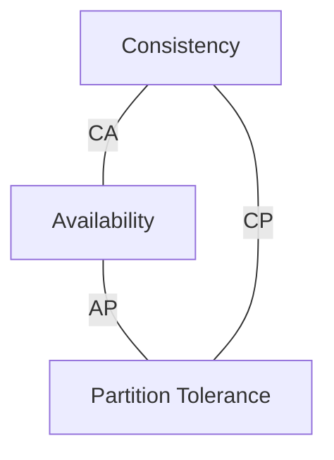

# 17 — CAP Theorem (LEC-20)

The **CAP Theorem** is one of the most important and fundamental concepts in **distributed databases**. Understanding it is essential to design an efficient distributed system that fits your given business logic, because it tells you which guarantees you can and cannot have at the same time.

---

## The Three Properties

The name **CAP** comes from the three properties a distributed system may try to provide.

### Consistency (C)

In a consistent system, all nodes see the same data simultaneously. A read operation on a consistent system should return the value of the **most recent write operation**, and the read should cause all nodes to return the same data. Every user sees the same data at the same time, regardless of which node they connect to. When data is written to a single node, it is then replicated across the other nodes in the system.

### Availability (A)

When availability is present, the system remains **operational all of the time**. Every request gets a response regardless of the individual state of the nodes, so the system keeps working even if multiple nodes are down. Unlike a consistent system, there is **no guarantee that the response will reflect the most recent write**.

### Partition Tolerance (P)

A **partition** means there is a break in communication between nodes. A partition-tolerant system **does not fail**, regardless of whether messages are dropped or delayed between nodes within the system. To achieve partition tolerance, the system must replicate records across combinations of nodes and networks.

---

## What the CAP Theorem States

> A distributed system can only provide **two of the three** properties simultaneously: Consistency, Availability, and Partition Tolerance.

The theorem formalises the **tradeoff between consistency and availability** when there is a partition. You must pick two of the three corners of the triangle below.

The CAP triangle — each edge is a pair of guarantees a system can choose; you cannot hold all three at once.

---

## Choosing Two: CA / CP / AP

Because network partitions are unavoidable in a truly distributed system, real distributed systems must be partition-tolerant. In practice the meaningful choice is usually between **CP** and **AP**, while **CA** applies mainly to single-node systems.

| Combination | Guarantees | Sacrifices | Behaviour on a partition | Example databases |
| --- | --- | --- | --- | --- |
| **CA** | Consistency + Availability | Partition Tolerance | Only viable when the network never partitions — effectively a single node. | PostgreSQL, MySQL, Oracle (single-node RDBMS) |
| **CP** | Consistency + Partition Tolerance | Availability | Nodes that cannot guarantee the latest data become unavailable to preserve consistency. | MongoDB, HBase, Redis |
| **AP** | Availability + Partition Tolerance | Consistency | Stays available and answers every request, but may return stale (eventually consistent) data. | Cassandra, DynamoDB, CouchDB |

---

## Key Takeaways

- No distributed system can guarantee Consistency, Availability, and Partition Tolerance all at once.
- Partitions are a fact of distributed life, so the real design decision is **consistency vs availability** during a partition.
- Choose **CP** when correctness of every read matters more than uptime.
- Choose **AP** when staying online matters more than always serving the latest write.
