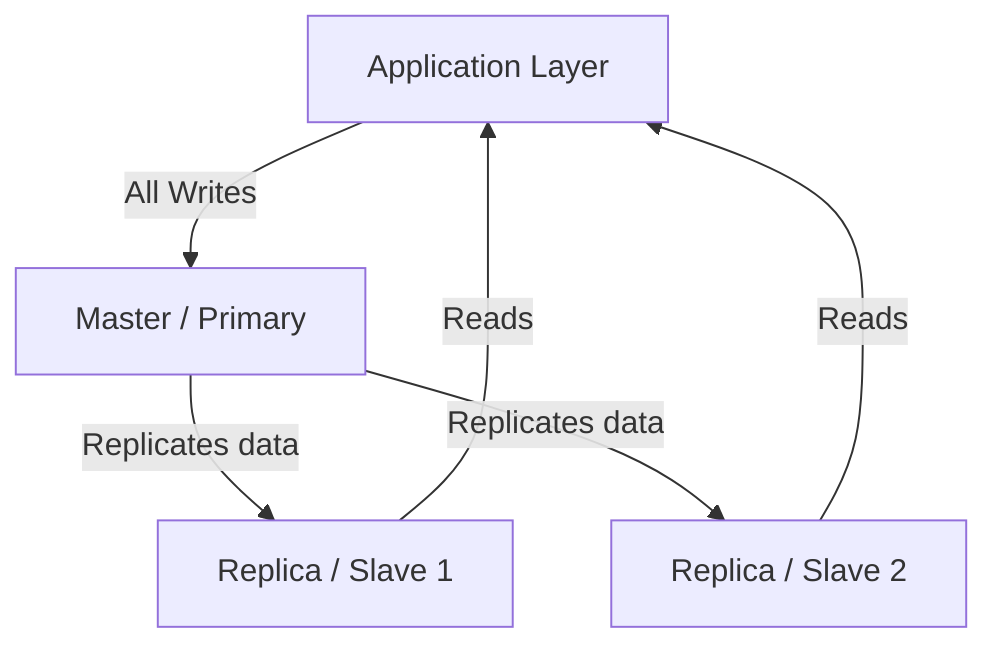

# 18 — The Master-Slave Database Concept (LEC-21)

The **Master-Slave** (also called **Primary-Replica**) pattern is a way to scale a database when a single, vertically-scaled machine can no longer handle all of the **read and write** requests on its own. The core idea is to **separate read and write operations physical-machine-wise**.

---

## The Core Idea

Instead of one machine serving everything, we split the workload across roles:

- **Master (Primary)** — a single machine that owns the authoritative copy of the data and handles all **write** queries.
- **Replicas (Slaves)** — one or more machines (for example, 2 additional machines) that are copies of the primary and handle all **read** queries.

Whenever data is written to the master, it is **replicated** across the slave machines so their copies stay up to date. Each machine can also keep its own replicas, which are useful for **failure recovery**.

---

## Replication Topology

Writes always go to the master; reads are served by the replicas, and the master streams its changes down to every replica.

---

## Why Use Master-Slave

| Benefit | Explanation |
| --- | --- |
| **Read scaling** | Read traffic is spread across many replicas, so a large volume of reads no longer overloads one machine. |
| **Separation of concerns** | Write load on the master is isolated from read load on the replicas. |
| **Failure recovery** | Because replicas hold copies of the data, a replica can take over if a machine fails. |
| **Disaster recovery** | Cross-data-centre replication keeps a copy in another location, protecting against a whole-site failure and helping maintain availability. |

---

## Limitations

- **Replication lag** — there is a delay between a write landing on the master and it appearing on the replicas. A read from a lagging replica can return **stale data**, which impacts user experience.
- **Write bottleneck** — all writes still funnel through a single master. As the business grows (for example, scaling to more cities), the primary may no longer be able to handle all write requests on its own.

---

## What Comes Next

When a single master can no longer absorb the write load, the natural next step is **Multi-Primary Replication**, where multiple nodes can each act as both primary and replica so that **write** requests are distributed too — data can be written to any node and read from any node that responds first.
