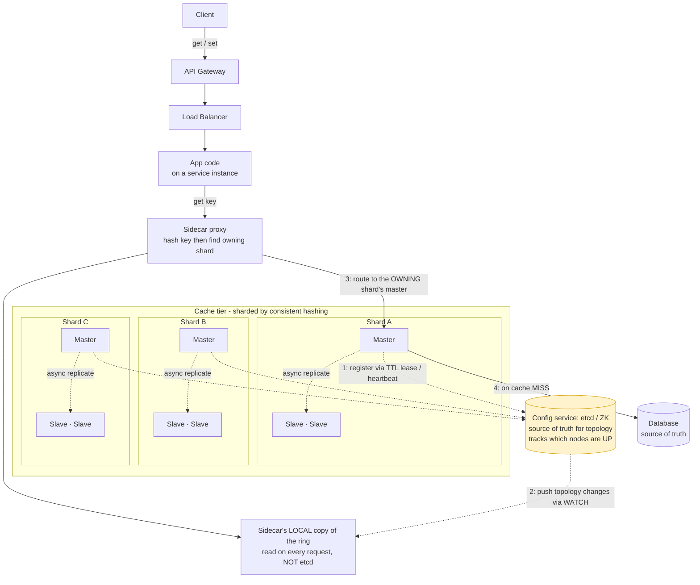

# Distributed Cache

*High-Level Design study note · interview answer + alternatives & production reality*

---

## 0 · The one-line mental model

A cache is a **library with many desks (nodes)**. Each book (key) has **one home desk**, decided by a hash. Reads and writes for a book always go to its home desk. The whole design is about three things:

1. **Which desk owns a book?** → partitioning (consistent hashing)
2. **What if a desk burns down?** → replication + failover
3. **What if everyone wants the same book?** → hot-key handling

Keep this picture in mind — every section below is one of these three questions.

---

## 1 · Requirements

**Functional**

- `get(key)` — return the value if present, else a miss.
- `set(key, value, ttl?)` — store a value, optionally with an expiry.
- `delete(key)` — remove a value.
- Values expire automatically (TTL) and are evicted when memory is full.

**Non-functional** *(these are what actually drive the design)*

- **Very low latency** — single-digit milliseconds (it's a cache; if it's slow, why have it).
- **High availability** — a node dying must not take the system down.
- **Horizontally scalable** — data must be able to exceed one machine's RAM (this is what makes it *distributed*).
- **Weak consistency is acceptable** — a cache is *allowed* to be briefly wrong; a stale entry just means a re-fetch from the DB. This single fact unlocks many cheap design choices.

> The dataset being bigger than one machine's memory is the reason the cache must be *distributed*. If it fit on one box, you'd just run one Redis and stop.

---

## 2 · Back-of-envelope estimate

State assumptions, then derive. Example numbers:

| Quantity | Assumption / derivation | Result |
|---|---|---|
| Data to cache | 1 billion keys × ~1 KB each | ~ 1 TB total |
| RAM per node | Commodity cache box | ~ 64 GB usable |
| Number of shards | 1 TB / 64 GB | ~ **16 shards** (round up for headroom → ~20) |
| Traffic | 1M reads/sec, 100K writes/sec | 10:1 read:write |
| Per-node load | 1M reads / 16 shards | ~ 60K ops/sec/node (well within Redis/Memcached range) |
| Replicas | 1 master + 2 slaves per shard | ×3 nodes → ~ 48–60 nodes total |

**What the numbers justify:** 1 TB can't live on one box → **must shard** (~16 nodes). Read-heavy + skew → a hot-key strategy matters. 60K ops/node is comfortable, so nodes fail from *crashes*, not overload — which is why the design spends its effort on **failover and topology**, not raw throughput.

---

## 3 · API

| Operation | Purpose | Returns |
|---|---|---|
| `get(key)` | Fetch value | `value` or `miss` |
| `set(key, value, ttl?)` | Store / overwrite | `ok` |
| `delete(key)` | Remove | `ok` |

Single-key operations only — no joins, no range scans. That simplicity is exactly why a cache can be so fast.

---

## 4 · High-level architecture & request flow

Every service instance carries a **sidecar proxy** (a small helper process next to the app). The sidecar knows the cache topology and does the routing, so the app just says "get this key."



**Read flow (numbered):**
1. Cache nodes **register** themselves in etcd with a **TTL lease** (a self-renewing "I'm alive" marker).
2. etcd **pushes** any topology change to every sidecar via a **watch** (long-lived subscription).
3. On `get(key)`, the sidecar hashes the key against its **local** ring copy → routes to the **owning shard's** node.
4. Hit → return. Miss → read the **database**, populate the cache, return.

> 🔑 **The subtle bit interviewers look for:** etcd is **NOT in the request hot path**. The sidecar keeps a **local copy** of the ring and only refreshes it when etcd *pushes* a change. So per-request routing costs zero network calls to etcd. etcd is the *control plane*, not the *data plane*.

---

## 5 · Partitioning — which node owns a key? *(the heart of it)*

This is what makes the cache *distributed*. Every key maps to exactly one shard, deterministically.

### Why not `hash(key) % N`?

If you have N nodes and one dies (N → N-1), **almost every key remaps** to a different node → the entire cache is suddenly wrong → a miss storm hammers the DB. Unusable.

### Consistent hashing (the answer)

Picture a **circle (ring)** numbered 0 → max. Both nodes and keys are placed on the ring by their hash. A key belongs to the **first node clockwise** from it.

- Add or remove a node → **only ~1/N of keys move**, not all of them. Everything else stays put.
- This is *why* a single dead node isn't catastrophic — only its slice goes cold.

### Virtual nodes (vnodes) — don't skip this

Each physical node is placed on the ring in **many small pieces** (say 100 vnodes each) instead of one big arc.

- **Without vnodes:** a dead node dumps its *entire* load onto its **one** ring neighbour → that neighbour may also fall over → **cascading failure**.
- **With vnodes:** the dead node's load spreads **evenly across all** survivors. No single victim.

> **Interview pick** — Consistent hashing **with virtual nodes**. Always name vnodes; mentioning them is the difference between "read about it" and "understand it."

---

## 6 · Replication & failover

Each shard is a small **cluster: 1 master + N slaves**.

- **Writes** → go to the master → replicate to slaves **asynchronously** (master acks immediately, slaves catch up shortly after).
- **Reads** → can be spread across master + slaves for extra read capacity.

**Why async replication?** Fast writes. The trade: a slave can lag slightly, so on failover you may **lose the last few writes**. For a cache this is fine — a lost entry is just a miss → re-fetch from the DB. (For a *database* this would be unacceptable; for a cache, it's a feature-grade tradeoff.)

**Master dies:** a slave is **promoted** to master (via a sentinel/controller, or the cluster's own gossip), and the new topology is written to etcd → pushed to sidecars.

> Note: etcd knowing a node is dead ≠ promotion. Detection (etcd lease expiry) and **failover (promoting a slave)** are two separate mechanisms — say both.

---

## 7 · Membership & topology (etcd / ZooKeeper)

The config service is the **single source of truth for "who's in the ring and who's alive."**

- **Registration:** each node creates an **ephemeral key with a TTL lease** in etcd and keeps renewing it (the heartbeat).
- **Failure detection:** node stops renewing (crash, GC pause, partition) → its lease **expires** → the key vanishes → **watchers are notified**.
- **Propagation:** sidecars **watch** the topology key. On any change, etcd pushes the new ring → sidecars update their **local** copy.

**Watch out for "up but not serving":** a node under a long GC pause may still renew its lease (looks alive to etcd) but can't serve traffic. Pure self-heartbeat misses this — real systems add client-side health signals / request timeouts too.

---

## 8 · Failure handling — when a whole shard dies

This is the scenario to narrate carefully (it's the common follow-up):

```
1. Whole shard C (all its replicas) dies.
2. etcd lease expires → pushes new topology → sidecars drop C from the ring.
3. The RING rebalances: C's key range now hashes to the next node(s) clockwise.
   ⚠️ NO DATA MOVES — C's data was in RAM and is GONE.
4. Those keys now land on nodes that DON'T have the data → that whole
   key range becomes a CACHE MISS.
5. Every miss falls through to the DATABASE at once → sudden load spike
   on ~1/N of the keyspace → cache stampede → DB may fall over.
6. Traffic slowly repopulates the new owner from the DB.
```

**Say "the *ring* rebalances," not "the *data* rebalances."** No data migrates — the affected key range goes **cold** and repopulates. Then immediately explain how you protect the DB during that cold window:

- **Replicate each shard across clusters** — keep a warm backup copy elsewhere so a whole-shard loss still has data.
- **Request coalescing (single-flight)** — 10,000 misses for the same key collapse into **1** DB fetch; the rest wait for it.
- **Promote a standby** instead of going fully cold.
- **When the dead shard returns:** the ring shifts back and those keys route to it again — but it may hold **stale** data. TTLs self-heal this; otherwise **flush the returning node** before use.

> Why it's survivable at all: consistent hashing means only **~1/N** of keys are affected, not the whole cache. With vnodes, even that 1/N is spread across all survivors.

---

## 9 · Hot keys — when everyone wants the same key

A hot key (celebrity profile, viral post, flash-sale item) maps to **one shard**. Adding more shards doesn't help — the key still lives in one place. It's a *single-node* problem. Techniques, weakest → strongest:

### 9.1 More read replicas of that shard
- ✅ Helps if the key is **read-heavy** (most are) — spread reads across slaves.
- ❌ **Writes still funnel to one master** — no help for write-hot keys.
- ❌ Scales the **whole shard** just for one key — wasteful, and has a ceiling.
- Verdict: coarse lever, not the primary fix.

### 9.2 Client-side (L1) local cache — **the real workhorse**
Cache the hottest keys **inside the sidecar itself** (local RAM) with a **short TTL** (even 1 s).
- The key is read constantly, so a 1-second-old local copy still yields a ~99% local hit rate → **most traffic never reaches the cache tier at all**. The crowd is absorbed at the edge (closest to the code).
- This is what Facebook/Netflix rely on most ("near cache").
- Trade: staleness bounded by TTL; a little memory per client.

> **Layers:** *CDN = close to the user* (caches user-facing responses at the network edge). *L1 client cache = close to the code* (caches hot keys inside your service). For hot keys in the **cache tier**, you want **L1**, not CDN. CDN solves a different flavour (viral public content to external users).

### 9.3 Key splitting / fan-out — for extreme or write-hot keys
Store the key as `key#1, key#2, … key#N`, each landing on a **different** shard. Readers pick a random suffix → load spreads across N shards.
- ✅ The only technique that scales a **write-hot** key past one shard.
- ❌ Write amplification (update all N copies) + consistency complexity.

### 9.4 Request coalescing — for the MISS moment only
- ⚠️ Common confusion: coalescing does **nothing** for a hot key that's *present* (a hit) — every read succeeds and the node is still crushed.
- It only helps when the key is **missing** (expired / shard died): collapse the flood of concurrent misses into one DB fetch.
- Think: **coalescing = seatbelt** (saves you in the crash / miss moment). **L1 caching = steering** (stops the crash happening in the first place). You want both, but they solve different situations.

### 9.5 Detection — you can't fix what you can't see
You have millions of keys; counting *every* key exactly is too much memory. So track only the **busiest few**, approximately:
- **Count-Min Sketch + top-K** — a tiny fixed-memory structure that spots "this key is getting hammered" without an exact per-key counter.
- **Sampling** — inspect 1 in 100 requests; a truly hot key still shows up constantly, a rare key never does. 100× cheaper.
- **Where:** at the **sidecar** (it sees every request). Cache nodes can also report their own hottest keys (Redis tracks usage for eviction anyway).
- **Signal:** if **one shard** is suddenly far busier than the rest, a hot key likely lives there — drill into its top-K.

**The loop:** `detect (top-K) → promote hot key to L1 cache → key cools → drop it from L1`. Automatic, no hardcoding.

> **Hot-key summary:** replicas help **read-hot** keys only; the primary defence is **L1 local caching (short TTL)**; **split the key** for write-hot/extreme cases; **coalesce** so a *missing* hot key can't stampede the DB — all driven by **top-K detection** at the sidecar.

---

## 10 · Write path — keeping cache & DB in agreement

Physically: consistent hash → owning shard's **master** → replicate to slaves; the **DB** is the source of truth. The strategy decides the *order* and *who writes to whom*.

### 10.1 Cache-aside (lazy loading) — **the default**
The app manages both stores:
```
Write:  app → write DB → DELETE key in cache
Read:   app → cache miss → read DB → fill cache → return
```
- ✅ Simple; only caches what's actually read (memory-efficient); if cache is down, writes still work (hit the DB).
- ❌ First read after a write is a miss (slightly slow).
- 🔑 **Delete, don't update, on writes** — deleting forces the next read to reload the truth. "Updating" the cache can leave the *older* value stuck if two writes race.

### 10.2 Write-through
```
Write:  app → cache → (cache writes DB synchronously) → ack
```
- ✅ Cache always fresh; read-after-write is a hit.
- ❌ Slower writes (two writes on the critical path); caches data nobody may ever read.

### 10.3 Write-back (write-behind)
```
Write:  app → cache → ack immediately (DB updated later, batched async)
```
- ✅ Very fast writes; great for write-heavy bursts (batch many DB writes into one).
- ❌ **Data loss risk** if the cache node dies before flushing. Only for loss-tolerant data (counters, view counts, metrics).

### 10.4 The consistency gotcha (senior-level point)
Even cache-aside has a famous **stale-cache race**:
```
1. Reader A: cache miss → reads DB → gets OLD value (not yet written back)
2. Writer B: updates DB → deletes cache key
3. Reader A: writes its OLD value into the cache
→ stale value stuck until it expires
```
Fixes: **TTL as a safety net** (simple, usually enough for a cache) · **delayed double-delete** (delete again a moment after the write) · **versioning** (only overwrite with newer data).

> **Interview pick** — **Cache-aside + a TTL backstop** is the standard cache answer. It's simple, memory-efficient, and cache failure doesn't break writes. Mention the race + double-delete to show you know the sharp edge. A cache is *allowed* to be briefly wrong, so don't over-engineer consistency.

---

## 11 · Eviction & expiry

When a node's memory is full, it must evict to make room:

| Policy | Evicts | Best for |
|---|---|---|
| **LRU** (Least Recently Used) | the key untouched longest | general default |
| **LFU** (Least Frequently Used) | the key used least often | stable hot-set (keeps true favourites) |
| **TTL** | anything past its expiry | time-sensitive data; also the consistency backstop |

Most systems combine **TTL + LRU** (Redis's `allkeys-lru`). TTL doubles as your staleness guard from §10.

---

## 12 · Decision summary — interview pick vs alternatives

| Decision | Interview pick | Alternatives / trade |
|---|---|---|
| Partitioning | Consistent hashing **+ virtual nodes** | `hash % N` (remaps everything on change — avoid) |
| Routing | Sidecar proxy with **local ring copy** | Smart client library; dedicated proxy tier (Twemproxy, mcrouter) |
| Topology / membership | etcd/ZK, **ephemeral TTL lease + watch**, **out of hot path** | Gossip-based (Redis Cluster); polling (slower to react) |
| Replication | 1 master + N slaves, **async** | Sync (safer, slower — usually overkill for a cache) |
| Whole-shard failure | Ring rebalances, keyrange goes cold + repopulates | Cross-cluster shard replica for a warm backup |
| Hot keys (read) | **L1 client cache, short TTL** | Extra read replicas (coarse); CDN (user-facing only) |
| Hot keys (write/extreme) | **Key splitting** across shards | — (replicas don't help writes) |
| Miss stampede | **Request coalescing** (single-flight) | Warm standby; longer TTLs |
| Hot-key detection | **Top-K + Count-Min Sketch** at sidecar | Exact counting (too much memory); shard-load monitoring |
| Write strategy | **Cache-aside + TTL** | Write-through (fresh, slower); write-back (fast, loss-risk) |
| Eviction | **TTL + LRU** | LFU (stable hot-set) |

---

## 13 · Real-world analogs (name-drop to show grounding)

- **Redis Cluster** — 16384 hash slots (a fixed-count form of consistent hashing), master+replica per slot range, gossip for membership.
- **Memcached + client-side consistent hashing** — dumb servers, smart clients; the original distributed cache pattern.
- **Twemproxy / mcrouter (Facebook)** — proxy tiers that do exactly what our sidecar does: hash, route, pool.
- **Facebook's near-cache** — the canonical L1 local-cache answer to hot keys.

---

*Rule of thumb — the three questions ARE the design: **which node owns the key** (consistent hashing + vnodes), **what happens when a node dies** (async replicas + ring rebalance + stampede protection), and **what happens when one key is white-hot** (L1 cache + splitting + coalescing, driven by top-K detection). A cache's superpower is that it's *allowed to be briefly wrong* — most of the cheap, elegant choices here fall out of remembering that.*
