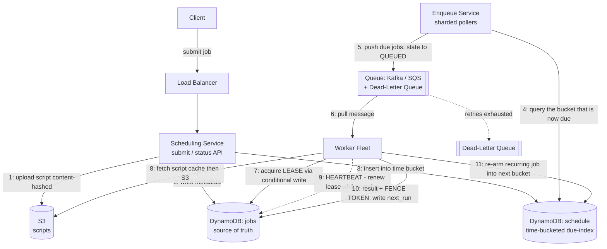

# Distributed Job Scheduler

*High-Level Design study note · interview answer + alternatives & production reality*

---

## 0 · The one-line mental model

A job scheduler is a **giant alarm clock wired to a factory of workers**. The whole design answers four questions:

1. **When should a job run?** → store the job + its "next run time" durably (Scheduling Service + DB).
2. **How do we notice it's time — without scanning millions of jobs?** → a time-**bucketed** index the poller reads cheaply (Enqueue Service).
3. **How do we run it on exactly one machine, safely, even if that machine dies?** → queue + **lease** + **heartbeat** + **fence token** (Worker fleet).
4. **What about failures and repeats?** → retries, dead-letter queue, and re-arming the next run.

Keep this picture in mind — every section below is one of these four questions.

> **Separation of concerns (the spine of the design):**
> **Scheduling Service** = *"when should this run"* · **Enqueue Service** = *"it's time now"* · **Queue** = *shock absorber* · **Worker + lease + fence** = *"run it on one machine, safely"* · **write-back** = *"arm the next run."* Each box does exactly one job.

---

## 1 · Requirements

**Functional**

- Submit a job: a script/code artifact + a schedule — either **one-time** (run at time T) or **recurring** (a cron expression like `0 * * * *`).
- Run each job at (or shortly after) its scheduled time.
- Recurring jobs automatically **re-arm** for their next occurrence.
- **Retry** on failure, with a cap; a permanently-failing job must not clog the system.
- Query a job's **status / history** (did it run, is it running, why did it fail).

**Non-functional** *(these are what actually drive the design)*

- **At-least-once execution.** Exactly-once is effectively impossible in a distributed system — we target *at-least-once + idempotency/fencing*. **Say this out loud in the interview.**
- **Durability** — a submitted job must never be silently lost.
- **Fault tolerance** — a worker dying mid-job must not drop the job; someone else picks it up.
- **Scalable** — millions of jobs; survive spikes at "round" times (midnight, top of the hour).
- **Scheduling latency SLA** — run within a few seconds of the target time (define the number).

> The dataset (100M+ jobs) and the spiky "everyone schedules for midnight" traffic are what force this to be *distributed*. A single cron box on one machine can't survive either.

---

## 2 · Back-of-envelope estimate

State assumptions, then derive. The point isn't the exact digits — it's that the numbers **justify each component**.

| Quantity | Assumption / derivation | Result |
|---|---|---|
| Registered jobs | given | **100 M** |
| Executions / day | ~10 runs per job/day avg (many hourly/daily crons) | **~1 B / day** |
| Avg execution rate | 1 B / 86,400 s | **~11.5 K/sec** |
| Peak rate (clustering at round times) | ~5× the average | **~60 K/sec** |
| Avg job duration | assume | **30 s** |
| Concurrent jobs (avg) | 11.5 K/s × 30 s | **~350 K** |
| Concurrent jobs (peak) | 60 K/s × 30 s | **~1.8 M** |
| Workers | ~50 concurrent light jobs/box → 350K / 50 | **~7 K steady** (~36K at peak) |
| Metadata storage | 100 M × ~1 KB/row | **~100 GB** (trivial for DynamoDB) |
| Script storage | 100 M × ~1 MB avg | **~100 TB** (trivial for S3) |
| DB writes | ~5 state writes/execution (QUEUED→RUNNING→DONE + heartbeats) | **~60 K writes/sec avg**, ~300K peak |
| Script bandwidth (naive) | 60 K/s × 1 MB | **60 GB/s** ⚠️ |

**What the numbers justify:**
- Never size the fleet for **peak** — you'd pay for 36K idle boxes most of the day. Run ~7K and let the **queue absorb the spike** and the fleet drain the backlog over a minute or two.
- 300K writes/sec peak means the DB key design **must spread**, not hotspot → this is *why* we bucket (§4, §6).
- 60 GB/s of script pulls is absurd → **cache scripts on the worker** (content-hashed; scripts rarely change) so S3 is hit rarely.

---

## 3 · API

| Operation | Purpose | Returns |
|---|---|---|
| `POST /jobs` `{script, schedule, retry_policy}` | Register a job | `job_id` |
| `GET /jobs/{id}` | Status + recent run history | `state, last_run, ...` |
| `DELETE /jobs/{id}` | Cancel / remove | `ok` |

The API is intentionally thin — the interesting engineering is behind it.

---

## 4 · Data model & why it's shaped this way

Two tables in DynamoDB. **This split is the key insight**, so first a bit of background on how DynamoDB even finds data.

### 4.1 How DynamoDB looks things up (needed to understand buckets)

Forget SQL. DynamoDB is a **giant distributed hash map**. Every row is stored under a key with two parts:

- **Partition key (PK)** — decides *which machine* the row lives on (DynamoDB hashes it).
- **Sort key (SK)** — orders rows *within the same partition key*.

The one rule that drives everything: **you can only look something up fast if you know its partition key.** Give DynamoDB the PK and it goes straight to the right machine (a **Query**). Ask a question that *isn't* keyed on the PK, and it must visit **every** machine and check **every** row (a **Scan**) — slow and expensive.

### 4.2 The two tables

**`jobs` — source of truth (one row per job):**
```
job_id (PK) | owner | cron_expr | s3_script_key | retry_policy
            | state | last_run  | next_run_time
            | lease_owner | lease_expiry | fence_token   ← the lease lives here
```

**`schedule` — the "due index" the poller reads (time-bucketed):**
```
PK = time_bucket           e.g. "2026-07-16T14:03"   (minute granularity)
SK = next_run_time#job_id
```

---

## 5 · High-level architecture & flow

> 💬 **Your question — "what do you think of this design?"** Your original sketch (Client → LB → Scheduling Service → S3 + DB; Enqueue Service polls DB → Queue → Workers with a lock in ZooKeeper + heartbeats; Job Claim Service writes back next run) was **structurally correct** — this is how real schedulers are shaped. The upgrades below are: (a) a **bucketed** due-index instead of scanning the DB, (b) a **lease in DynamoDB** instead of a separate ZooKeeper, (c) a **fence token** for the frozen-worker case, and (d) explicit **retries + DLQ**. Everything else is your design.



**Flow, step by step:**

1–3. **Submit.** Client → LB → **Scheduling Service**. It uploads the script to **S3** (keyed by content hash), writes job metadata to **`jobs`**, and inserts a row into **`schedule`** under the bucket for its `next_run_time`.
4. **Detect due.** The **Enqueue Service** (multiple *sharded* pollers, each owning a slice of buckets so they don't collide) queries the buckets that are **now due** — one cheap Query, not a Scan.
5. **Enqueue.** It pushes those jobs onto the **queue** and flips their state `SCHEDULED → QUEUED` so they aren't re-polled.
6. **Pick up.** A **worker** pulls a message from the queue.
7. **Claim safely.** Before running, it acquires the **lease** (a conditional write — §7) and gets a **fence token**. State → `RUNNING`.
8. **Run.** Fetch the script (local cache, else S3) and execute.
9. **Stay alive.** The worker sends periodic **heartbeats** that renew the lease. A dead worker stops → its lease expires → the job is reclaimable.
10. **Complete.** Report result; the write-back carries the **fence token** (rejected if stale). On success: state `DONE`, and for a **recurring** job compute the next cron time.
11. **Re-arm.** Insert a fresh `schedule` row in the future bucket. Release the lease. (One-time jobs just end at `DONE`.)

> 🔑 **The subtle bit interviewers look for:** the double-enqueue window. If the Enqueue Service pushes a job and **crashes before flipping its state**, the next poll re-enqueues it → the job is now in the queue *twice*. The **lease** is what saves you: even with two messages, only one worker wins the lease, so the job **executes once**. This is *why the lease exists* — say it explicitly.

---

## 6 · Deep dive — the "bucket" *(why polling is the hard part)*

> 💬 **Your question — "what is a bucket? I've never used DynamoDB."**

**The problem.** The poller needs to ask *"which jobs are due right now?"* In SQL that's trivial:
```sql
SELECT * FROM jobs WHERE next_run_time <= now();   -- an index handles it
```
DynamoDB **can't do this cheaply**, because `next_run_time` isn't the partition key — the due jobs are scattered across thousands of machines. Answering it means a **Scan** of all 100M rows, every few seconds. Total non-starter.

**The fix — a bucket.** A bucket is just a **label that groups every job due in the same time window**, and we make that label the **partition key**. Round each job's run time down to the minute and use that string as the PK:

```
PK (bucket)          SK
──────────────────────────
2026-07-16T14:03     job_42     ┐
2026-07-16T14:03     job_87     │ all due in the 14:03 minute →
2026-07-16T14:03     job_91     ┘ they share ONE bucket
──────────────────────────
2026-07-16T14:04     job_15
2026-07-16T14:05     job_09
```

Now the poller doesn't search — it asks for **one bucket by name**: *"give me everything in bucket `2026-07-16T14:03`."* That's a single fast **Query** to the one machine holding that bucket. Next minute it asks for `14:04`, and marches forward one bucket at a time.

> **The whole trick:** you turned an expensive *"find the needles in the haystack"* into a cheap *"open the drawer labeled 14:03."* You pay a tiny cost at **write** time (compute the label) to make **reads** almost free.

**Analogy — the pharmacy.** A million prescriptions.
- *Scan* = walk every aisle reading every bottle to find today's pickups. Exhausting.
- *Bucket* = one shelf per pickup date; a filled prescription goes on its date's shelf; each morning you grab everything off **today's shelf**. You never search — you go to one shelf.
The date on the shelf = the partition key = the bucket. **Bucket granularity = scheduling precision:** 1-minute buckets → jobs can be up to ~a minute late. Use 10-second buckets for tighter SLAs.

---

## 7 · Deep dive — locks → leases → heartbeats → fence tokens *(running on exactly one machine, safely)*

> 💬 **Your question — "explain lease / heartbeat / lock, I don't get them."** This is the heart of the fault-tolerance story. Build it up in four steps.

### 7.1 The problem
A worker picks up `job_42` and starts it. We must guarantee **only one worker runs it at a time**. Fine — until the worker **dies mid-job** (crash, power loss, network cut). Now nobody knows: still running? finished? safe to take over?

### 7.2 A plain **lock** — and why it fails
Naive idea: the worker grabs a **lock** ("I own job_42, hands off") and releases it when done. The killer flaw: **if the worker dies holding the lock, it never releases** → the job is frozen **forever**. A crashed worker becomes a permanently stuck job. ❌

### 7.3 A **lease** = a lock with an expiry date ✅
A **lease** is a lock that **auto-expires** unless renewed:
> *"I own job_42, but only until 14:05:30. After that, my claim is dead."*

If the worker crashes, it stops renewing → the lease **expires on its own** → the job frees up for another worker. No cleanup process needed — the expiry *is* the safety net.

**Analogy — a hotel key card** programmed to stop working at checkout. If you vanish without checking out, the hotel doesn't chase you — your card just expires and the room is re-let.

### 7.4 **Heartbeats** = renewing the lease while alive
Real jobs outlast one short lease window, so the worker sends a periodic **heartbeat**: *"still alive, extend my lease."*

```
14:05:00  acquire lease, expires 14:05:30
14:05:15  ❤️ heartbeat → extend to 14:05:45
14:05:30  ❤️ heartbeat → extend to 14:06:00
   ...    (keeps pushing the deadline forward while running)
14:05:52  💀 worker crashes — heartbeats STOP
14:06:00  ⏰ lease expires (nobody renewed)
14:06:01  another worker sees the expired lease → takes over job_42
```

A healthy worker keeps moving the deadline; a dead one lets time catch up. It's a **dead man's switch**.

### 7.5 How the lease actually lives in DynamoDB (no ZooKeeper needed)
The lease is just **columns on the job row**. To *acquire*, a worker does a **conditional write** — "claim it **only if** it's currently free":
```
UPDATE job_42
SET lease_owner = "worker_7", lease_expiry = now + 30s, fence_token = fence_token + 1
IF   lease_expiry < now          ← the condition
```
The `IF` is the whole game: DynamoDB guarantees **only one** racing worker's conditional write can succeed — the others' conditions fail because the lease is no longer expired. That's mutual exclusion **without** a separate ZooKeeper/etcd. A **heartbeat** is the same write, just pushing `lease_expiry` further out.

> **Why not ZooKeeper/etcd (your original pick)?** They're great for a *small* number of coordination locks, but scale poorly to *millions* of per-job ephemeral locks + watches. Since we already run DynamoDB, a lease **column** with a conditional write is cheaper and one fewer system to operate. Naming this tradeoff is a maturity signal.

### 7.6 The subtle bug → the **fence token**
The scenario that trips people up:
```
1. Worker A holds the lease, running job_42.
2. Worker A FREEZES — long GC pause / brief network cut. Not dead, just paused.
   It stops heartbeating, but WILL wake up.
3. Lease expires. Worker B legitimately grabs it and ALSO starts job_42.
4. Worker A wakes, unaware time passed, thinks "I still own this," and finishes.
→ TWO workers ran the same job, both try to write results.
```
A lease alone **can't** stop this — A never knew it lost ownership. Fix: every lease grant carries a **monotonically increasing number** (the **fence token**):
```
Worker A leased with token = 12
(A freezes, lease expires)
Worker B leased with token = 13     ← higher, because newer
```
**Rule:** every result/state write must carry your token, and the system **rejects any write with a token lower than the latest seen.**
- Worker B writes with token 13 → accepted.
- Worker A wakes, writes with token 12 → **rejected**. A is *fenced out*.

**Analogy — the hotel re-keys the room** when B checks in; confused old-guest A's still-physical card no longer opens the door. The token is the "which key is currently valid" counter.

### 7.7 Summary table

| Piece | Its one job | Breaks without the next piece because… |
|---|---|---|
| **Lock** | one worker at a time | …a dead holder freezes the job forever |
| **Lease** | a lock that **auto-expires** | …long jobs would expire mid-run |
| **Heartbeat** | renew the lease while alive; stop = "I'm dead" | …a *frozen-then-revived* worker still causes damage |
| **Fence token** | reject the stale worker's write | — (this is the last line of defense) |

> Together: lease + heartbeat handle the **crash** case; the fence token handles the **"I thought I still owned it"** case. This is *why* we can promise **at-least-once safely** — never zero (something retries), never two workers stomping on each other's results.

---

## 8 · Failures, retries & the thundering herd

**Retries.** Job exits non-zero → retry with **exponential backoff**, up to `retry_policy.max_attempts`.

**Dead-letter queue (DLQ).** A job that fails forever goes to a **DLQ** for inspection instead of looping and burning workers. Also **bound re-attempts** so a job that *crashes* workers can't take down the fleet one box at a time.

**Worker death (recap).** Heartbeat stops → lease expires → job reclaimable → re-enqueued → retried (bounded). Handled by §7.

**Thundering herd.** Huge numbers of jobs are cron'd for the same instant (`0 0 * * *`). That one bucket (`00:00`) is enormous while neighbors are empty — a **hot partition** in DynamoDB terms, and a load spike on the fleet. Mitigations:
- **Jitter** — spread jobs across `00:00`, `00:01`, … at submit time.
- **Poller drains a fat bucket over several rounds** instead of all at once.
- **The queue absorbs the burst** and the fleet drains the backlog — this is the shock-absorber role from the BOE.

**Skipped runs (pick a policy).** If the system was down when a job was due: run it **late**, **skip** it, or **backfill** all missed occurrences? Cron systems differ — state your choice.

---

## 9 · Why exactly-once is off the table (and what we do instead)

You cannot atomically "run a side-effecting job" **and** "record that it ran" across a crash boundary — the process can die in the gap. So:
- Target **at-least-once**: something always retries, so a job never silently *doesn't* run.
- Make the **job itself idempotent** where possible (running twice == running once), **or**
- Use the **fence token** so a duplicate/stale execution's *writes* are rejected.

State this framing up front; it's the difference between a naive and a senior answer.

---

## 10 · Decision summary — interview pick vs alternatives

| Decision | Interview pick | Alternatives / trade |
|---|---|---|
| "Who's due?" lookup | **Time-bucketed `schedule` table** (Query one bucket) | Full Scan (dies at scale); SQL index (fine on RDBMS, not Dynamo) |
| Time source of runs | Poller marching bucket-by-bucket | **Hierarchical timing wheel** (lower latency, in-memory, less durable) |
| Enqueue scaling | **Sharded pollers**, each owns bucket slices | Single poller (bottleneck + SPOF) |
| Decoupling | **Queue** (Kafka/SQS) as shock absorber | Direct dispatch (no spike buffer) |
| Mutual exclusion | **Lease (conditional write) + fence token** | ZooKeeper/etcd locks (don't scale to millions); queue visibility alone (too weak) |
| Failure detection | **Heartbeat → lease expiry** | Central health-checker (extra moving part) |
| Execution guarantee | **At-least-once + idempotency/fencing** | "Exactly-once" (unachievable — a trap answer) |
| Permanent failures | **Bounded retries + DLQ** | Infinite retry (burns the fleet) |
| Hot bucket (midnight) | **Jitter + drain over rounds** | Ignore it (hot partition + fleet spike) |
| Script delivery | **Content-hashed + worker-side cache** | Re-fetch from S3 each run (60 GB/s — absurd) |

---

## 11 · Interview FAQ

**Q. Why not just run cron on a big server?**
One box = single point of failure, no horizontal scale, and no fault tolerance if it dies mid-job. The whole point is durability + scale + recovery.

**Q. Why a separate Enqueue Service instead of workers polling the DB directly?**
Thousands of workers all scanning the DB would hammer it and duplicate work. A small sharded poller layer converts "who's due" into a controlled stream onto the queue; workers just consume.

**Q. Why both a queue *and* a lease — isn't that redundant?**
The queue's exclusion is weak: SQS visibility timeout can expire on a slow job (redelivery), and a double-enqueue puts two messages for the same job in the queue. The lease makes **execution** single-winner across all of that. Different guarantees.

**Q. What if the Enqueue Service crashes after pushing but before marking the job QUEUED?**
The job gets enqueued again next poll → duplicate message. The **lease** ensures only one worker runs it, so it still executes once. (This is the canonical double-enqueue case.)

**Q. What happens when a worker dies mid-job?**
It stops heartbeating → its lease expires → the job becomes claimable → it's retried by another worker (bounded by the retry policy).

**Q. Two workers end up running the same job — how do you prevent damage?**
The **fence token**: the newer worker holds a higher token; the stale worker's result write carries a lower token and is **rejected**. See §7.6.

**Q. How do you avoid scanning millions of rows to find due jobs?**
Time-**bucketing**: due jobs are grouped under a bucket partition key, so the poller Queries one bucket instead of Scanning everything. See §6.

**Q. How do you handle 500K jobs all scheduled for midnight?**
Jitter at submit time + drain the fat bucket over several poll rounds + let the queue buffer the burst.

**Q. Can you guarantee a job runs exactly once?**
No — exactly-once is unachievable across crashes. We do at-least-once and rely on idempotency or fence-token rejection of duplicate writes.

**Q. How does a recurring job schedule its next run?**
On success, the worker computes the next cron time and inserts a fresh row into the `schedule` table's future bucket. One-time jobs simply end at `DONE`.

**Q. How does a user check job status?**
A `GET /jobs/{id}` API reads the `jobs` table (state, last_run, failure reason) — cheap to add and interviewers like that you thought about the operator.

---

## 12 · Real-world analogs (name-drop to show grounding)

- **Apache Airflow** — scheduler process + executor + workers; DAG runs with next-run scheduling; the canonical batch scheduler.
- **Kubernetes CronJobs** — controller creates Job objects on a cron schedule; pods execute; the control loop re-arms.
- **Quartz Scheduler** (JVM) — clustered mode uses DB row locks for mutual exclusion — exactly the "lease in the DB" idea.
- **Kafka's timing wheel / purgatory** — the in-memory hierarchical timing wheel alternative to DB polling.
- **AWS Step Functions / EventBridge Scheduler** — managed cousins of this design.

---

*Rule of thumb — the four questions ARE the design: **when to run** (durable job + next-run time), **how to notice cheaply** (bucketed due-index, not a Scan), **how to run on one machine safely** (queue + lease + heartbeat + fence token), and **what about failure & repeats** (bounded retries + DLQ + re-arm). The single most important sentence to say: "exactly-once is impossible, so I target **at-least-once + idempotency**, and the **lease + fence token** are what make that safe."*
