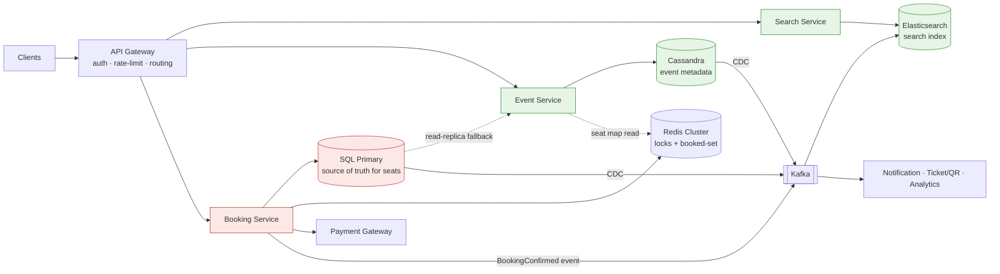
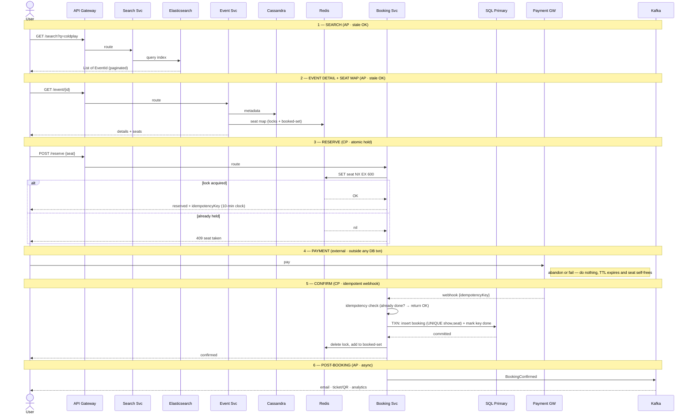

# Ticket Booking Service (BookMyShow / Paytm / District)

*High-Level Design study note · interview answer + the gotchas that separate a first-pass design from a defensible one*

> An online platform where users **search** for events (movies, concerts, sports), **view** event details + seat map, and **book** a seat. The whole design turns on one idea: **browsing is a different world from booking**, and the two must not be built the same way.

---

## 1 · Requirements

**Functional**

- Search an event by title, location, date.
- View event details — description, metadata, seat map.
- Book a seat for an event (pick → hold → pay → confirm).

**Non-functional**

- **Scale:** ~100M DAU.
- **CAP split (the whole design in one line):**
  - **Search / browse → highly available (AP).** A broken search is a broken product; slightly stale data is fine.
  - **Booking → strongly consistent (CP).** One seat, one buyer. A double-booking is a refund, an angry customer, and a bug you can't hide.
- **Read ≫ Write.** Millions browse; a fraction book. Every read-path choice (cache, ES, replicas) exists to serve this skew.

> **The interview framing** — Say up front: *"This system is two consistency regimes bolted together. I'll make the read path AP and the booking path CP, and the interesting engineering is at the seam between them."* That sentence alone signals seniority.

---

## 2 · Back-of-envelope (why the choices are forced)

| Quantity | Assumption / derivation | Result |
|---|---|---|
| Browse reads | 100M DAU, most just browse | ~ read-dominated, 100:1+ vs booking |
| Booking writes | small fraction actually buy | modest, but **contended** (hot shows) |
| Contention shape | 1 blockbuster show, ~10k seats, 1M people | thousands of writes onto a **few hot keys** |

The numbers say two things: (1) the read path must be **cache/index served**, never the booking DB; (2) the write path's problem isn't *volume*, it's **contention on a handful of seats** — which is a concurrency problem, not a throughput problem.

---

## 3 · Core entities & API

**Entities:** `User`, `Event` (Movie / Concert), `Venue` (Hall / Location), `Seat`, `Booking`.

| Endpoint | Purpose | Consistency |
|---|---|---|
| `GET /v1/search?q=&location=&date=` → `List<EventId>` (paginated) | find events | AP |
| `GET /v1/event/{eventId}` → details + `Seat[]` | view + seat map | AP (stale OK) |
| `POST /v1/booking/reserve { showId, seats[] }` → `{ reservationId, idempotencyKey }` | **hold** the seat | CP |
| `POST /v1/booking/confirm { idempotencyKey, paymentRef }` | **commit** after payment | CP |

The **two-phase booking API** (`reserve` then `confirm`) is the single most important API decision — it exists because **payment is slow and external**, and you must never hold a seat inside a live payment call. More in §7–§8.

---

## 4 · Architecture



- **Green = AP world** (search, browse, index). **Red = CP world** (booking, source of truth).
- **Cassandra** holds *event metadata* — venue, artist, description, title. Mostly static, high-read → Cassandra's sweet spot.
- **SQL primary** is the *single owner of seat state*. This is non-negotiable (see §5).
- **Redis** does two jobs: (1) reservation **locks** with TTL, (2) a fast **seat-map cache** (booked-set mirrored from SQL).
- **Kafka** is the async spine: CDC transport (Cassandra/SQL → ES), spike absorption for hot shows, and post-booking fan-out (email/ticket/analytics).

---

## 5 · Gotcha #1 — the dual-write trap (source-of-truth ownership)

**Naive first design:** *"Booking writes seat status to both Cassandra and SQL and keeps them in sync."*

**Why it's wrong:** there is no transaction spanning Cassandra + SQL. A crash between the two writes leaves them **permanently disagreeing**, and now neither is trustworthy. This is the classic **dual-write anti-pattern** — two stores both claimed as truth, with no way to guarantee they agree.

**The fix — one owner per fact:**

| Fact | Owner | Why |
|---|---|---|
| Event metadata (venue, artist, description) | **Cassandra** | static, high-read |
| Seat state (available / booked) | **SQL primary** | volatile, must-be-consistent |
| Search index | **Elasticsearch** | derived, via CDC |
| Reservation holds + seat-map cache | **Redis** | transient / derived |

Seat state lives in **exactly one place: SQL.** Nothing volatile gets replicated into Cassandra. That single rule deletes the entire sync problem.

> **The principle to name out loud:** *Duplicating data is fine when one copy is authoritative and the other is allowed to be wrong. It's dangerous when both must be right for correctness.* A cache is the first case; a dual-write is the second. Same mechanism (write two places), opposite consistency contract.

---

## 6 · The seat map — Redis as a cache, not a truth

The browse read (`GET /event/{id}`) must be fast and must **not** hit the booking DB on the hot path. So:

- **Metadata** → Cassandra.
- **Seat availability** → **Redis** (a cache), where a seat is **unavailable** if *either*:
  1. an **active reservation lock** exists (`seat:{showId}:{seatId}` with TTL), **or**
  2. it's in the **booked-set** (mirrored from SQL on commit).

**You actually have three seat states, not two:**

| State | Where it lives | How it clears |
|---|---|---|
| `AVAILABLE` | absence of lock + not in booked-set | — |
| `RESERVED` (held) | Redis lock **with TTL** | self-heals on TTL expiry — *no cleanup job needed* |
| `BOOKED` (committed) | SQL row → mirrored to Redis booked-set | permanent |

**Nice consequence:** the `RESERVED` state is *already in Redis natively* — it's the same lock from the reserve step. You don't sync it. The **only** thing pushed SQL → Redis is the `BOOKED` state, on payment confirm. So "keep the cache updated" is **one write, on commit** — much smaller than it first looks.

> **Interview pick** — Present it as *"SQL owns seat state; Redis is a read cache plus reservation store, and it's rebuildable from SQL"* — never as *"kept in sync."* The word "sync" is what invites the dual-write follow-up.

---

## 7 · Gotcha #3 — the atomic reservation (the actual concurrency core)

*"Check Redis if the seat is free, then set it"* hides a **race**: two requests both check → both see free → both set. Two people, one seat.

**The fix is one atomic op:**

```
SET seat:{showId}:{seatId} {userId} NX EX 600
```

- `NX` → set **only if absent**. Only one concurrent request wins; the loser gets `nil` → `409 seat taken`, UI refreshes.
- `EX 600` → the 10-minute hold. If the user never pays, the key expires and the seat **self-frees**.

**Two-layer defense (say both):**

1. **Redis `SET NX`** = the *optimization* — fast, absorbs almost all contention without touching SQL.
2. **`UNIQUE(show_id, seat_id)` constraint in SQL** = the *correctness backstop* — if Redis ever loses a key or fails over, the DB **still refuses** the double-booking at commit time.

> Redis makes it *fast*; the DB constraint makes it *correct*. Never rely on the cache for correctness.

---

## 8 · Full request lifecycle — search → confirm



**Step-by-step in words:**

1. **Search** — Gateway → Search → **Elasticsearch**. ES is fed by **CDC** (metadata written to Cassandra → Kafka → ES). *AP: always up, seconds of staleness fine.*
2. **Event detail + seat map** — metadata from **Cassandra**, seat map from **Redis**. *AP: allowed to be stale — truth is enforced at reserve time.*
3. **Reserve** — `SET NX EX 600` on the seat. Returns an **idempotency key**. *CP: the atomic op is the concurrency gate.*
4. **Payment** — user pays via the external gateway, **outside any DB transaction** (payment takes 2–30s; you never hold a SQL lock across it). Abandon/fail → TTL just expires.
5. **Confirm** — gateway fires a **webhook**. Idempotency check → **one SQL transaction** (insert booking, `UNIQUE` guard, mark key processed, commit) → **then** delete the Redis lock and mark the booked-set. *CP: SQL primary + constraint = ground truth.*
6. **Post-booking** — emit `BookingConfirmed` to Kafka → async email / ticket-QR / analytics. *AP: off the critical path.*

---

## 9 · High-demand spikes (the Coldplay / Taylor Swift problem)

1M people hit **one show** at 10:00am — thousands of writes onto a handful of hot seat keys.

**Kafka as the shock absorber:** funnel booking requests into Kafka, **partitioned by seat**, one consumer per partition → they process **in order** (fair FIFO) with natural **backpressure**. The broker eats the spike instead of Redis/SQL.

> **Correction worth internalizing:** Kafka here is **not** what makes booking correct — `SET NX` already does that. Kafka buys **spike absorption + fairness**, at the cost of an **async UX** (user gets *"you're in the queue"* → result via WebSocket, not an instant response).

- **You don't route *all* bookings through Kafka** — in normal times that's just added latency. It's a mode you flip on for hot shows.
- **Alternative:** a **virtual waiting room** — hand out admission tokens at the gate, admit N users/sec into the booking flow. Same goal (throttle admission), simpler mental model. Either answer is defensible; know the trade.

---

## 10 · Failure modes & edge cases (the senior-signal section)

| Scenario | What happens | Why it's safe |
|---|---|---|
| **Redis dies** | Browse falls back to a **SQL read replica** (never the primary); reserve path degrades but `SET NX` returns on Redis recovery | **Degrades performance, never correctness** — the SQL primary + `UNIQUE` constraint still prevent double-booking. Read replicas are themselves slightly stale, which is fine (AP browse). |
| **Every read hits SQL** | This is *why you can't just add stale replicas to a CP store the way you add cache nodes* | You sized SQL for booking writes, not 100M-DAU browse — so you protect the primary and serve browse from replicas/cache |
| **User abandons / payment fails** | Nothing to undo | Redis **TTL expires**, seat self-frees, seat map reflects it (it reads the lock directly) |
| **Webhook retried** | Idempotency key → second call is a no-op returning success | Gateways retry by design; the key is mandatory, not optional |
| **⭐ Payment succeeds but reservation already expired** | Someone else took the seat; the `UNIQUE(show,seat)` constraint **rejects** the insert | Detect the conflict → **auto-refund** (or offer an alternate seat). Money is *never* taken without a seat. |

> **The ⭐ edge case is the sharpest in the whole design.** Volunteer *"payment succeeded but the seat was lost, so I trigger a compensating refund"* unprompted, and you read as someone who has actually shipped a payment flow.

---

## 11 · Gotchas summary — first design → fix

| First-pass idea | Problem | Fix |
|---|---|---|
| Write seat status to **both** Cassandra + SQL, "keep in sync" | Dual-write; no cross-store txn → permanent disagreement | **SQL owns seat state**; Cassandra = metadata only |
| *"A taken seat can never show as available"* | Impossible with async propagation | Browse is **stale-tolerant**; **reserve-time check is authoritative** |
| *"Check then set"* the Redis seat | Race → double-book | Atomic **`SET NX EX`** + **`UNIQUE` DB constraint** |
| Hold seat *through* the payment call | Long-held DB lock, blocks others | **Reserve → pay outside txn → confirm** (two-phase) |
| Kafka *makes booking correct* | It doesn't — `SET NX` does | Kafka = **spike absorption + fairness**, async UX |
| Sync-only confirm | Retried webhooks double-charge | **Idempotency key** on `/confirm` |

---

## 12 · Decision summary — interview pick vs alternatives

| Decision | Interview pick | Alternatives / notes |
|---|---|---|
| Overall shape | Two regimes: **AP browse + CP booking** | one-DB-fits-all (fails at either scale or correctness) |
| Metadata store | **Cassandra** (static, high-read) | any wide-column / doc store |
| Search | **Elasticsearch**, fed by **CDC** | query the primary DB (don't — couples read load to truth) |
| Seat source of truth | **single SQL primary** + `UNIQUE(show,seat)` | dual-write to Cassandra (anti-pattern) |
| Seat-map read | **Redis cache** (locks + booked-set), rebuildable from SQL | read SQL on hot path (bottleneck) |
| Reservation | **`SET NX EX 600`** hold, TTL self-frees | check-then-set (race); explicit cleanup job (unneeded) |
| Booking API | **two-phase reserve → confirm** | single synchronous book (holds lock through payment) |
| Payment safety | **idempotency key** + **compensating refund** on lost seat | trust webhook once (double-charge risk) |
| Spike handling | **Kafka partitioned by seat** or **virtual waiting room** | let 1M requests hit Redis/SQL directly |
| Redis failure | fall back to **read replica**, degrade not break | fall back to primary (melts it) |

---

*Rule of thumb — this problem is won at the **seam between AP and CP**, not inside either half. The read path is easy (cache + index + replicas); the booking path is easy in isolation (`SET NX` + a DB constraint). The senior signal is naming the boundary explicitly and showing that every failure mode **degrades performance without ever compromising correctness** — because a single SQL owner plus a unique constraint is the floor the whole design stands on.*
