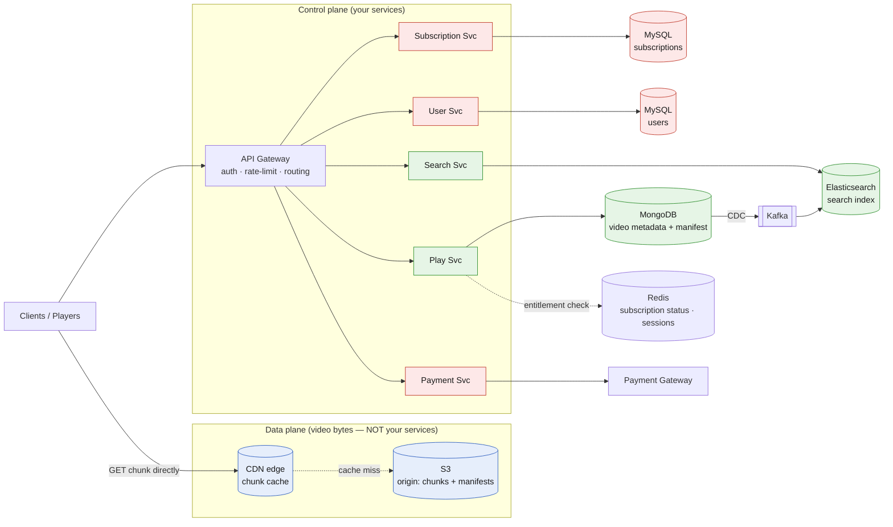
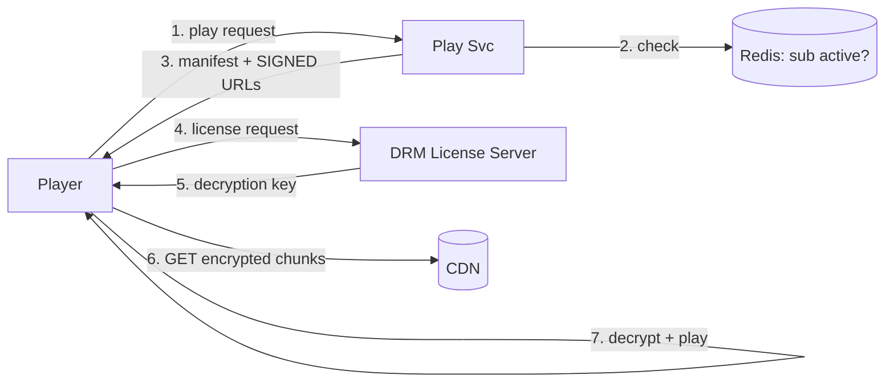
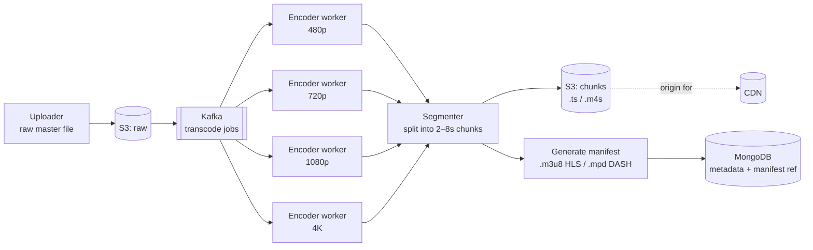
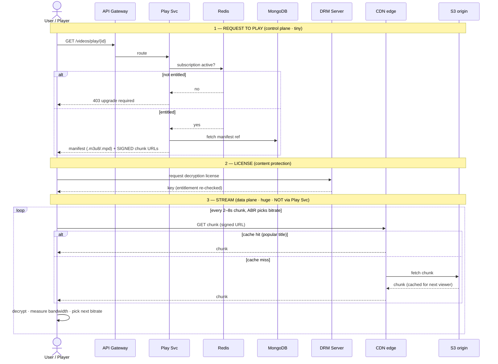
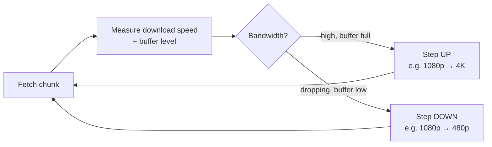

# OTT Platform (Netflix / Prime Video / Hotstar)

*High-Level Design study note · interview answer + the gotchas that separate a first-pass design from a defensible one*

> A service that delivers video (movies, shows) to millions of viewers over the internet. The whole design turns on one idea: **the video bytes never touch your application tier.** Your services move *metadata and permission*; a CDN moves the *pixels*. Get that split right and the rest falls into place.

---

## 1 · Requirements

**Functional**

- User can create an account and buy a **subscription**.
- User can **search** movies/shows by title or name.
- User can **watch** video in multiple resolutions (480p, 720p, 1080p, 4K) with **near-zero buffering**.

**Non-functional**

- **Scale:** ~200M users, ~10k videos (~1 hr each).
- **Scope:** **VOD (video-on-demand), not live.** Say this out loud — live streaming changes the whole ingest path (real-time transcode, low-latency protocols). Bounding scope is a senior move.
- **CAP split (the design in one line):**
  - **Playback / search / browse → highly available (AP).** Stale metadata is fine; a video that won't play is a churned customer.
  - **Subscription / payment → strongly consistent (CP).** Money needs transactions. "AP for everything" is wrong here — separate the two regimes.
- **Read ≫ Write.** Writes are rare (a title uploaded once); reads are enormous (millions streaming). Every read-path choice — CDN, Redis, ES, replicas — exists to serve this skew.

> **The interview framing** — Say up front: *"This is really two systems. A small control plane — accounts, subscriptions, search, 'may this user play this title' — and a massive data plane that is basically a CDN serving pre-chunked video files. The interesting engineering is keeping the video bytes out of my services entirely."* That sentence signals you understand what streaming actually is.

---

## 2 · Back-of-envelope (why the choices are forced)

| Quantity | Assumption / derivation | Result |
|---|---|---|
| **Storage** | 10k videos × 1 hr. Store ~5 renditions (480p→4K). A 1080p hour ≈ 3–4 GB; summing renditions ≈ **~10 GB per title** | **~100 TB** raw — trivially cheap on S3 |
| **Peak bandwidth** | Say 20M concurrent streams × ~5 Mbps avg | **~100 Tbps** egress at peak |
| **The punchline** | Storage is a rounding error; **egress bandwidth is the entire cost and scaling story** | → this is **why a CDN is non-negotiable**, not a nice-to-have |

The numbers force the architecture: you cannot serve 100 Tbps from S3 through your app servers. **The CDN is the system.** Everything else is plumbing around it.

> **Say the bandwidth number out loud.** It's the single calculation that justifies every downstream decision (CDN, edge caching, ABR). Interviewers love watching a requirement become an architecture.

---

## 3 · Core entities & API

**Entities:** `User`, `Subscription`, `Video`, `VideoMetadata` (title, description, thumbnail), `Manifest`.

| Endpoint | Purpose | Consistency |
|---|---|---|
| `POST /v1/user/register` (+ login/logout/update) | account | CP |
| `GET /v1/subscription/plans` → all plans | list plans | AP (cacheable) |
| `POST /v1/subscription { userMeta, planId }` | buy a plan | **CP** (money) |
| `GET /v1/videos/search?q={name}` → `List<VideoId>` (paginated) | search | AP |
| `GET /v1/videos/{videoId}` → metadata (JSON) | detail page | AP (stale OK) |
| `GET /v1/videos/play/{videoId}` → **manifest + signed CDN URLs** | start playback | AP + entitlement gate |

The last endpoint is the one that matters. It does **not** stream video. It returns a **manifest** (the "table of contents" of the video) whose chunk URLs are **short-lived signed CDN links**. The player then fetches chunks *directly from the CDN* — your service is done. More in §5–§6.

---

## 4 · Architecture

- **Green = AP world** (search, playback-metadata). **Red = CP world** (accounts, subscriptions, payment — need transactions). **Blue = data plane** (video bytes, served by CDN, never by your services).
- **MySQL** for users + subscriptions — you need **ACID transactions** for money. **MongoDB** for video metadata — read-heavy, flexible schema, no transactions needed. *Say the "why," not just the "what."*
- **Redis** = fast entitlement lookups ("is this user's subscription active?") + session/"continue watching" position. **Not** a video cache (see §5).
- **CDC (Change Data Capture)** streams metadata changes MongoDB → Kafka → Elasticsearch, so search stays fresh without coupling the search index to the metadata DB.
- **The dotted client→CDN arrow is the whole point:** that's where 100 Tbps flows, and it never enters the green/red boxes.

---

## 5 · Gotcha #1 — video chunks must NEVER flow through your services ⭐

**Naive first design:** *"Play Service checks Redis for the chunk, else fetches from S3 and returns it to the player."*

**Why it's wrong:** you just put your application tier in the path of **100 Tbps of video**. Redis would melt; your Play Service would need to be the size of a CDN. This is the single most common OTT-design mistake — treating video like an API response.

**The fix — separate control plane from data plane:**

| Plane | Carries | Served by | Volume |
|---|---|---|---|
| **Control** | manifest, permission, metadata | Play Svc (a few KB) | tiny |
| **Data** | the actual video chunks | **CDN edge → S3 origin** | enormous |

The player asks your Play Svc **once** for a manifest + signed URLs, then fetches every 2–8s chunk **directly from the CDN**. Your service handles one small request per playback session, not per chunk.

**Where does Redis fit, then?**

- ✅ Redis caches **subscription status** ("can this user play?") — a small, hot key read on every `play` request.
- ✅ Redis holds **session state** — "continue watching" position, current bitrate.
- ❌ Redis does **not** cache video chunks. **The CDN is the chunk cache; S3 is the origin.** There is no Redis layer between them.

> **The principle to name out loud:** *"My services move permission and metadata; the CDN moves pixels."* Put Redis in front of video chunks in an interview and you invite the follow-up that unravels the whole design.

---

## 6 · Gotcha #2 — content protection (the OTT-specific bit people forget)

If chunks live on a CDN and the player fetches them directly, **what stops anyone from copying a chunk URL and downloading the whole movie?** This is the question that separates a generic "video app" answer from an OTT answer. Two layers:

**1 · Signed, expiring CDN URLs (access control)**

The manifest's chunk URLs are **signed tokens that expire in minutes** and are optionally bound to the user's IP/session. A leaked link dies almost immediately. The Play Svc mints these **only after** the entitlement check passes.

**2 · DRM (content encryption)**

Chunks are **encrypted at rest**. The player must fetch a **decryption license/key** from a DRM license server — and only gets it after proving entitlement. The three you name: **Widevine** (Android/Chrome), **PlayReady** (Windows/Edge), **FairPlay** (Apple). Even just naming these signals you know real streaming.

> **Interview pick** — Volunteer *"chunks are DRM-encrypted and served via short-lived signed URLs, gated on an entitlement check"* before you're asked. Unprompted content-protection is a strong senior signal for OTT specifically.

---

## 7 · The upload / transcode pipeline (the write path)

A title is uploaded **once** and processed by a slow, async pipeline **before** anyone can watch it. This is where chunking + multi-bitrate happens.

**Steps in words:**

1. **Upload** raw master → S3.
2. **Fan out transcode jobs via Kafka** — one job per rendition (480p, 720p, 1080p, 4K), processed in parallel by a **worker fleet**. This is CPU-heavy and **slow** — a 1-hr movie into 5 renditions is minutes-to-hours of compute, which is exactly why it's async and off the request path.
3. **Segment** each rendition into **2–8s chunks** (the ABR unit — small enough to switch quality mid-stream).
4. **Generate the manifest** (`.m3u8` for HLS, `.mpd` for DASH) — the index listing every chunk and every available bitrate.
5. **Store** chunks in S3 (the CDN's origin) and the manifest reference in MongoDB. Mark the title **`READY`**.

> **Why Kafka here:** it's a durable job queue that lets the encoder fleet scale independently and absorb upload bursts. The transcode is the one genuinely heavy compute in the whole system — keep it far away from the playback path.

---

## 8 · Playback lifecycle — click → pixels

**The key observation:** steps 1–2 hit your services **once**. Step 3 — the actual watching, thousands of chunk fetches — happens entirely between the **player and the CDN**. Your Play Svc is idle during the movie. *That* is the control/data-plane split working.

---

## 9 · Adaptive Bitrate (ABR) — how buffering hits ~zero

The manifest advertises the **same video at multiple bitrates**. The **player** (not the server) decides which to fetch for each chunk:

- **Chunks are small (2–8s)** precisely so the player can switch quality every few seconds without re-buffering.
- The trade-off you state explicitly: **prioritize continuity over quality.** When the network dips, ABR *degrades resolution* rather than *stalling* — the user sees softer video, never a spinner. That's the non-functional "near-zero buffering" requirement being met by design.
- ABR is **client-side** — the server just offers options in the manifest. Say this; people wrongly assume the server picks.

---

## 10 · The CDN — the actual scaling story

Since bandwidth is the whole cost (§2), the CDN is where the design is won:

- **Popular titles** (the new blockbuster) get **cached at edge locations near users** → most requests never reach S3. Cache **hit ratio** is the metric that matters.
- **Long-tail / cold titles** miss the edge → fetched from **S3 origin**, then cached for the next viewer (see the sequence diagram's cache-miss branch).
- **Real-world flex:** Netflix runs **Open Connect** — its own caching appliances placed *inside ISPs*, so video is served from within the viewer's own network. Naming this shows you know how it's really done.
- S3 is **only the origin** — it serves cache-fills, not viewers. It sees a tiny fraction of total traffic.

> **Interview pick** — "Hot content is edge-cached so ~95%+ of bytes never touch my origin; S3 only handles cache-fill for the long tail." That one line explains how 100 Tbps is even affordable.

---

## 11 · Search via CDC (keeping the read path decoupled)

Search must be fast, fuzzy, and **must not query the metadata DB directly** (that couples search load to your source of truth):

- Video metadata is written to **MongoDB**.
- A **CDC** stream captures every change → **Kafka** → **Elasticsearch**.
- Search Svc queries **only Elasticsearch**.

*AP by design:* the index is allowed to lag by seconds. A newly added title showing up in search a few seconds late is fine; search being down is not.

---

## 12 · Failure modes & edge cases (the senior-signal section)

| Scenario | What happens | Why it's safe |
|---|---|---|
| **CDN edge miss** | Chunk fetched from S3 origin, then cached | First viewer of a cold title pays a small latency cost; everyone after hits the edge |
| **Redis dies** | Entitlement check falls back to the **subscription DB (MySQL)** | Degrades latency on `play`, not correctness — the DB is still the source of truth |
| **Leaked chunk URL** | Signed token expires in minutes; DRM key still required | Even a copied link is useless quickly, and undecryptable without the license |
| **Transcode job fails** | Kafka **redelivers** the job; title stays `PROCESSING`, not `READY` | Users never see a half-encoded title; the pipeline is idempotent and retryable |
| **Network dips mid-stream** | ABR **steps down** resolution | Continuity preserved — quality degrades, playback never stalls (the core NFR) |
| **⭐ Subscription lapses mid-binge** | Signed URLs are short-lived; next manifest/license refresh re-checks entitlement | Access revokes at the **next token refresh**, not instantly — an acceptable, deliberate trade (you don't kill a chunk already in flight) |

> **The ⭐ edge case is worth volunteering:** *"Entitlement isn't checked per chunk — that'd hammer my services. It's checked at manifest/license time, so a lapsed sub loses access at the next refresh, not mid-frame. That's an intentional consistency trade."* Naming a deliberate trade-off reads as senior.

---

## 13 · Gotchas summary — first design → fix

| First-pass idea | Problem | Fix |
|---|---|---|
| Play Svc fetches chunks, Redis caches them before S3 | Puts your app tier in the path of 100 Tbps | **CDN serves chunks; S3 is origin; services never touch video bytes** |
| Chunk URLs are just public S3 links | Anyone copies the URL → free movie | **Signed expiring URLs + DRM encryption + license server** |
| Play Svc starts the video | No permission check → non-subscribers watch | **Entitlement gate (Redis → MySQL) before minting the manifest** |
| Transcode inline / synchronously | It's minutes-to-hours of compute | **Async worker fleet via Kafka, fanned out per rendition** |
| Server picks the bitrate | Server can't know the client's live bandwidth | **ABR is client-side**; manifest just lists options |
| Search queries MongoDB directly | Couples search load to source of truth | **CDC → Kafka → Elasticsearch**, search reads ES only |
| One DB / "AP for everything" | Payment/subscription need transactions | **MySQL (CP) for money, MongoDB (AP) for metadata** |

---

## 14 · Decision summary — interview pick vs alternatives

| Decision | Interview pick | Alternatives / notes |
|---|---|---|
| Overall shape | **Control plane (services) + data plane (CDN)** | serving video through app tier (melts at scale) |
| Chunk delivery | **CDN edge → S3 origin**, client fetches directly | Redis/app-tier in the byte path (the classic mistake) |
| Content protection | **signed URLs + DRM (Widevine/PlayReady/FairPlay)** | public URLs (piracy); DRM-only (hotlinking) |
| Entitlement | **check at manifest/license time** (Redis, MySQL fallback) | per-chunk check (hammers services); no check (freeloaders) |
| Transcode | **async Kafka fan-out, worker fleet per rendition** | inline transcode (blocks, unscalable) |
| Bitrate selection | **client-side ABR**, 2–8s chunks | server-side selection (can't see client bandwidth) |
| Video metadata | **MongoDB** (read-heavy, flexible) | SQL (unneeded rigidity for metadata) |
| Users / subscriptions | **MySQL** (ACID for money) | NoSQL (no transactions → payment bugs) |
| Search | **Elasticsearch fed by CDC** | query metadata DB (couples read load to truth) |
| Streaming protocol | **HLS (.m3u8) / DASH (.mpd)** | progressive download (no ABR, no quality adaptation) |

---

*Rule of thumb — this problem is won by refusing to let video bytes into your services. The control plane (accounts, subscriptions, search, "may this user play this title") is a normal microservices + AP/CP-split system. The data plane is **a CDN with S3 behind it**, protected by signed URLs and DRM, fed by an async transcode pipeline. The senior signal is naming that boundary explicitly, deriving the CDN from the bandwidth math, and treating content protection as a first-class requirement — not an afterthought.*
