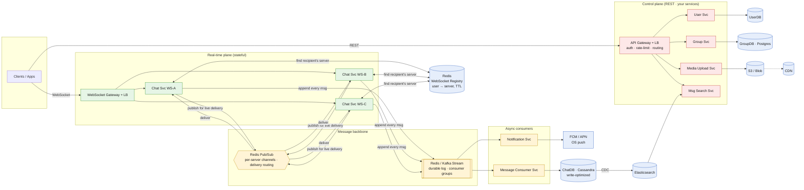
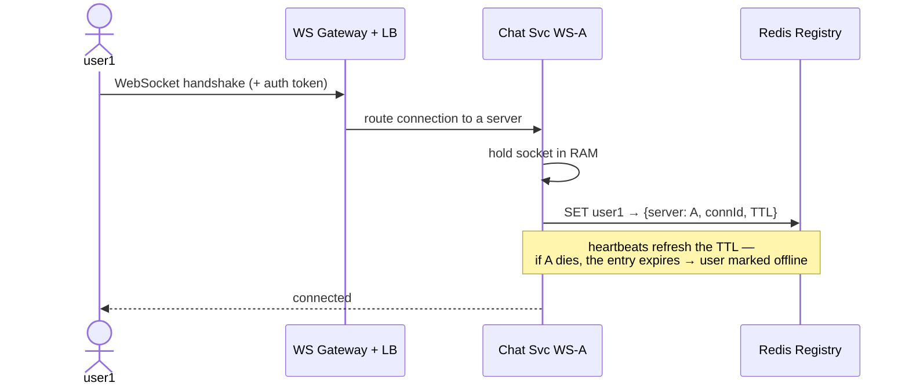
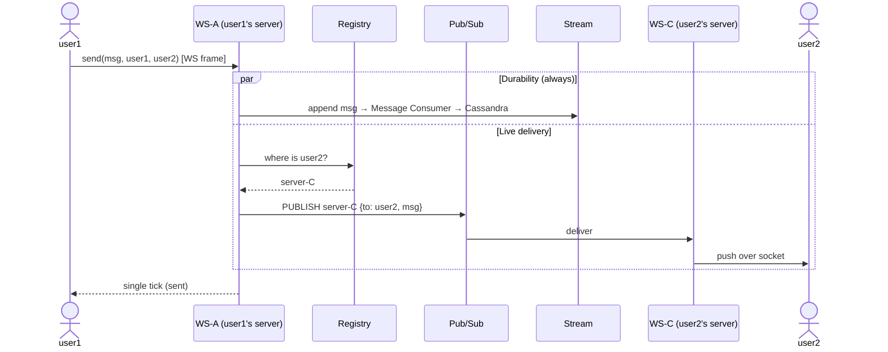
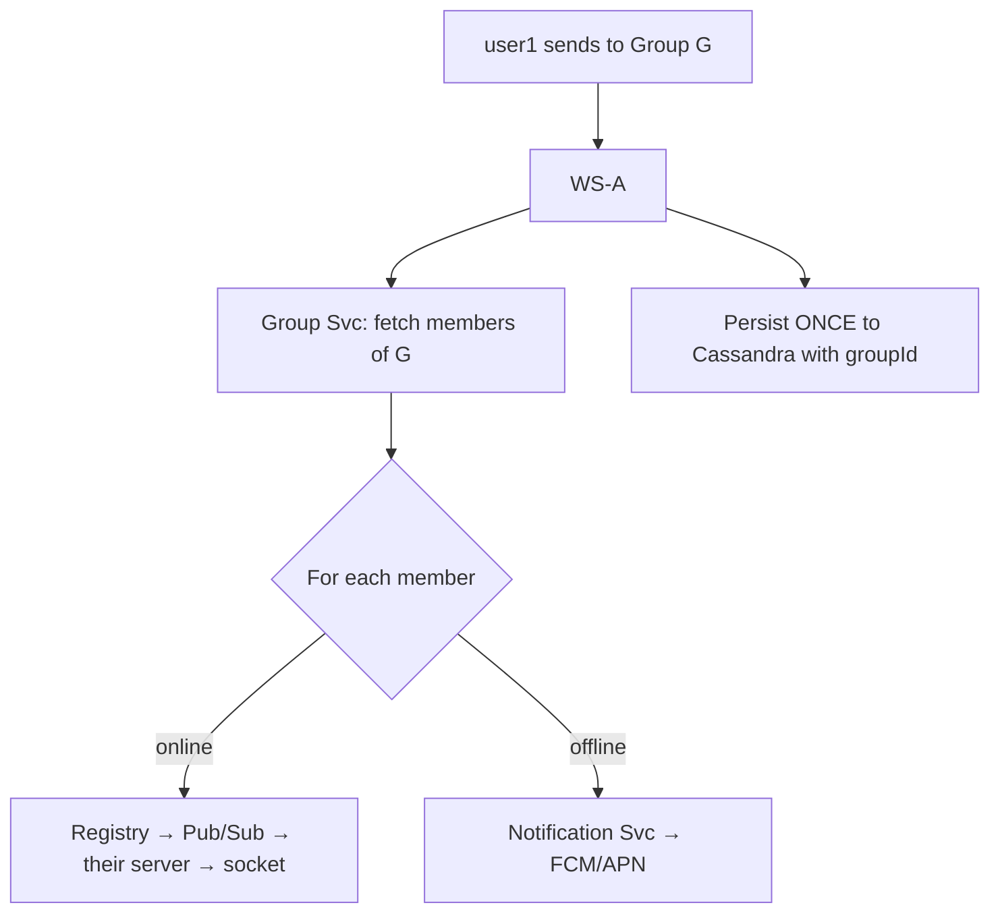

# Real-Time Chat Application (WhatsApp / Messenger / Slack DMs)

*High-Level Design study note · interview answer + the gotchas that separate a first-pass design from a defensible one*

> A service that delivers messages between users in real time, at global scale, with nothing ever lost. The whole design turns on one idea: **a WebSocket only reaches a *running* app, so the system is really two delivery machines bolted together — a live path (WebSocket) for online users and a wake-up path (push notification) for everyone else — sitting on top of one durable log that guarantees no message is ever dropped.** Get that split right and the rest falls into place.

---

## 1 · Requirements

**Functional**

- User can **register / login**.
- **One-to-one messaging** and **group messaging**.
- Support **text and media** (image / video) messages.
- **Message history** (persisted, paginated).
- **Delivery / read receipts** (sent → delivered → read).

**Non-functional**

- **Scale:** ~1B users, ~100 msgs/user/day → **~100B msgs/day**. At ~1 KB/msg that's **~100 TB/day** of writes.
- **CAP split:** **Availability ≫ Consistency.** A chat that won't connect is a dead product; a message arriving a half-second out of order is survivable. Lean AP.
- **Low latency:** **< 300 ms** end-to-end for a live message.
- **Highly reliable — no message loss.** This one NFR is what forces a durable log in the middle (see §6). A "fire it over the socket and hope" design fails here.

> **The interview framing** — Say up front: *"This is two delivery problems, not one. If the recipient's app is open, I have a live WebSocket and I deliver in milliseconds. If it's backgrounded or killed, the socket is gone and only the OS push service (FCM/APN) can wake the device. Underneath both, every message is appended to a durable log first, so 'no message loss' holds regardless of which path delivers it."* That sentence signals you understand what real-time chat actually is.

---

## 2 · Back-of-envelope (why the choices are forced)

| Quantity | Assumption / derivation | Result |
|---|---|---|
| **Write throughput** | 100B msgs/day ÷ 86 400 s | **~1.1M msgs/sec** average, multiples of that at peak |
| **Storage/day** | 100B × ~1 KB | **~100 TB/day** → **~36 PB/yr** |
| **Concurrent connections** | Say 10–20% of 1B online | **100–200M live WebSockets** at once |
| **The punchline** | Millions of writes/sec + hundreds of millions of *stateful, long-lived* connections | → **write-optimized store (Cassandra)** + **horizontally-scaled stateful WS tier** with an external **connection registry** |

The numbers force the architecture: no single server holds 200M sockets (they live in RAM), and no relational DB ingests 1M writes/sec comfortably. **The scaling story is the stateful WebSocket fleet and the write-optimized log.** Everything else is plumbing.

> **Say the connection number out loud.** 200M concurrent sockets is *why* the WS tier is horizontally scaled and *why* you need a registry to find which server holds a given user. Watching a requirement become an architecture is what interviewers reward.

---

## 3 · Core entities & API

**Entities:** `User`, `Group`, `Message` (id, chatId, senderId, receiverId, body, type=text/image/video, timestamp, deliveryStatus), `GroupMembership`.

| Endpoint | Purpose | Notes |
|---|---|---|
| `POST /v1/user/register` (+ login) | account | CP-ish (small) |
| **`WS /v1/messages/send`** | send a message (live) | **the hot path — a WebSocket frame, not REST** |
| `GET /v1/chat/{userId}` → `List<Chat>` (paginated) | 1:1 history | AP, lazy-loaded |
| `GET /v1/message/{userId}/{receiverId}` | conversation detail | AP |
| `POST /v1/groups/create` · `/groups/{id}/add` · `/groups/{id}/remove` | group management | CP for membership |
| `GET /v1/groups/{groupId}/message` | group history | AP, lazy-load |
| `POST /v1/media/upload` → `{ url }` | **media over HTTP, not WS** | returns S3/CDN URL (see §9) |

The one to internalize: **`send` is a WebSocket frame, not a REST call.** Media upload is the opposite — a plain HTTP call that returns a URL, which is *then* sent as a normal message. Keep big bytes off the socket.

---

## 4 · Architecture

- **Red = control plane** (normal REST: accounts, groups, media, search). **Green = real-time plane** (stateful WebSocket servers — the interesting part). **Yellow = the message backbone** (the two-mechanism split, §6). **Blue = data / infra.**
- **WebSocket servers are stateless routers** — the *only* state they hold is the live sockets in RAM. Anything durable lives in Cassandra; anything about "who is where" lives in the Registry.
- **Cassandra (ChatDB)** for messages — chosen for **write throughput** (1M+/sec) and horizontal scale, at the cost of relational features you don't need. **Postgres** for groups — membership needs consistency.
- **The two boxes in the backbone are the whole design** — a **Pub/Sub** for fast live routing and a **durable Stream** for reliability. §6 is about why you need *both*.

---

## 5 · Connection setup — how a socket is born and found

Before any message flows, the connection must exist and be *discoverable by other servers*.

- The socket lives in **RAM on server A only**. It cannot be reached from any other server directly.
- The **WebSocket Registry** (Redis) is the *phone book*: `user → which server holds its socket`. **This is how a message arriving on server A finds user2 who is on server C.**
- **TTL + heartbeats** make the registry self-healing: a crashed server's entries expire, so stale routes don't linger.

---

## 6 · The core mechanism — two paths, one durable log ⭐

This is the heart of the design and the section to nail. Every message does **two independent things**, and it's a mistake to conflate them:

| Plane | Tool | Job | Guarantee it buys |
|---|---|---|---|
| **Delivery** | **Redis Pub/Sub** (per-server channel) | route a live message to the *right server's* socket, right now | **speed** (< 300 ms) — fire-and-forget is OK |
| **Durability** | **Stream + consumer groups** (Redis Streams / Kafka) | persist to Cassandra · trigger notifications · handle receipts | **no message loss** — durable, ack'd, replayable |

**Why both?** Pick one and you lose:

- **Pub/Sub only** → fast, but a crashed/slow consumer drops messages → violates *no message loss*.
- **Stream only** → durable, but log-append + consumer-group overhead sits on the hot delivery path → hurts your < 300 ms latency.

Splitting them means **each path pays only for the guarantee it needs.** Delivery stays lean; durability stays safe.

> **Interview pick** — *"Live delivery routing goes over Pub/Sub per-server-channel; durable persistence goes over a Stream with consumer groups. Pub/Sub buys latency, the Stream buys durability and replay."* That one line reads as senior — it shows you know the two have different guarantees rather than "we use Redis for messaging."

### 6a · Per-server channels (the detail everyone gets wrong)

How does Pub/Sub route? **The channel is keyed by *server id*, not user id.**

| | ❌ Per-user channel (naive) | ✅ Per-server channel |
|---|---|---|
| Channel key | `userId` | `serverId` |
| Subscriptions per server | one per connected user (100k+) | **exactly 1** (its own) |
| Sub/unsub churn | every connect/disconnect | never (fixed at startup) |
| Find the target | publish to user's channel | **registry lookup → publish to that server's channel** |
| Scales to 1B users? | no (millions of channels) | yes |

Each WS server does `SUBSCRIBE server-C` **once, for its whole life**. To deliver to user2: look up user2 in the registry → get `server-C` → `PUBLISH server-C {to: user2, msg}`. Server C receives it, finds user2's socket **locally in RAM**, pushes it down. The routing knowledge lives in the **registry lookup**, not in a fleet of per-user channels.

---

## 7 · Delivery mechanism — case by case

### Case A — 1:1 message, recipient ONLINE

1. Message arrives at user1's server (WS-A) as a WebSocket frame.
2. **Durability branch (always runs):** append to the Stream → **Message Consumer Svc** writes to Cassandra with `deliveryStatus = sent`. This is unconditional — it's what makes history and no-loss hold.
3. **Delivery branch:** registry says user2 is on WS-C → publish to WS-C's channel → WS-C pushes it down user2's live socket.
4. WS-A returns a **single tick** to user1.

> Note the routing: **WS-A cannot send to user2 directly** — it doesn't hold that socket. It *must* go through Pub/Sub to reach WS-C. That's the entire reason the Pub/Sub layer exists.

### Case B — 1:1 message, recipient OFFLINE

1. Message still hits the Stream → **still persisted to Cassandra** (durability never depends on online-ness), stored as undelivered.
2. Registry lookup → user2 has **no active connection**.
3. So the **Notification Svc** (a Stream consumer) fires → calls **FCM / APN** with user2's device push token.
4. The OS **wakes the device and shows a banner** — even though the app isn't running. This is the case a WebSocket physically cannot cover.
5. Message waits in Cassandra as unread until user2 returns (Case E).

### Case C — Delivery & read receipts

1. When WS-C actually delivers to user2's socket, user2's client sends an **ack** back over its own socket.
2. WS-C publishes a **receipt event** into the Stream, on **user1's channel** (the sender).
3. **Message Consumer** persists updated `deliveryStatus` (delivered → read) to Cassandra.
4. The receipt routes back (registry → Pub/Sub → WS-A) to user1's socket → UI updates: single tick → double tick → blue.

Receipts flow through the *exact same machinery*, just in reverse on the sender's channel.

### Case D — Group message (the scaling gotcha)

1. Message hits WS-A → **Group Svc** returns the member list (from GroupDB).
2. Persist **once** with the group/chat id.
3. **Fan out to each member:** online → deliver via Pub/Sub (Case A); offline → FCM/APN (Case B).

> **⚠️ This is the weak spot to defend.** Naive per-member iteration is **fan-out amplification** — 1 message → N deliveries. For large groups: **batch by server** (all recipients on WS-C → one publish to WS-C carrying the member list) and/or offload the fan-out to a **dedicated worker** instead of doing it inline on the WS server. Also state **ordering**: everyone must see the same order → a **per-group partition key on (groupId, timestamp)** in Cassandra keeps it consistent. Saying this unprompted is a strong senior signal.

### Case E — Reconnect / offline catch-up

1. user2 comes back → socket reconnects → registry updated to the new server.
2. Client calls **`GET /v1/chat/{userId}`** (paginated) → pulls everything stored while offline from Cassandra.
3. Client sends delivery receipts for that batch (Case C).

This is *why* durability (Case A, branch 2) had to be unconditional — catch-up is only possible because every message was durably written whether or not it was delivered live.

---

## 8 · Why FCM/APN when we already have WebSockets? ⭐

The single most common confusion — and it looks redundant until you see it:

- A WebSocket lives **inside your app's process, in RAM**. On mobile that process is **not guaranteed to run**: swipe it away → killed; background it → the OS suspends/kills it (iOS especially, Android Doze). Screen locked → no live socket.
- So the WS path only works while the **app is actively running with a live connection**.
- **FCM (Android) / APN (iOS) are OS-level services.** The OS keeps **one** privileged, battery-optimized connection to Google/Apple for *all* apps and can **wake a device even when your app is dead**. Your app cannot do this; the OS can.

| Situation | Delivery path |
|---|---|
| Recipient's app open, socket alive | **WebSocket** (real-time, in-chat) |
| App backgrounded / killed / phone locked | **FCM / APN** (wakes device, shows banner) |

> **The principle:** *"WebSocket = talk to a running app; FCM/APN = wake a sleeping or dead app."* They're not redundant — they cover disjoint device states. **Fire FCM/APN only on the offline branch** (registry shows no live socket); firing both double-notifies, which is the classic bug.

---

## 9 · Media messages

- Media does **not** go over the WebSocket. Client does a plain **HTTP** `POST /v1/media/upload` → **Media Upload Svc** → stores the blob in **S3** → returns a **URL**.
- Only the **URL + metadata** (type = image/video) travels as a normal message through §7's flow.
- Recipient receives the URL → the client downloads the media, ideally via a **CDN** in front of S3 for fast global fetch.

Separation of concerns: **big bytes over HTTP/S3/CDN, small routing frames over WS.** Putting a 10 MB video through the message pipeline would wreck latency for everyone.

---

## 10 · Search via CDC (keeping the write path fast)

- **Cassandra** is a great write log but poor at full-text search.
- So **CDC (Change Data Capture)** streams message changes Cassandra → **Elasticsearch**, kept continuously in sync.
- **Msg Search Svc** queries **only Elasticsearch** — never the write DB.

*AP by design:* the index may lag a few seconds. A message appearing in search slightly late is fine; search coupling to (and slowing) the hot write path is not.

---

## 11 · Failure modes & edge cases (the senior-signal section)

| Scenario | What happens | Why it's safe |
|---|---|---|
| **WS server dies with 100k live sockets** | Its registry entries **expire (TTL)**; clients auto-reconnect through the LB to a new server and re-register | Sockets are ephemeral by design; nothing durable was on that server — messages live in Cassandra |
| **Pub/Sub message missed** (fire-and-forget) | Live delivery is lost, but the message is **already in the Stream → Cassandra** | Recipient gets it on reconnect (Case E); no-loss NFR holds |
| **Stream consumer falls behind / crashes** | Consumer group **replays** un-acked messages on restart | Durable log + acks mean persistence/notification catch up without loss |
| **Recipient offline** | Persisted + FCM/APN push | Covered by §8 — WS can't reach a dead app, push can |
| **Duplicate delivery** (retry after missed ack) | Client dedupes by **messageId** (idempotent) | Messages carry a stable id; at-least-once + dedupe = effectively once |
| **⭐ Out-of-order arrival** | Client reorders by **(timestamp / sequence)** per chat | AP system tolerates it; ordering is enforced at read, and per-partition in Cassandra for groups |
| **Group fan-out to a huge group** | Batch-by-server + dedicated fan-out worker | Avoids amplification melting the WS tier (Case D) |

> **The ⭐ edge case is worth volunteering:** *"I don't rely on the network for ordering. Each message carries a per-chat sequence/timestamp and the client orders on read. In an AP system that's the honest trade — availability over strict global ordering."* Naming a deliberate trade-off reads as senior.

### 11a · Walkthrough — a WS server dies with 100k live sockets ⭐

The classic probe. Answer it as a timeline and it ties the whole design together:

- **What's lost:** *only the sockets in RAM* — WS servers are stateless routers. Messages are already in Cassandra; routing (user→server) is in the registry. A crash loses connection endpoints, **never data**.
- **Clients detect it fast** (broken TCP / missed heartbeat) and start reconnecting; the LB health-check pulls the dead server out so no one is routed back to it.
- **The stale-registry gap:** until the dead server's entries **expire (TTL)**, the registry still says `user2 → WS-C`, so a sender publishes to WS-C's channel and **that live delivery is lost** (Pub/Sub is fire-and-forget). **But the message was already persisted** on the durability branch → this is exactly the case that split was built for.
- **Recovery:** clients reconnect through the LB to a **surviving server**, which **re-registers** them (registry self-heals). Catch-up (`GET /v1/chat/{userId}`, Case E) pulls anything missed during the gap **from Cassandra** → delivered now.
- **Sender-side:** if the *sender* was on the dead server, its last message got no ack → client **resends** → **`messageId` dedupe** makes it a no-op (at-least-once + idempotency ≈ effectively-once).
- **Thundering herd:** 100k simultaneous reconnects → **exponential backoff + jitter** spreads them; keep fleet **headroom** to absorb a redistributed server's load.

> **One line:** *"A crash loses only ephemeral sockets, never data. Clients reconnect (backoff+jitter) to a surviving server, the stale registry entry self-heals on TTL, messages sent during the gap lost live delivery but were durably persisted so they arrive on reconnect, and idempotent messageId dedupe covers resends. Net: brief delay, zero loss."* That answer alone demonstrates statelessness, the registry TTL, the Pub/Sub-vs-Stream split, catch-up, and idempotency all holding together under failure.

---

## 12 · Gotchas summary — first design → fix

| First-pass idea | Problem | Fix |
|---|---|---|
| Send over WS and forget it | A dropped socket = lost message → violates no-loss | **Append to a durable Stream first**; WS/Pub-Sub is only the live path |
| One channel per user in Pub/Sub | Millions of channels + constant sub/unsub churn | **Per-server channels** (one sub per server) + **registry lookup** to route |
| WS-A sends straight to user2 | user2's socket is on WS-C, not WS-A | **Registry → publish to the recipient's server channel** |
| "We have WebSockets, why notifications?" | WS can't reach a backgrounded/killed app | **FCM/APN wakes the device**; fire only on the offline branch |
| Media through the message pipeline | 10 MB over the socket wrecks latency | **HTTP upload → S3/CDN → send only the URL** |
| Group = loop-send to every member inline | Fan-out amplification melts the WS tier | **Batch by server + dedicated fan-out worker**; order via partition key |
| One DB for everything | 1M writes/sec + search + membership don't share a store | **Cassandra (messages) · Postgres (groups) · ES (search via CDC)** |
| Search queries the message DB | Couples/ slows the hot write path | **CDC → Elasticsearch**, search reads ES only |

---

## 13 · Decision summary — interview pick vs alternatives

| Decision | Interview pick | Alternatives / notes |
|---|---|---|
| Overall shape | **Control plane (REST) + real-time plane (stateful WS) + durable backbone** | one monolith serving everything (can't scale sockets or writes) |
| Live transport | **WebSocket** (persistent, bidirectional) | long-polling / SSE (higher latency, one-way, wasteful) |
| Finding a user's server | **Redis WebSocket Registry** (user→server, TTL) | broadcast to all servers (N× waste) |
| Live routing | **Pub/Sub per-server channels** | per-user channels (millions of channels, churn) |
| Reliability | **durable Stream + consumer groups** (Kafka / Redis Streams) | rely on Pub/Sub alone (loses messages) |
| Why both Pub/Sub + Stream | **latency path vs durability path — different guarantees** | one tool for both (loses latency *or* durability) |
| Offline delivery | **FCM / APN OS push** | keep retrying the socket (app is dead — impossible) |
| Message store | **Cassandra** (write-optimized, horizontal) | SQL (can't take 1M writes/sec) |
| Group membership | **Postgres** (needs consistency) | eventual-consistent store (membership bugs) |
| Media | **HTTP → S3/CDN, send URL** | bytes over WS (latency disaster) |
| Search | **Elasticsearch fed by CDC** | query Cassandra (slow, couples write path) |
| Ordering / dedupe | **per-chat seq/timestamp + messageId dedupe (client)** | trust network order (breaks under retries/AP) |

---

*Rule of thumb — this problem is won by refusing to treat "send a message" as one action. It's **(1) append durably, (2) deliver live if you can, (3) wake the device if you can't** — three steps with three different guarantees. The control plane (accounts, groups, media, search) is a normal AP microservices system. The real engineering is the **stateful WebSocket fleet + registry** (finding where a user is), the **Pub/Sub-vs-Stream split** (latency vs no-loss), and knowing **why FCM/APN exists at all** (WebSockets can't reach a dead app). Naming those three boundaries explicitly, deriving the WS fleet from the 200M-connection math, and treating no-message-loss as a first-class constraint — not an afterthought — is the senior signal.*
