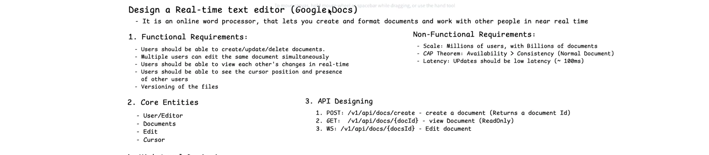
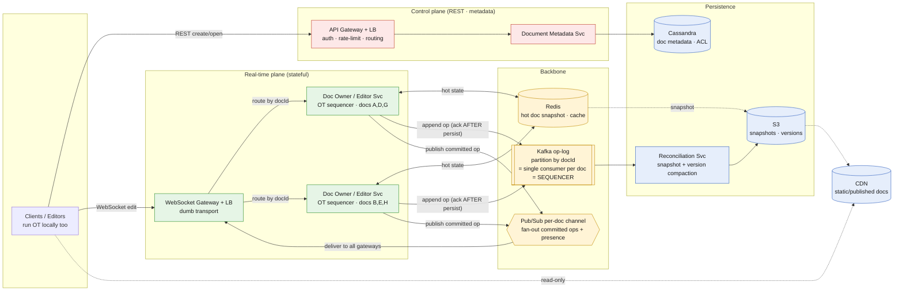
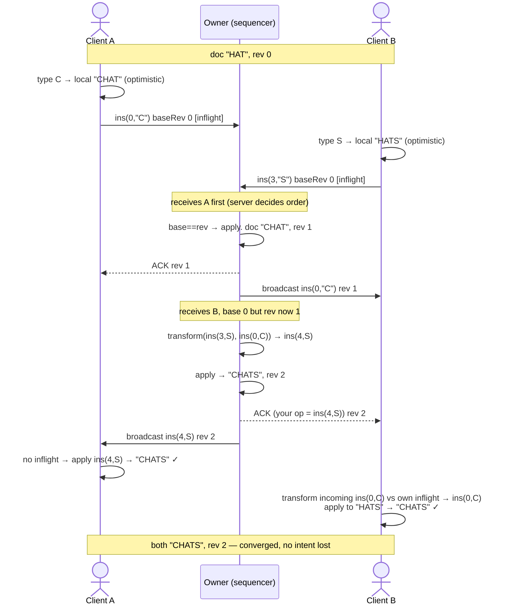
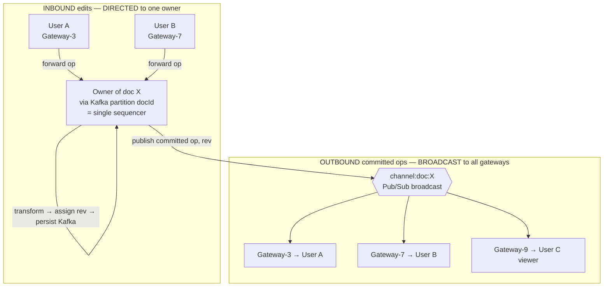
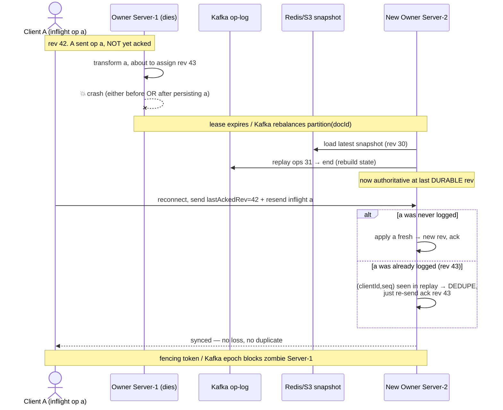

# Real-Time Collaborative Editor (Google Docs / Notion / Word Online)

*High-Level Design study note · interview answer + the gotchas that separate a first-pass design from a defensible one*

> An online word processor where **many people edit the same document at the same time** and every keystroke shows up on everyone else's screen in ~100 ms — without their edits clobbering each other. The whole design turns on one idea: **concurrent edits to one document must be funneled through a single per-document sequencer (Operational Transformation), so ordering is centralized while delivery is distributed.** Get that split right — one owner per doc for *order*, broadcast fan-out for *delivery*, and a durable op-log as the source of truth — and everything else is plumbing.

---

## My whiteboard

Requirements, entities and API:



High-level architecture:


The rest of this note is the cleaned-up version + the gotchas that separate a first-pass design from a defensible one.

---

## 1 · Requirements

**Functional**

- Users can **create / update / delete** documents.
- **Multiple users edit the same document simultaneously.**
- Users **see each other's changes in real time.**
- Users **see other users' cursor position and presence.**
- **Versioning** of documents (history, restore).

**Non-functional**

- **Scale:** millions of users, billions of documents.
- **CAP split:** **Availability > Consistency** at the *system* level (a doc that won't open is a dead product) — **but each document's operation stream needs strong, total ordering** (one sequencer). So: globally AP, per-document strongly-ordered. Name this nuance out loud.
- **Latency:** edits should propagate with **low latency (~100 ms)**.
- **No lost edits, no divergence:** two people editing the same word must converge to one consistent document on every screen.

> **The interview framing** — Say up front: *"The hard part isn't CRUD or WebSockets — it's conflict resolution. If two users edit the same word concurrently, I need every client to converge to the same result. I'll use Operational Transformation with a single sequencer per document: all edits for a doc funnel to one owner that assigns a total order, and I fan the ordered ops back out. Ordering is centralized; delivery is distributed. Underneath, every op is appended to a durable log, so state = snapshot + replay and failover never loses an edit."* That sentence signals you know what this problem actually is.

---

## 2 · Back-of-envelope (why the choices are forced)

| Quantity | Assumption / derivation | Result |
|---|---|---|
| **Per-doc edit rate** | Humans type ~5–10 chars/sec; even 50 concurrent editors on one doc | **~250–500 ops/sec** for that document |
| **Single-sequencer capacity** | OT transform = array-position math, in memory | **tens of thousands of ops/sec on one core** |
| **The punchline** | One doc's edit rate (hundreds/sec) ≪ one sequencer's capacity (10k+/sec) | **a single owner per doc is never the bottleneck** — and it *has* to be single for OT |
| **System-wide scale** | billions of docs | **shard ownership across the fleet** — each server owns a *subset* of docs |

The numbers force the architecture in a counter-intuitive way: you **cannot** parallelize the sequencing of *one* document (that's the whole point of OT), but you don't need to — one doc's traffic is bounded by human fingers. What scales the system is **sharding documents across owners**, not splitting a single document.

> **Say the bounded-rate insight out loud.** The common wrong instinct is "millions of edits will melt the server." They won't hit *one* server — ownership is sharded by docId, and any single doc's rate is capped by how fast humans type. Watching a requirement (bounded per-doc rate) justify an architecture (single sequencer per doc, sharded across the fleet) is what interviewers reward.

---

## 3 · Core entities & API

**Entities:** `User/Editor`, `Document` (id, title, ownerId, ACL, createdTime, lastModified), `Operation` (documentId, revision, clientId, seq, type=insert/delete, pos, char, timestamp), `Cursor/Presence` (docId, userId, position — *ephemeral*), `Version` (docId, versionId, snapshot ref).

| Endpoint | Purpose | Notes |
|---|---|---|
| `POST /v1/api/docs/create` → `{docId}` | create a document | metadata plane, low-throughput |
| `GET /v1/api/docs/{docId}` | view document (read-only) | AP; can be CDN-served if static |
| **`WS /v1/api/docs/{docId}`** | **edit document (live)** | **the hot path — a WebSocket, not REST** |
| `GET /v1/api/docs/{docId}/versions` | version history | metadata plane |

The one to internalize: **editing is a WebSocket, not a REST call.** Create/rename/delete/share are ordinary REST on the metadata plane. Big-throughput logic lives entirely on the WS/OT path.

---

## 4 · Architecture



- **Red = control plane** (normal REST metadata — no Kafka needed here, it's low-throughput). **Green = real-time plane** (the stateful per-doc OT sequencers — the interesting part). **Yellow = backbone** (the op-log that *is* the sequencer + the fan-out bus + hot cache). **Blue = persistence.**
- **One document → exactly one owner** (its OT sequencer). **The fleet holds many owners, each owning a different subset of docs.** Both facts coexist: per-doc single sequencer (OT requirement) + load spread across docs (scale).
- **Kafka partitioned by docId gives you the sequencer for free** — Kafka guarantees one consumer per partition, so the consumer of `partition(docId)` *is* the single ordered processor for that doc. No separate leader election needed.
- **The op-log (Kafka) is the source of truth**, not Redis. Redis is a hot cache for fast joins/rebuilds. Doc state = snapshot + replay of ops since.

---

## 5 · The core mechanism — Operational Transformation ⭐

This is the heart of the design. Two algorithms exist for concurrent editing:

| | **OT (Operational Transformation)** | **CRDT** |
|---|---|---|
| Model | central **sequencer** transforms ops into a total order | order-independent data types merge peer-to-peer |
| Needs a server? | yes — a single sequencer per doc | no (works P2P), but heavier metadata per char |
| Used by | **Google Docs** (the *Jupiter* algorithm) | Figma, Yjs, Automerge |
| Interview pick here | **OT** — matches Google Docs, simpler to reason about with a server | valid alternative; mention the trade |

**We pick OT** (Google uses it). The primitive is the **transform function**:

```
transform(opX, opY) → opX'
```

*"opX was written on a document that didn't include opY. Rewrite it so it applies correctly after opY."* The correctness guarantee (**TP1 / convergence**):

> `apply(apply(doc, opY), transform(opX, opY)) == apply(apply(doc, opX), transform(opY, opX))`

i.e. **order doesn't matter — both sides converge.** The rule for the common insert/insert case is just position math: *an edit before you shifts your position; an edit after you doesn't.*

| Incoming op | vs op transformed against | Result |
|---|---|---|
| `ins(p1,c)` | `ins(p2,_)`, `p2 < p1` | `ins(p1+1,c)` — shift right |
| `ins(p1,c)` | `ins(p2,_)`, `p2 > p1` | `ins(p1,c)` — unchanged |
| `ins(p1,c)` | `ins(p2,_)`, `p2 == p1` | **tie-break by clientId** (see gotcha) |
| `ins(p1,c)` | `del(p2)`, `p2 < p1` | `ins(p1-1,c)` — shift left |

### 5a · The client-server (Jupiter) model — why it's tractable

Google Docs does **not** do symmetric N-way OT. It uses **Jupiter**: a **single server as the serialization point**, so every relationship is just *one client ↔ the server*. This collapses the hard N-way problem into many simple 2-way transforms. Bookkeeping:

- **Server (owner):** authoritative doc + a monotonic `revision`.
- **Client:** `lastAckedRev`, an **inflight** op (sent, unacked), and a **buffer** of ops typed since. Every op carries the **`baseRevision`** it was written against, plus a unique **`(clientId, seq)`** id.

Three rules run everything:
1. **Client applies its own edit locally *immediately*** (optimistic → instant, meets ~100 ms; network off the critical path).
2. **Server transforms** a late op against every op accepted since its `baseRevision`, assigns the next `revision`.
3. **Client transforms** an incoming remote op against its own inflight/buffered op before applying.

---

## 6 · Trace — two clients editing the same word converge ⭐

**Initial:** doc `"HAT"`, server `rev=0`. Both clients loaded at rev 0.
**A** wants `"CHAT"` → `ins(0,"C")`. **B** wants `"HATS"` → `ins(3,"S")`. Concurrent, both at base 0.



The naive (no-transform) bug: B's raw `ins(3,"S")` on `"CHAT"` → `"CHAST"`. That misplaced S is exactly what OT kills.

> **The gotcha they'll ask:** *"What if both insert at the same position?"* Without a rule you get `"AB"` on one client and `"BA"` on the other — permanent divergence. Fix: a **deterministic tie-break** — attach `clientId` to each op and, on a position tie, order by it. Both sides make the same choice. (In the pure server model it's even simpler: whichever op the server accepts *first* gets the lower position; the second is transformed to `p+1`.)

---

## 7 · Users on different servers — ordering vs delivery ⭐

Users A and B editing one doc may be connected to **different WS gateways**. The resolution is one principle worth memorizing:

> **Ordering must be centralized per doc. Delivery can be distributed.**

Two *different* directions of traffic, two *different* mechanisms — even though both key on `docId`.



- **Inbound = directed to the one owner.** All edits for doc X funnel to the single sequencer (Kafka `partition(docId)` guarantees one consumer). This preserves the total order OT needs. **This cannot be pub/sub** — pub/sub broadcasts to *all* servers, giving N independent sequencers → divergence.
- **Outbound = broadcast** via the per-doc pub/sub channel. Safe because committed ops already carry revision numbers → clients **buffer and apply rev N only after N-1**, self-correcting even if delivery is slightly out of order.

> **Why the same key but two mechanisms:** the property that must differ is *how many consumers act on each message.* Inbound: **exactly one** (the sequencer). Outbound: **all**. A single pub/sub channel gives "many receive" — perfect outbound, fatal inbound.

**Kafka gives you the owner for free:** a topic partitioned by docId with a consumer group where one consumer owns each partition — Kafka's partition assignment *is* your ownership/leader election. (Trade-off: Kafka in the synchronous keystroke path adds a hop against the 100 ms budget. If tail latency bites, move Kafka to an **async side-channel** — edits go direct to the partition owner over fast RPC, owner broadcasts immediately, then persists to Kafka async. Then you need consistent-hashing/lease for ownership instead. Both are valid.)

---

## 8 · Presence & cursors — the separate lane

Cursor position and "who's online" are an **explicit requirement** but a *different traffic class*: high-frequency, **ephemeral, order-independent, broadcast-only**.

- They **skip the sequencer entirely** — a cursor at position 12 needs no transforming.
- They ride the **pub/sub backplane directly**, fire-and-forget. **Never** written to Kafka/Cassandra.
- This keeps the sequencer free for real edits and avoids persisting throwaway data.

> Showing that edits go through the owner but presence bypasses it proves you understand *why* the owner exists (ordering), not just that it's there.

---

## 9 · Persistence & versioning

- **Every committed op → Kafka op-log** (partitioned by docId). This is the durable **source of truth**. Doc state = snapshot + replay.
- **Snapshots** taken periodically (every N ops, or on autosave interval) → Redis (hot) + **S3** (durable). *Not a full-doc blob every 10 s* — a snapshot plus the op delta. Storing an entire copy every few seconds is the wasteful first-pass instinct.
- **Reconciliation Svc** compacts many fine-grained versions into fewer named versions in S3 — **offline, off the hot path** (space optimization only).
- A **version** = a snapshot reference + the ops between it and the next. Restore = load snapshot, replay to the target revision.

> **Why the op-log is truth, not Redis:** Redis is in-memory — calling it "canonical" means data loss on a node failure. The durable, replayable log is what makes failover (§10) and version history correct. Redis is the *cache* that makes joins and rebuilds fast.

---

## 10 · Owner failover mid-edit ⭐ (the senior-signal section)

The failure case that ties everything together: a client has an **inflight op** when the owner dies. Two mechanisms make it safe.

> **Rule 1 — ack-after-persist:** the owner acks the client only *after* the op is durable in Kafka. ⇒ **acked ⇒ durable**, **unacked ⇒ client still holds it ⇒ will resend.**
> **Rule 2 — idempotency:** every op carries `(clientId, seq)`, so a resend of something already applied is deduped, not double-applied.

Together: **exactly-once effect over an at-least-once channel.**



1. **Detection & election** — lease TTL expires (etcd/ZK) or **Kafka consumer-group rebalance** reassigns `partition(docId)` to Server-2. Gateways/sockets survive; clients just see acks stop.
2. **Rebuild** — Server-2 loads **snapshot + replays Kafka**. (Why the op-log is truth.)
3. **Resync** — clients send `lastAckedRev`; owner ships everything after it. B (no inflight) just catches up.
4. **Resend** — A resends its unacked `a`. Never-logged ⇒ applied fresh; already-logged ⇒ **deduped by `(clientId, seq)`**.
5. **Meanwhile clients kept typing** (optimistic, stacking inflight+buffer) → **no keystrokes lost**, replayed in order on reconnect.
6. **Split-brain guard** — a partitioned (not dead) Server-1 can't corrupt the log: the new owner holds a higher **fencing token / Kafka epoch**, and stale-epoch writes are rejected (automatic on Kafka rebalance).

> **One line:** *"Failover is safe because I ack only after persisting to the op-log, rebuild the new owner from snapshot + replay, and make ops idempotent via (clientId, seq) so clients safely resend anything unacked. Fencing tokens stop a partitioned old owner from split-braining. Net: brief reconnect pause, zero loss, no divergence."*

---

## 11 · Failure modes & edge cases

| Scenario | What happens | Why it's safe |
|---|---|---|
| **Owner server dies mid-edit** | lease/rebalance → new owner rebuilds from snapshot+replay | op-log is durable; ack-after-persist + idempotent resend ⇒ no loss (§10) |
| **Two inserts at same position** | deterministic tie-break by `clientId` (or server-accept order) | both clients make the same choice → converge |
| **Pub/sub op delivered out of order** | client buffers, applies rev N only after N-1 | revision numbers stamp the order into each message |
| **Kafka hop threatens 100 ms** | move Kafka to async side-channel; edits go direct to owner | broadcast immediately, persist async — latency path vs durability path |
| **Duplicate op after resend** | owner dedupes by `(clientId, seq)` | at-least-once + idempotency ≈ exactly-once |
| **Split-brain (old owner partitioned, not dead)** | fencing token / Kafka epoch rejects stale writes | only one owner can commit to the partition |
| **Viral doc — 10k people** | cap concurrent **editors** (~100); rest become **read-only viewers** | viewers served by fan-out/CDN, never the sequencer → owner load stays bounded |
| **New user joins active doc** | serve hot snapshot from Redis + current rev, then stream ops | fast join without hitting S3; cold doc = snapshot+replay |

> **The viral-doc answer is worth volunteering:** *"A single doc can't overload its owner, because editors are capped and everyone beyond the cap is demoted to a read-only viewer served off the fan-out/CDN path — the sequencer only ever processes bounded editor traffic."*

---

## 12 · Gotchas summary — first design → fix

| First-pass idea | Problem | Fix |
|---|---|---|
| "All writes go to Redis" = conflict resolution | Redis isn't a sequencer; no ordering ⇒ divergence | **One OT sequencer per doc** (Kafka partition owner) assigns a total order |
| Redis is the canonical copy | In-memory ⇒ data loss on failure | **Op-log (Kafka) is truth**; Redis is a hot cache; state = snapshot+replay |
| Kafka in front of the **metadata** service | Create/rename/delete are rare — over-engineering | Metadata writes go **straight to Cassandra**; buffering belongs on the *edit* path |
| Pub/sub the inbound edits to all servers | N independent sequencers → divergence | **Inbound directed to one owner**; only *outbound* is broadcast |
| One doc split across servers for scale | OT needs a single sequencer | **One doc = one owner**; scale by **sharding docs across the fleet** |
| Full-doc copy to S3 every 10 s | Wasteful; contradicts versioning goal | **Snapshot + op-delta**; compact versions offline in Reconciliation |
| Presence/cursors through Kafka+DB | Persisting throwaway, high-freq data | **Ephemeral pub/sub lane**, fire-and-forget, skip the sequencer |
| CDN for live-edited docs | Serves stale content | **CDN only for static/published** docs; live viewers use fan-out |
| Client resends after crash, no id | Double-applied edits | **`(clientId, seq)` idempotency** + **ack-after-persist** |

---

## 13 · Decision summary — interview pick vs alternatives

| Decision | Interview pick | Alternatives / notes |
|---|---|---|
| Overall shape | **Metadata plane (REST) + real-time plane (stateful OT owners) + durable op-log** | one service for everything (can't scale edits or ordering) |
| Conflict resolution | **OT (Jupiter, client-server)** — matches Google Docs | CRDT (Figma/Yjs) — P2P-capable, heavier per-char metadata |
| Sequencer per doc | **Kafka partition(docId) = one consumer = owner** | consistent-hash + lease (needed if Kafka moved off hot path) |
| Ordering vs delivery | **inbound directed to owner; outbound broadcast pub/sub** | one channel for both (divergence or no fan-out) |
| Source of truth | **Kafka op-log** (state = snapshot + replay) | Redis-as-canonical (loses data on failure) |
| Hot doc state | **Redis snapshot cache** | rebuild from S3 every join (slow) |
| Versions | **snapshots + offline compaction** | full-doc copy per interval (wasteful) |
| Metadata store | **Cassandra** (write-scalable, AP) | SQL (fine at small scale; watch access patterns) |
| Presence / cursors | **ephemeral pub/sub, no persistence** | route through op-log (wasteful, over-ordered) |
| Failover safety | **ack-after-persist + `(clientId,seq)` idempotency + fencing** | fire-and-forget owner (loses inflight edits) |
| Latency tuning | **Kafka async side-channel if 100 ms threatened** | Kafka synchronous in keystroke path (extra hop) |
| Read-only / viral | **cap editors; viewers via fan-out/CDN** | let everyone hit the sequencer (bounded but wasteful) |

---

*Rule of thumb — this problem is won by refusing to treat "merge concurrent edits" as magic. It's **(1) funnel every edit for a doc to one sequencer** (OT needs a total order; Kafka's partition-per-doc gives it for free), **(2) transform + revision-number each op and broadcast it back** (ordering centralized, delivery distributed), and **(3) treat the op-log as truth** so versioning and failover are just snapshot + replay. The metadata side (create/share/list) is a normal AP microservice. The real engineering is the **single-sequencer-per-doc model** (and why one doc can't be split, yet the fleet still scales by sharding docs), the **inbound-directed / outbound-broadcast asymmetry**, and **failover without loss or duplicates** (ack-after-persist + idempotency + fencing). Naming those three boundaries explicitly — and stating the AP-globally / strongly-ordered-per-doc nuance — is the senior signal.*
