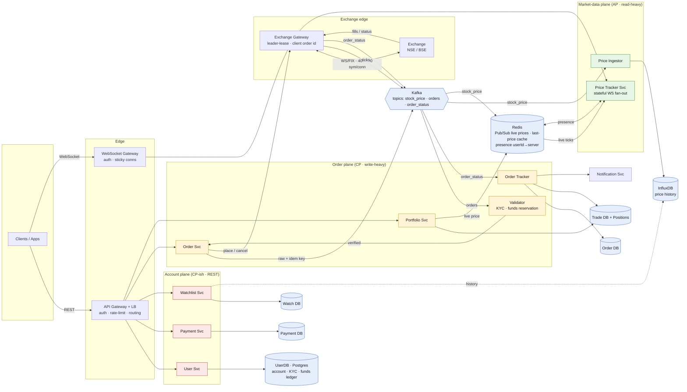
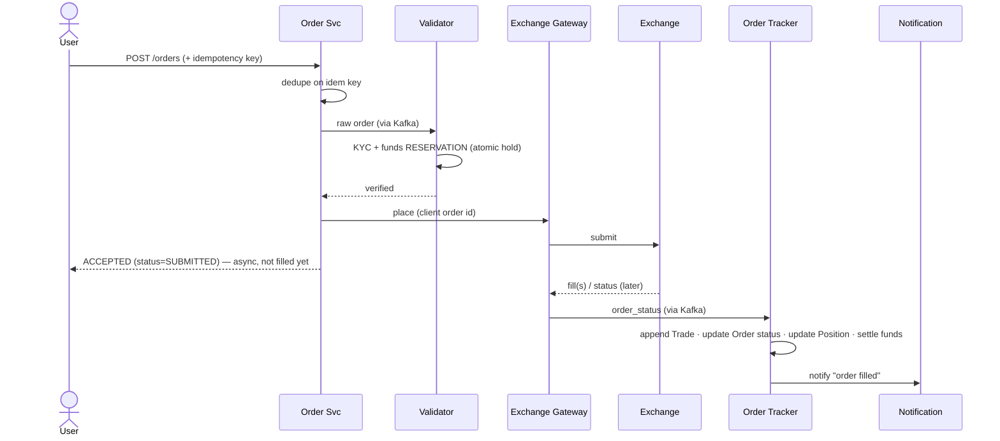

# Stock Trading Platform (Zerodha / Groww / Upstox)

*High-Level Design study note · interview answer + the gotchas that separate a first-pass design from a defensible one*

> A commission-free platform to **view live prices** and **place/track orders** on an exchange (NSE/BSE). The whole design turns on one split: **it is two systems bolted together — a market-data system (read-heavy, AP, "stale-by-50ms is fine, downtime is not") and an order system (write-heavy, CP, "a duplicate trade or wrong balance is a disaster").** They have opposite CAP goals, so design them separately and stop treating "CAP" as one global answer.

---

## 1 · Requirements

**Functional**
- Register / login / **KYC**.
- View **real-time prices** + **historical data (charts)**.
- Place / modify / **cancel** market & limit orders, with accurate **status updates**.
- **Watchlist** with live updates.
- **Dashboard:** holdings, trade history, **PnL**.

**Non-functional**
- **Scale:** millions of users, **8–10k symbols**, high-frequency ticks.
- **CAP — split it, don't state one:** market-data path → **AP** (availability: viewing prices must never be down; a 50 ms-stale tick is fine). Order/funds path → **CP** (consistency: correctness over uptime — wrong balance / duplicate trade / stale fill = financial loss).
- **Latency:** order placement **< 100 ms**, market data **< 50 ms**.

> **Interview framing (say first):** *"I'll treat this as two subsystems with opposite CAP goals — market data is AP and read-optimized, orders are CP and correctness-critical. Most of the interesting engineering is (a) fanning live prices to millions of sockets and (b) the order → fill → position → PnL spine with money safety."* That one sentence sets the whole answer up.

---

## 2 · Core entities & API

**Entities:** `User` (KYC, funds ledger), `Stock/Symbol`, `Order` (id, userId, symbol, type, side, qty, price, **status**), `Trade` (a single **fill** — one order → many trades), `Position` (per user+symbol: qty, avg cost), `Watchlist`.

> ⭐ **`Order ≠ Trade ≠ Position`** is the entity insight the whole order side hangs on (see §6).

| Endpoint | Path | Notes |
|---|---|---|
| Live prices | **`WS /stream/prices`** (subscribe: `[symbols]`) | a socket, not REST — the hot read path |
| History | `GET /stocks/{sym}/candles` | reads **InfluxDB**, not the WS service |
| Place order | `POST /orders` (+ **idempotency key**) | CP, funds-checked |
| Modify / cancel | `PUT /orders/{id}` · `DELETE /orders/{id}` | routed to exchange against the order id |
| Portfolio | `GET /portfolio` | positions × live price → PnL |
| Watchlist | `GET/POST /watchlist` | durable list in Watch DB |

---

## 3 · Architecture

- **Red = account plane** (accounts, KYC, funds — needs consistency). **Green = market-data plane** (AP, read-heavy — the fan-out problem). **Yellow = order plane** (CP, write-heavy — the correctness spine). **Blue = data / infra.**
- **One idea per plane:** market data flows *out* from the exchange (ingest → store + fan-out); orders flow *in* toward the exchange (validate → place → track fills back).

---

## 4 · Market-data path — why Influx **and** Redis

The exchange pushes ticks → Exchange Gateway → **Kafka `stock_price`** → forks into two:

| Fork | Tool | Job | Why |
|---|---|---|---|
| **History** | Price Ingestor → **InfluxDB** | persist ticks for charts | time-series DB = built for `write-once, query-by-time-range`; SQL would choke on the write rate |
| **Live** | **Redis Pub/Sub** (+ last-price cache) | push current price to sockets *now* | fire-and-forget is fine — the next tick corrects a miss; don't pay durability cost on the hot path |

**Charts read InfluxDB; the socket reads Redis.** Keep them separate.

> ⚠️ **Watchlist history must NOT go through Price Tracker.** Price Tracker is the live WS push service; historical/candle queries are a *pull* from InfluxDB. Overloading the socket service with history reads is a common first-pass mistake.

### 4a · Price fan-out — the hard part ⭐

Millions of sockets, 8–10k symbols ticking many times/sec. You **cannot** query a DB per tick.

- **You only fan out to subscribers** — never broadcast all 8–10k symbols to everyone.
- **Where the map lives (get this right):**
  - **WS server RAM:** `symbol → {local socketIds}`. Built on subscribe, torn down on disconnect. **This is the per-tick path — no DB, no Redis lookup.**
  - **Redis presence:** `userId → serverId`. A *pointer*, not the socket. Used only for **targeted** messages (order-filled, notification), never for prices.
  - **User/Watch DB:** the **durable** watchlist. Not in the tick path.
- **Tick flow:** each WS server does `SUBSCRIBE price:<sym>` only for symbols its users watch → tick on `price:RELIANCE` → server looks up its local map → pushes to just those sockets.

> **Two fan-out patterns, don't merge them:** *prices* fan out **by symbol** (topic → local socket map, Redis not in path); *order/notification events* fan out **by userId** (presence directory → that user's server). One line to say: *"You can't store a WebSocket in Redis — the socket lives in one server's RAM; Redis only holds a presence pointer so targeted events can find the user's server."*

---

## 5 · Exchange Gateway — HA without split-brain ⭐

Stateful edge holding the exchange session (WS/FIX). It's critical and singular, so:

- **The exchange sees ONE session** → you can't run 3 active replicas placing orders (duplicates). Run **active–passive**.
- **Consensus/coordination (etcd/ZK/Raft) does exactly one thing here: leader election via a lease** → guarantees **no split-brain** (two "leaders" = double orders — the disaster you're guarding against). It does *not* "replace" a server by magic.
- **In-flight orders on failover** (the real question): leader dies right after sending, before recording the ack — did it go through?
  - **Persist intent + a `client order id` BEFORE sending.**
  - On failover the new leader **reconciles** (queries the exchange by client order id) instead of blind-resending; the id also makes any resend idempotent at the exchange.

> One line: *"Active-passive with a lease so there's no split-brain; every order carries a client order id persisted before send; on failover the new leader reconciles in-flight orders against the exchange rather than resending."*

---

## 6 · Order path — the correctness spine ⭐

**Order lifecycle (state machine):** `PENDING → SUBMITTED → PARTIALLY_FILLED → FILLED | CANCELLED | REJECTED`.

**Why the pieces:**
- **Async by nature.** Placement ≠ fill. You ACK the placement fast (< 100 ms), the fill comes back later via `order_status` → that's why the **Notification Svc** exists.
- ⭐ **One order → many Trades (partial fills).** A limit order can fill in pieces over time. So `Order` holds running status/filled-qty; each fill appends a `Trade`; `trade_id` does **not** belong inside Order.
- ⭐ **Funds = reservation, not a read.** Validator puts an **atomic hold** on the ledger (reserve → place → settle-or-release). A plain balance *read* lets two concurrent orders both pass on the same balance → wrong balance. **This is the CP subsystem.**
- ⭐ **Idempotency.** Kafka is at-least-once → redelivery = duplicate order. **Client idempotency key** deduped at Order Svc. Coming back, dedupe `order_status` by `(order_id, sequence)` (upsert by version, tolerate out-of-order).
- **Modify/cancel** = new requests routed to the exchange against the existing order id (same path).

---

## 7 · PnL / Portfolio — reads positions, not history

`PnL = Σ over positions of (current_price − avg_cost) × qty`

- **Positions ledger** (per user+symbol: qty, avg cost) — updated by Order Tracker on each fill. *This is what Portfolio reads* — not raw trade history, not "price history."
- **Current price from the live market-data path** (Redis last-price), not InfluxDB history.
- Trade history is a separate read (list of `Trade` rows) for the "trade history" screen.

---

## 8 · Interview watch-outs — name-and-defer

A 45-min interview can't build all of this. **Say the cut out loud** (20 sec, full credit) instead of silently omitting — that's the difference between "chose to skip" and "didn't know":

> *"Funds use an atomic reservation on the ledger, not a read, so concurrent orders can't double-spend. Orders carry an idempotency key since Kafka is at-least-once. PnL reads a positions ledger; one order maps to many trades via a state machine — happy to expand whichever you want."*

Then let the interviewer steer.

---

## 9 · Gotchas summary — first design → fix

| First-pass idea | Problem | Fix |
|---|---|---|
| "CAP: Consistency ≫ Availability" (global) | Contradicts "viewing prices must be highly available" | **Split by subsystem:** market data AP, orders CP |
| Redis broadcasts all symbols to all servers | Firehose to every box; melts down | **Per-symbol subscribe** + **local `symbol→socket` map** in server RAM |
| Store the WebSocket in Redis | A socket lives in one server's RAM — can't move | Redis holds a **presence pointer** (`userId→server`), not the socket |
| Query user DB per tick for subscribers | DB dies under tick rate | Durable list in DB; **hot routing map in RAM** |
| Watchlist history via Price Tracker | Overloads the live WS service | **Pull from InfluxDB** via a query API |
| `trade_id` inside Order (1 order = 1 trade) | Breaks on partial fills | **Order → many Trades**; Order carries running status |
| Funds = balance read | Two orders pass on same balance | **Atomic reservation / hold** on ledger |
| Orders through Kafka, no idem key | At-least-once → duplicate order | **Idempotency key** at Order Svc; dedupe status by `(id, seq)` |
| PnL from "price history" | Wrong inputs | **Positions × live price** |
| Multiple active Exchange Gateways | Duplicate sessions / split-brain | **Active-passive + lease**; reconcile in-flight on failover |

---

## 10 · Decision summary — interview pick vs alternatives

| Decision | Pick | Why / alternative |
|---|---|---|
| Overall shape | **AP market-data plane + CP order plane** | opposite CAP goals — don't share one answer |
| Price history store | **InfluxDB (time-series)** | built for time-range writes/reads; SQL choke on tick rate |
| Live price transport | **Redis Pub/Sub + WS** | fire-and-forget OK; next tick corrects a miss |
| Price fan-out routing | **local `symbol→socket` map; Redis only for presence** | per-user channels / DB-per-tick don't scale |
| Backbone | **Kafka** (`stock_price`, `orders`, `order_status`) | decouple ingest, validation, tracking; replay |
| Exchange edge | **active-passive + leader lease + client order id** | no split-brain; safe failover reconcile |
| Order model | **Order → many Trades → Positions**, state machine | partial fills; correct PnL |
| Funds safety | **atomic reservation on ledger** | prevents double-spend (CP) |
| Duplicate protection | **idempotency key + `(id,seq)` dedupe** | Kafka is at-least-once |
| PnL | **positions × live price** | not from history |

---

*Rule of thumb — this problem is won by refusing to answer "CAP" once. **Market data is AP** (fan-out is the scaling story: per-symbol subscribe, in-RAM socket map, Redis for presence not prices). **Orders are CP** (the spine is order → fill → trade → position → PnL, wrapped in funds reservation, idempotency, and a leader-lease exchange gateway). State that split up front, derive the fan-out from "millions of sockets × thousands of ticks," and treat duplicate-trade / wrong-balance as first-class constraints — that's the senior signal.*
