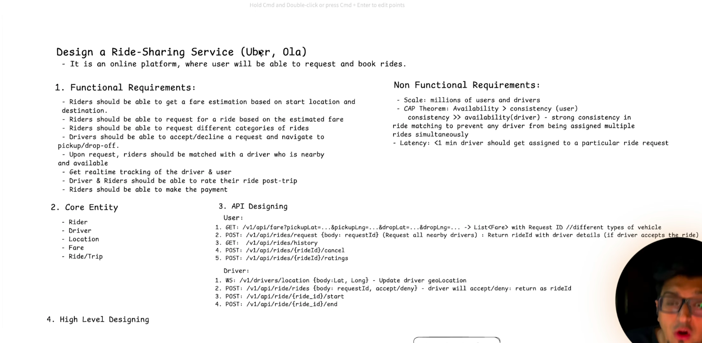
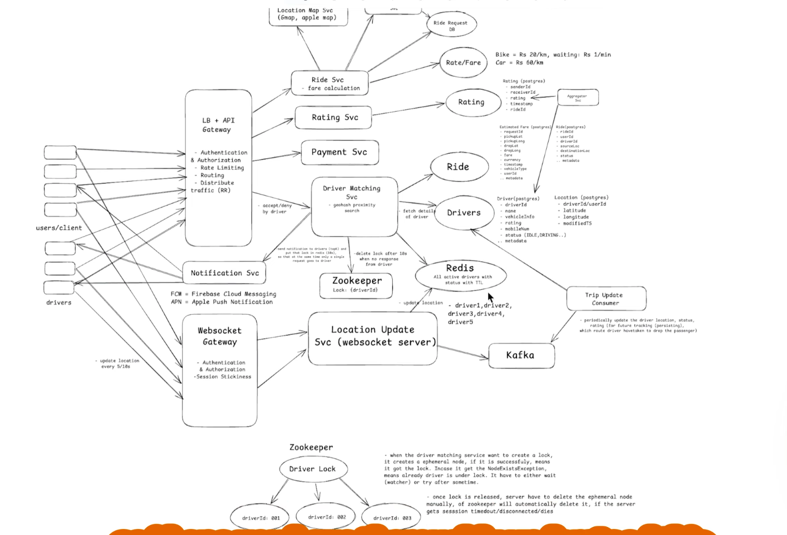
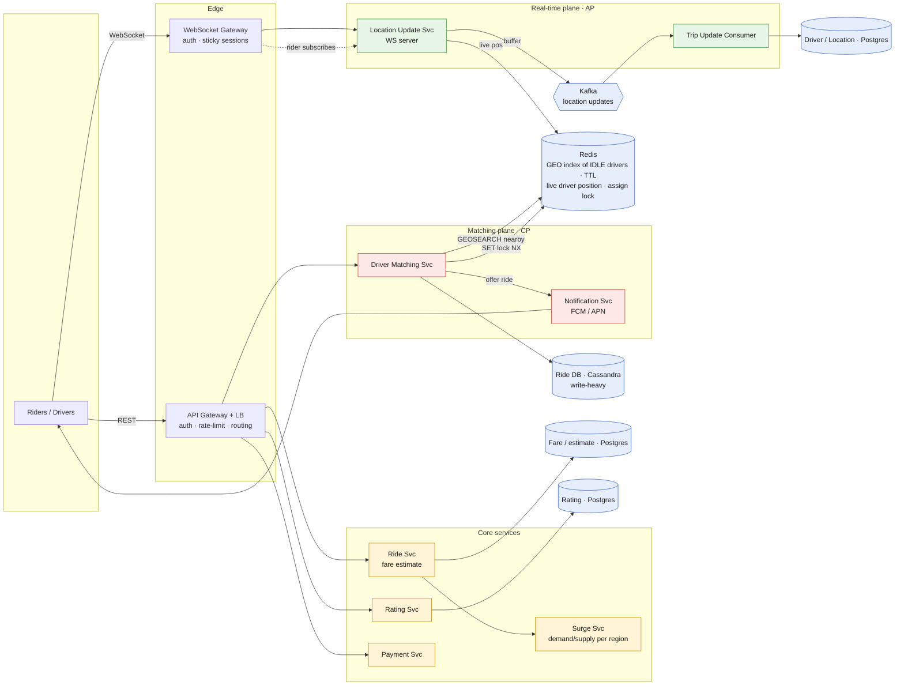
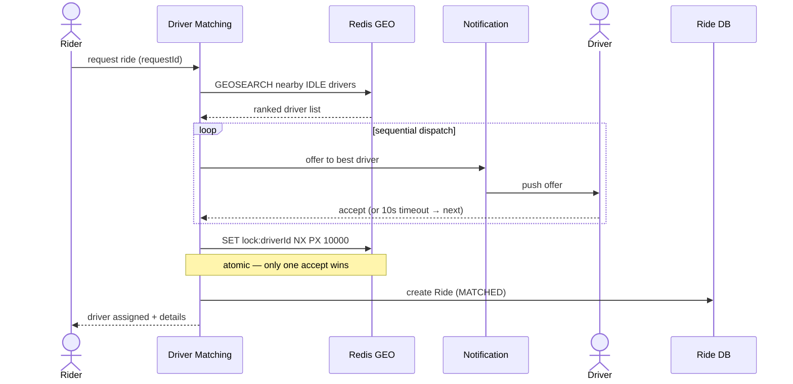

# Ride-Sharing Service (Uber / Ola)

*High-Level Design study note — an online platform where riders request and book rides, drivers accept and navigate, both track each other live.*

> The design turns on **two hot paths that pull in opposite directions**: **driver matching** (must be strongly consistent — one driver, one ride, no double-assign) and **live location tracking** (must be highly available and fast — a 5s-stale dot is fine, a frozen map is not). Design them separately; don't give "CAP" one global answer.

---

## My whiteboard

Requirements, entities and API:

High-level architecture:

The rest of this note is the cleaned-up version + the five things an interviewer will push on.

---

## 1 · Requirements

**Functional**
- Fare **estimate** from pickup → drop (per vehicle type).
- **Request** a ride on the estimate; match to a **nearby, available** driver.
- Driver **accepts / declines**; navigate to pickup → drop.
- **Live tracking** of driver ↔ rider during the trip.
- **Rate** the ride post-trip. Payment (skipped here).

**Non-functional**
- **Scale:** millions of riders + drivers.
- **CAP — split it:** rider-facing reads → **AP** (availability). **Matching → CP** (strong consistency: never assign one driver to two rides).
- **Latency:** driver assigned in **< 1 min**; location updates near real-time.

> **Say first:** *"Two subsystems with opposite goals — matching is CP and correctness-critical, live tracking is AP and latency-critical. The interesting engineering is (a) finding nearby drivers fast and locking one atomically, and (b) fanning driver location to riders at scale."*

---

## 2 · Core entities & API

**Entities:** `Rider`, `Driver` (status: IDLE / DRIVING…), `Location` (driverId, lat, lng, ts), `Fare`, `Ride/Trip` (id, riderId, driverId, pickup, drop, fare, status).

| Endpoint | Path | Notes |
|---|---|---|
| Fare estimate | `GET /fare?pickup&drop` | list of fares per vehicle type |
| Request ride | `POST /rides/request` (+ **requestId**) | returns rideId once a driver accepts |
| Cancel / rate | `POST /rides/{id}/cancel` · `/ratings` | |
| Driver location | **`WS /drivers/location`** `{lat,lng}` | pushed every 5–10s |
| Accept / decline | `POST /rides` `{requestId, accept}` | returns rideId |
| Start / end trip | `POST /rides/{id}/start` · `/end` | ride state transitions |

**Ride states:** `REQUESTED → MATCHED → STARTED → ENDED` (+ `CANCELLED`).

---

## 3 · Architecture

- **Red = matching (CP)** · **Green = live tracking (AP)** · **Yellow = core services** · **Blue = data / infra.**
- **Cassandra for Ride DB** — the write-heavy path (every request, status change). **Postgres** for drivers, fares, ratings (relational, lower write rate).

---

## 4 · Matching flow — nearby search + atomic lock ⭐

**Two decisions to defend here:**

1. **Proximity search → Redis GEO.** Active IDLE drivers already live in Redis with a TTL; `GEOADD` / `GEOSEARCH` is geohash under the hood. Postgres/PostGIS or Elasticsearch are for cold/analytical geo, not the hot matching path. *Don't list three options and not pick — commit.*

2. **Dispatch model — broadcast vs sequential.** My board broadcast to all top-K and let them race for the lock. That works but causes a **thundering herd** (K drivers notified, K-1 lose the race) at density. **Sequential dispatch** (offer best → 10s timeout → next) is cleaner and is what real systems lean on. Trade-off out loud: *broadcast = faster match, worse contention; sequential = clean, higher tail latency.*

> **Lock — Redis, not necessarily Zookeeper.** The race is *one driver assigned to two rides*, so lock on `driverId`. `SET lock:driverId <ride> NX PX 10000` is atomic and Redis is already in the path. Zookeeper's edge is auto-release on session death — worth it only if you want that stronger failure semantics; for a 10s offer lock, Redis + TTL is the simpler, defensible pick.

---

## 5 · Live tracking — why Redis **and** Kafka ⭐

Drivers ping location every 5–10s. This is the biggest load in the system, and the number motivates the whole design:

> **1M active drivers × 1 ping / 5s ≈ 200K writes/sec.** Postgres can't take that head-on.

| Fork | Tool | Job |
|---|---|---|
| **Live** | **Redis** (latest position, GEO index) | serve the rider's map *now*; feed matching |
| **Persist** | **Kafka → Trip Update Consumer → Postgres** | drain asynchronously for history / audit / route replay |

- **Rider sees driver:** rider's WS connection subscribes via the gateway → Location Update Svc pushes that driver's position (per-ride channel). You **can't store a WebSocket in Redis** — the socket lives in one server's RAM; the gateway routes to it.
- **TTL doubles as offline detection** — a driver that stops pinging ages out of the IDLE GEO set on its own.

---

## 6 · Surge (the FR that's easy to forget)

Surge multiplier = **demand / supply ratio per geohash region** over a rolling window, fed into fare calc as a multiplier. One sentence closes the fare requirement — don't leave surge as just a box.

---

## 7 · Gotchas summary — first design → fix

| First-pass idea | Problem | Fix |
|---|---|---|
| "CAP: consistency everywhere" (global) | Rider reads should stay available | **Split:** matching CP, tracking AP |
| "Postgres OR geohash OR ES" for proximity | Not committing reads as unsure | **Redis GEO** — drivers already there with TTL |
| Broadcast offer to all top-K | Thundering herd, lock contention | **Sequential dispatch** (or name the trade-off) |
| Zookeeper lock for every match | Heavyweight dependency | **Redis `SET NX PX`** atomic lock; ZK only for stronger failure semantics |
| Location writes straight to DB | ~200K writes/s melts Postgres | **Redis (live) + Kafka (persist async)** |
| Store the WebSocket in Redis | Socket lives in one server's RAM | Gateway routes to the server; Redis holds position, not the socket |
| Surge left as a box | Unmet FR | **Demand/supply per region × rolling window** |

---

## 8 · Decision summary

| Decision | Pick | Why |
|---|---|---|
| Overall shape | **CP matching + AP tracking** | opposite goals — don't share one CAP answer |
| Ride DB | **Cassandra** | write-heavy (requests + status churn) |
| Driver / fare / rating | **Postgres** | relational, lower write rate |
| Proximity search | **Redis GEO** | hot, fresh, already holds active drivers |
| Assign lock | **Redis `SET NX PX`** on `driverId` | atomic; one accept wins; TTL auto-releases |
| Dispatch | **Sequential offer + timeout** | avoids thundering herd |
| Live location | **Redis + Kafka** | 200K w/s → fast read + async persist |
| Surge | **demand/supply per geohash** | closes the fare FR |

---

*Rule of thumb — win this one by refusing to answer "CAP" once. **Matching is CP**: Redis GEO to find drivers, an atomic lock so one accept wins, sequential dispatch to avoid the herd. **Tracking is AP**: derive it from "1M drivers × a ping every 5s = 200K writes/s," which is exactly why Redis fronts the live position and Kafka drains it to Postgres. State that split up front and let the numbers justify the boxes.*
