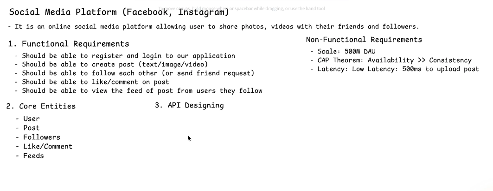
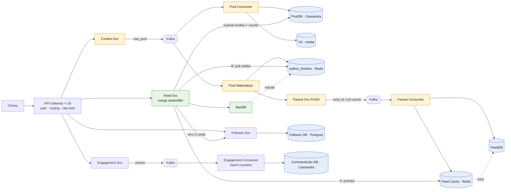

# News Feed Generation (Facebook / Instagram)

*High-Level Design study note · interview answer + the gotchas that separate a first-pass design from a defensible one*

> Share photos/videos with friends; **view a feed of posts from people you follow**. The whole design turns on one line: **push for the many, pull for the few, and merge at read time.** Fan out a normal user's post into their followers' feed caches (push); leave a celebrity's posts in their own timeline and pull them when a follower reads (pull); every real feed is a **merge of both**. Everything else is caching around that.

---

## My whiteboard

Requirements, entities and API:



High-level architecture:


The rest is the cleaned-up version + the gaps my first pass missed.

---

## 1 · Requirements

**Functional**
- Register / login.
- Create post (text / image / video).
- Follow / friend-request.
- Like / comment.
- **View feed** of posts from people you follow.

**Non-functional**
- **Scale:** 500M DAU, read-heavy.
- **CAP:** **Availability ≫ Consistency** — a feed a few seconds stale is fine; being down is not.
- **Latency:** upload post **< 500 ms**.

> **Interview framing (say first):** *"Read-heavy feed problem. Core decision is the fanout model — push (fanout-on-write) vs pull (fanout-on-read) — and the answer is hybrid: push for normal users, pull for celebrities, merged at read time. Upload stays under 500ms because fanout is async over Kafka."*

---

## 2 · Core entities & API

**Entities:** `User` (followers_count, friends_count), `Post` (Cassandra: post_id, user_id, type, content, media_url, counts), `Follower` (follow_id, follower_id, following_id, status), `Like/Comment`, `Feed` (per-viewer list of post_ids).

| Endpoint | Path | Notes |
|---|---|---|
| Create post | `POST /posts` | persists + emits event, returns fast (< 500ms) |
| Get feed | `GET /feed?cursor=` | the hot read; merge assembler (§5) |
| Follow | `POST /follow/{userId}` | writes Follower DB |
| Like / comment | `POST /posts/{id}/like` · `/comment` | async counters (§6) |

---

## 3 · The mental model — 3 stores, the rest is cache

| Store | Keyed by | Role |
|---|---|---|
| **PostDB** (Cassandra) | `post_id` | source of truth for post **content** |
| **`author_timeline`** (Redis) | **author** | that author's recent ~100–200 posts — the **PULL source** |
| **`user_feed`** (Feed Cache) | **viewer** | precomputed ~50–100 post_ids — the **PUSH target** |

⭐ **`user_feed` is disposable** — it can always be rebuilt by merging `author_timeline`s. That's what lets you skip inactive users and page past the hot window. **FeedDB** persists the materialized feed (durability / cold-start below cache TTL); the cache fronts it.

---

## 4 · Architecture



- **Yellow = write/fanout path** (out from the author). **Green = read/merge path** (into the viewer). **Blue = data.**

---

## 4a · Full flow (step by step) — read top → bottom

**① WRITE — normal user uploads a post**
```
Client
  │  POST /posts
  ▼
API Gateway → Content Svc
  │  emit event
  ▼
Kafka (raw_post)
  ├─▶ Post Consumer ─▶ PostDB + S3 (media)
  │
  └─▶ Post Materializer
        │  prepend post_id
        ▼
      author_timeline (Redis)     ✅ PULLABLE now
        │
        ▼
      Fanout Svc
        │  get followers, drop INACTIVE
        ▼
      Kafka (fanout)  <post_id, [followerIds]>
        │
        ▼
      Fanout Consumer
        │  prepend to each follower
        ▼
      Feed Cache + FeedDB         ✅ PUSHED now
```
> 200 OK returns right after `Kafka(raw_post)`. Everything below the fork is **async** → that's the <500ms.

**② WRITE — celebrity uploads a post**
```
... same up to author_timeline (Redis) ...
        │
        ▼
      Fanout Svc
        │  follower_count ≥ threshold
        ▼
      ⛔ STOP — no fanout
      post waits in author_timeline (pulled at read)
```

**③ READ — open feed (the merge assembler)**
```
Client
  │  GET /feed?cursor=
  ▼
API Gateway → Feed Svc
  │
  ├─ A = Feed Cache (pushed)         [miss → FeedDB → else Backfill ④]
  │
  ├─ celeb followees? ── Follower Svc
  │
  └─ B = their author_timeline (Redis)   ← PULL leg, EVERY read
        │
        ▼
      MERGE(A, B)
        │  sort by time DESC → dedup
        ▼
      top pageSize post_ids
        │  HYDRATE: bodies (PostDB) + live counts
        ▼
      return feed page
```

**④ READ fallback — Backfill** (cache empty/exhausted: page-2, eviction, inactive user returns)
```
Feed Svc (A empty/partial)
  │
  ▼
Backfill ── Follower Svc (followees)
  │  pull each author_timeline (Redis)
  ▼
MERGE + sort + dedup
  │  repopulate Feed Cache + FeedDB
  ▼
continue as normal read ③
```

**⑤ LIKE / COMMENT**
```
Client
  │  POST /posts/{id}/like
  ▼
API Gateway → Engagement Svc
  │  emit event
  ▼
Kafka (engagement)
  │
  ▼
Engagement Consumer
  │  write Like/Comment DB (Cassandra)
  │  BATCH-increment counter     ← hot-row protection
  ▼
count shows up at read-time hydration ③
```

> **One-line trace to memorize:** *upload → Kafka → (PostDB + author_timeline) → fanout to active followers' feeds; read → Feed Cache (push) ⊕ celebrities' author_timeline (pull) → merge + sort + dedup → hydrate.*

---

## 5 · Write path (upload)

1. `Content Svc` writes post → emits Kafka `raw_post`.
2. `Post Consumer` → **PostDB** + media to **S3** (transcode async — feed never waits on encoding).
3. `Post Materializer` → prepend post_id into author's **`author_timeline`** → *post is pullable immediately.*
4. **Fanout decision** on `follower_count`:
   - **< threshold (e.g. 10k) → PUSH:** fetch followers → Kafka `<post_id, List<followerId>>` → `Fanout Consumer` prepends into each **active** follower's `user_feed` + FeedDB.
   - **≥ threshold (celebrity) → no fanout;** post stays in `author_timeline`, pulled at read.
5. **Inactive-user skip:** don't push to users idle for N days — rebuild lazily on login. Biggest write-amplification saver at 500M scale.

→ Upload returns after steps 1–3 (fast writes + one emit) → **< 500ms**. Fanout is async / eventually consistent — allowed by CAP choice.

---

## 6 · Read path — the merge assembler ⭐ (the gap in v1)

Every feed = **pushed posts MERGED with pulled celebrity posts**, at read time:

```
GET feed(userId):
  A = user_feed[userId]                          # pushed (already materialized)
  celebs = [f in followees(userId) if isCelebrity(f)]
  B = union(author_timeline[c] for c in celebs)  # PULLED now, never pushed
  merged = dedup(merge_sort_desc_by_time(A + B))
  return hydrate(merged[:pageSize])              # bodies + live counts from PostDB
```

Three things v1 missed:
- ⭐ **The pull leg runs on every read**, not only for celebrity viewers — a normal user follows celebrities too. Celebrity posts are **never** in `user_feed`; read from *their* `author_timeline`.
- ⭐ **Merge-sort by timestamp + dedup** — two independently-ordered lists.
- **Late hydration** — feed stores only IDs; fetch bodies + like/comment counts at read so counts aren't stale.
- **Cache the celeb-pull** (30–60s TTL per celebrity) → thundering-herd guard when millions read the same viral post.

### Backfill = read path's fallback
Not a separate concept — the merge assembler running when `user_feed` is empty/exhausted: page-2 scroll, cache eviction, or inactive user returning. Same code, `A` empty/partial, rebuild from `author_timeline`s.

---

## 7 · Like / comment

- `Engagement Svc`, own **Cassandra** DBs (AP — matches CAP).
- Event → **Kafka** → consumer **batches counter increments**. Reason is **hot-row protection**: a post at 100k likes/sec would destroy a single counter row; Kafka absorbs the spike, consumer applies aggregated increments.
- Counts read at hydration, eventually consistent — off-by-few for a second is fine.

---

## 8 · Gotchas summary — first pass → fix

| First-pass idea | Problem | Fix |
|---|---|---|
| Pull celebrity posts "from feed cache" | They were never pushed there | Pull from the **celebrity's `author_timeline`**, merge at read |
| Pull only for celebrity *viewers* | Every user follows celebs | **Merge leg on every read** |
| Feed = single list, no merge | Wrong order, dupes | **Merge-sort by ts + dedup** |
| Store full post bodies in feed | Cache blows up | **IDs only + late hydration** |
| Push to everyone | Write storm + wasted work | **Skip inactive users**; rebuild on login |
| "Celebrity" as a hard binary | 5k-follower user still storms | **Threshold**; hybrid at the boundary |
| Like counter = direct row write | Hot-row meltdown | **Kafka + batched increments** |
| Sync fanout on upload | Breaks 500ms SLA | **Async fanout via Kafka** |

---

## 9 · Decision summary

| Decision | Pick | Why |
|---|---|---|
| Fanout model | **Hybrid push + pull, merge at read** | push cost vs read cost crossover |
| Celebrity split | **follower_count threshold** | avoid fanout write storm |
| Pull source | **`author_timeline` (Redis)** | rebuildable per-author recent posts |
| Feed store | **Feed Cache + FeedDB** | cache = hot path; FeedDB = durable materialized feed |
| Feed contents | **post_ids only + late hydration** | small cache, fresh counts |
| Post store | **Cassandra + S3** | write-heavy, AP; media off-DB |
| Backbone | **Kafka** (post, fanout, engagement) | decouple + absorb spikes, async |
| Counters | **Kafka → batched increments** | hot-row protection |
| Inactive users | **skip push, rebuild on login** | kill write amplification |

---

*Rule of thumb — this problem is won by refusing to treat fanout as one choice. **Push for the many, pull for the few, and merge at read time.** Keep `user_feed` as a disposable IDs-only cache rebuildable from per-author timelines, make upload fast by fanning out async over Kafka, and treat celebrity fanout + inactive-user skip as the two levers that keep write amplification survivable at 500M DAU.*
