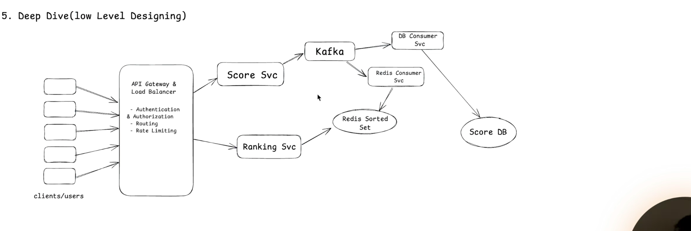
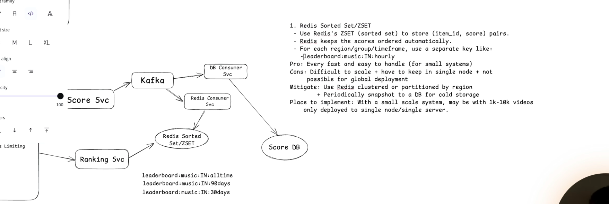
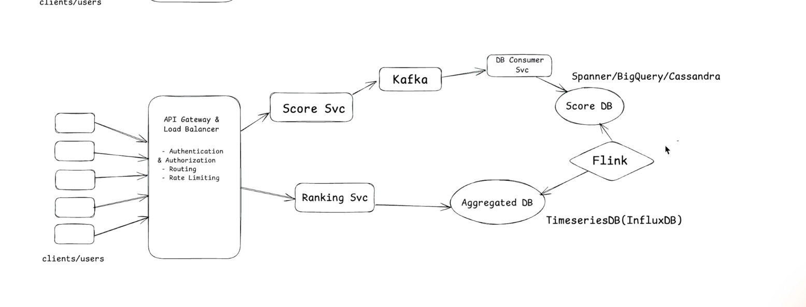
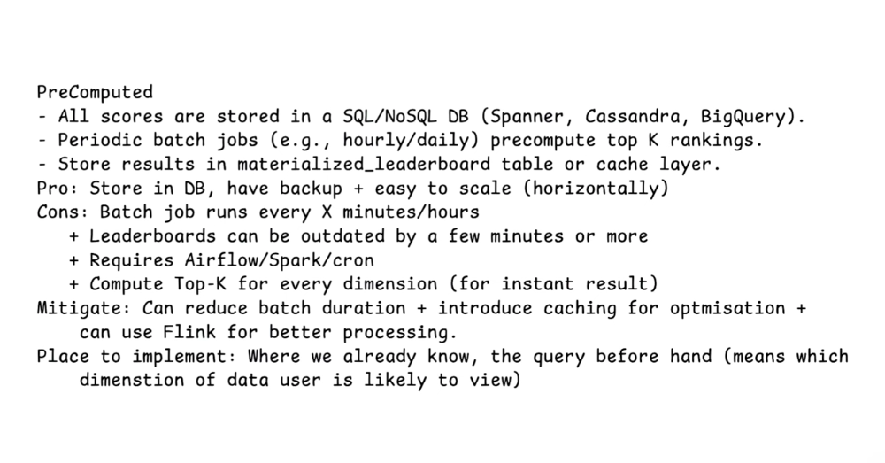
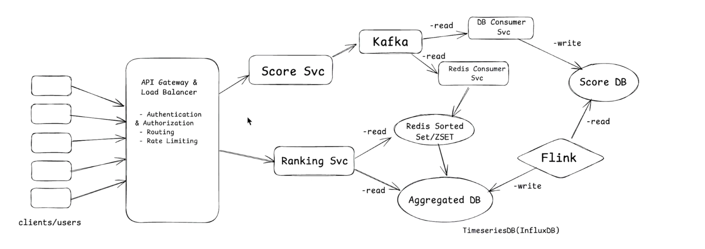
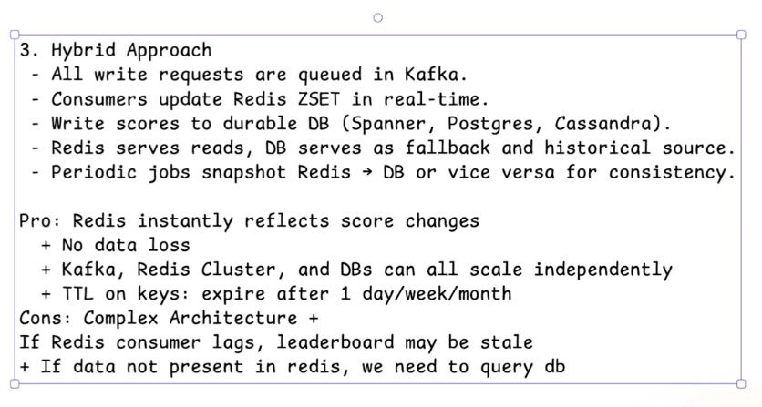
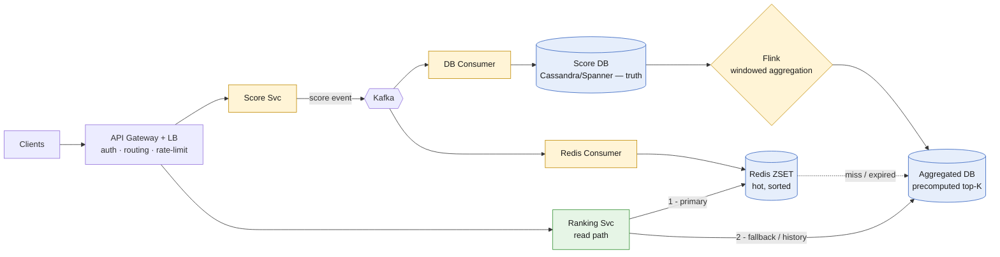

# Top-K Leaderboard (Games / Music / Video ranking)

*High-Level Design study note · interview answer + the gaps that separate a first-pass design from a defensible one*

> "Show the top K by score, per region / genre / timeframe." The whole design turns on one line: **writes and reads are two different problems — writes need durability, reads need a pre-sorted structure.** Redis Sorted Set (ZSET) is a live counter that stays sorted; a durable DB is the source of truth; a stream processor (Flink) is what makes *rolling time-windows* possible. Every solution below is just a different mix of those three.

---

## My whiteboard

**Solution 1 — Real-time (Redis ZSET):**





**Solution 2 — Precomputed / eventual (Flink + timeseries):**





**Solution 3 — Hybrid (Redis + durable DB + Flink):**





The rest is the cleaned-up version + the gaps my first pass missed.

---

## 1 · Requirements

**Functional**
- Submit a score (a play, a win, a like).
- **Get top-K** for a dimension: region + genre + timeframe (e.g. `music:IN:30days`).
- Get a single item's rank ("you're #4,213").

**Non-functional**
- **Scale:** write-heavy ingest (millions of events), read-heavy top-K.
- **CAP:** **Availability ≫ Consistency** — a leaderboard a few seconds stale is fine; being down is not.
- **Latency:** top-K read in **single-digit ms**.

> **Interview framing (say first):** *"Read path and write path are separate. Reads need a structure that's already sorted — that's Redis ZSET. Writes need durability — that's Kafka + a DB. The one hard part is time-windowed boards (30/90-day), because a plain ZSET can't drop scores that age out — that's what pushes me to a stream processor. So I'll present three points on a spectrum: pure real-time, pure precomputed, and the hybrid I'd actually ship."*

---

## 2 · Core entity & the one data structure that matters

**Entity:** `Score(item_id, dimension, value, ts)` — `dimension` = region + genre + timeframe.

**Redis Sorted Set (ZSET)** — the whole reason this problem is easy:

| Op | Command | Cost | Use |
|---|---|---|---|
| add / set score | `ZADD key score member` | O(log N) | absolute score |
| **increment** | `ZINCRBY key +Δ member` | O(log N) | cumulative score |
| **top-K** | `ZREVRANGE key 0 K-1 WITHSCORES` | O(log N + K) | the read |
| my rank | `ZREVRANK key member` | O(log N) | "you're #N" |

One key per dimension: `leaderboard:music:IN:30days`, `:90days`, `:alltime`. Redis keeps them sorted for free — that's the trick.

| Endpoint | Path | Notes |
|---|---|---|
| Submit score | `POST /scores` | emits Kafka event, returns fast |
| Top-K | `GET /leaderboard?dim=music:IN:30days&k=100` | the hot read |
| My rank | `GET /leaderboard/rank?dim=...&id=...` | `ZREVRANK` |

---

## 3 · The three solutions in one line each

| # | Shape | Freshness | Why you'd pick it |
|---|---|---|---|
| **1** | Kafka → Redis ZSET; read Redis | **real-time** | small–mid scale, live board |
| **2** | Kafka → DB → Flink → aggregated store; read that | **eventual** (seconds–mins) | huge scale, windowed/historical, don't need instant |
| **3** | **both** — Redis for hot reads, DB+Flink behind it | real-time **+** durable | production default |

⭐ These aren't rivals — they're a **maturity ladder**. Start at 1, add 2's durability, and 3 is where you land.

---

## 4 · Architecture (Solution 3 — the one to draw)



- **Yellow = write / aggregation path. Green = read path. Blue = data.**
- **Kafka fan-out** = one event, two independent consumers (Redis + DB). They scale separately and neither blocks the other.

---

## 4a · Full flow (step by step)

**① WRITE — a score comes in**
```
Client
  │  POST /scores  (item_id, +Δ, dimension)
  ▼
API Gateway → Score Svc
  │  emit event  (200 OK returns HERE)
  ▼
Kafka
  ├─▶ Redis Consumer ─▶ ZINCRBY leaderboard:...   ✅ live board updated
  └─▶ DB Consumer    ─▶ Score DB (append)          ✅ durable truth
```
> Returns right after Kafka. Both consumers are **async** → fast write, no data loss (Kafka replays if a consumer dies).

**② AGGREGATE — background, continuous**
```
Score DB (or Kafka directly)
  ▼
Flink  — windowed aggregation (last 30d / 90d, rolling)
  ▼
Aggregated DB  — precomputed top-K per dimension
```
> This is what a plain ZSET **can't** do (§6). Flink runs forever, keeps windows fresh.

**③ READ — top-K**
```
Client
  │  GET /leaderboard?dim=music:IN:30days&k=100
  ▼
API Gateway → Ranking Svc
  │
  ├─ ZREVRANGE Redis ZSET 0 99          ← primary, single-digit ms
  │
  └─ miss / key TTL-expired / old window
        ▼
      Aggregated DB (rebuild Redis, then serve)
```

> **One-line trace to memorize:** *score → Kafka → (Redis ZINCRBY + DB append); Flink rolls windows into aggregated store; read → Redis ZREVRANGE, fall back to aggregated DB on miss.*

---

## 5 · Solution 1 deep-dive — Redis ZSET (real-time)

Simplest working board. `Score Svc → Kafka → Redis Consumer → ZINCRBY`; `Ranking Svc → ZREVRANGE`. Great up to ~single-node capacity.

- ✅ **Kafka in front, not direct writes** — buffers spikes, replays on consumer crash, decouples ingest from Redis.
- ✅ Read/write split (CQRS-style): writes go the long async way, reads hit Redis directly.

---

## 6 · The gaps my first pass missed (the little ones that matter) ⭐

**G1 · `ZADD` vs `ZINCRBY` + idempotency.** Is a score *absolute* ("now 500") or a *delta* ("+10")?
- Absolute → `ZADD` — Kafka redelivery is harmless (idempotent).
- Delta → `ZINCRBY` — redelivery **double-counts**. Fix: dedup by `event_id`, or exactly-once consumer.

**G2 · A single ZSET can't do *rolling* time-windows.** ⭐ *This is the whole reason Solutions 2 & 3 exist.* A TTL expires the **entire key**, not the individual scores that are now older than 30 days. So `:30days` with a TTL = "since a fixed reset," **not** a true rolling 30-day window.
- Small fix: **per-day bucket ZSETs**, `ZUNIONSTORE` the last 30 → the window.
- Real fix: **Flink windowing** (Solution 2) — handles rolling windows natively.

**G3 · One ZSET = one shard (hot key).** Redis Cluster shards *by key*, but a leaderboard is *one* key → lives on *one* node. "Use Redis Cluster" does **not** spread a single board. Fixes: per-region keys (already have them), or score-range bucketing + merge for one giant global board.

**G4 · Timeseries DB is wrong for top-K reads.** InfluxDB is built for time-range scans, not "top 100 by score." Don't query it live for ranking — have Flink write **precomputed top-K** into a materialized table / cache and read *that*.

**G5 · Flink should consume Kafka, not poll the DB.** The stream is the source; continuously reading Cassandra to aggregate is unnatural. (Diagram shows DB→Flink; prefer Kafka→Flink.)

**G6 · TTL-expiry fallback = cache stampede.** In Solution 3, when a *hot* key expires, all traffic hits the DB at once. Fix: refresh-before-expiry, or lock-and-rebuild (one request repopulates, others wait).

**G7 · Name the source of truth.** Two consumers off Kafka can diverge. State it: **DB is truth, Redis is derived**, reconciled by periodic snapshot. Monitor **consumer lag** — lag = stale board.

---

## 7 · Gotchas summary — first pass → fix

| First-pass idea | Problem | Fix |
|---|---|---|
| `ZINCRBY` on every event | Kafka redelivery double-counts | Dedup by event_id / absolute `ZADD` |
| `:30days` ZSET + TTL | TTL kills whole key, not aged scores | Per-day buckets + `ZUNIONSTORE`, or **Flink** |
| "Use Redis Cluster to scale" | One board = one key = one node | Per-region keys / score bucketing |
| Read top-K from InfluxDB | Timeseries ≠ ranking store | Precompute top-K into materialized table |
| Flink reads the DB | Unnatural, laggy | **Flink consumes Kafka** |
| Read DB on every TTL expiry | Cache stampede on hot keys | Refresh-before-expiry / lock-rebuild |
| Redis and DB both "truth" | Divergence | **DB = truth, Redis = derived** + snapshot |
| Direct writes to Redis | Spikes + data loss on crash | **Kafka in front**, replayable |

---

## 8 · Decision summary

| Decision | Pick | Why |
|---|---|---|
| Read structure | **Redis ZSET** | stays sorted; O(log N + K) top-K |
| Write backbone | **Kafka** | buffer spikes, replay, fan-out |
| Score semantics | **absolute `ZADD`** if possible | idempotent under redelivery |
| Time-windows | **Flink windowing** (or day-bucket ZSETs) | rolling windows a ZSET can't do |
| Serving store for windows | **precomputed top-K table**, not timeseries | ranking query, not time scan |
| Source of truth | **durable DB (Cassandra/Spanner)** | Redis is a rebuildable cache |
| Global scale | **partition by region + merge** | single key can't shard |
| Which solution | **#3 Hybrid** | real-time reads + durability + windows |

---

*Rule of thumb — a leaderboard is won by keeping three jobs separate: **Redis stays sorted for reads, the DB stays durable for truth, and a stream processor handles the one thing Redis can't — rolling time-windows.** Put Kafka in front so writes never block and never get lost, and remember that a single sorted set is a single node — you scale by partitioning dimensions, not by "adding a cluster."*
