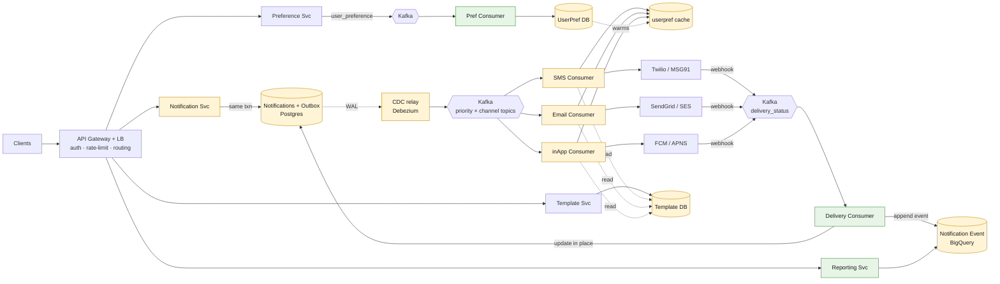

# Notification Service (multi-channel: SMS / Email / Push / In-App)

*High-Level Design study note · interview answer + the gaps that separate a first-pass design from a defensible one*

> Accept a "notify this user" request, deliver it over the right channel(s), and **never lose it, never double-send it, and always know its status.** The whole design turns on one line: **write-first for durability, fan out async per channel, and track delivery back from the provider's webhook.** Everything hard is in the two guarantees — *no loss* comes from an **outbox + CDC**, *no duplicates* comes from an **idempotency key** — and the two are a pair, not two features.

---

## My whiteboard

Full architecture — gateway, notification svc, outbox→CDC→Kafka, per-channel consumers, providers + webhooks, delivery-status path, preference & template services, reporting:

![Notification service architecture — API Gateway (auth/rate-limit/routing) → Notification Svc writes Notifications + Outbox (Postgres), CDC publishes to Kafka priority topics (critical/standard/promotional × email/sms/push + bulk/retry/dlq), per-channel consumers (SMS→Twilio/MSG91, Email→SendGrid/SES, inApp→FCM/APNS, OTP Svc) check userpref cache then call provider; provider webhooks → Kafka delivery_status → Delivery Consumer updates Notifications status (Postgres) + Notification Event log (BigQuery); Reporting Svc reads BQ; Template Svc + Template DB; User Preference Svc → Kafka user_preference → User Pref Consumer → UserPref DB](HLD_Notes_Images/notification-service-architecture.png)

The rest is the cleaned-up version + the gaps my first pass missed.

---

## 1 · Requirements

**Functional**
- Accept a notification request (transactional or promotional) for a user.
- Deliver over one or more **channels**: SMS, Email, Push (mobile), In-App.
- Respect **user preferences** (opted out of SMS marketing, etc.).
- **Templates** — render `content` with `variables`, versioned.
- **Scheduled** and **bulk** sends.
- **Track status** end-to-end: `PENDING → SENT → DELIVERED / FAILED`.

**Non-functional**
- **No loss** — a transactional message (OTP, payment receipt) must not vanish if a broker or pod dies.
- **No duplicates** — a user must not get two OTPs.
- **CAP:** **Availability ≫ Consistency** for delivery; but **durability of the accept** is non-negotiable.
- **Scale:** millions of sends, bursty (a 10M promotional blast must not starve OTPs).
- Provider-agnostic — swap Twilio for MSG91 without touching the core.

> **Interview framing (say first):** *"Accept-and-ack fast, then deliver async. The two guarantees drive everything: no loss → **transactional outbox + CDC** so I never do a dual-write; no duplicates → **idempotency key at the consumer** because Kafka is at-least-once. Pair them and I get **effectively-once**. Channels fan out over priority-partitioned Kafka topics so bulk can't starve critical, and delivery status flows back from the provider's webhook on its own topic."*

---

## 2 · Core entities & API

**Entities**

| Store | Table | Key fields |
|---|---|---|
| **Notifications** (Postgres) | source of truth, **mutable status** | `notification_id`, `client_id` (partition), `external_user_id`, `template_id`, `channel`, `payload`, `status` (PENDING/SCHEDULED/SENT/DELIVERED/FAILED/CANCELLED), `priority`, `scheduled_at`, `last_updated_at`, `provider_msg_id`, metadata |
| **Notifications_outbox** (Postgres) | the durability trick | `outbox_id`, `notification_id`, `event_type`, `payload`, `published`, `created_at` |
| **Templates** (Postgres) | render source | `template_id`, `name`, `type` (transactional/promotional), `channel`, `content`, `variables`, `version`, `is_active` |
| **User_Preference** (Postgres) | opt-in/out | `client_id`, `external_user_id`, `preferences {email, sms, push}`, `updated_at` |
| **Notification Event** (BigQuery) | append-only event log | one row per status transition — analytics/reporting, never updated in place |

| Endpoint | Path | Notes |
|---|---|---|
| Send | `POST /notifications` | writes row + outbox in **one txn**, returns **202 Accepted** fast |
| Bulk send | `POST /notifications/bulk` | same, routed to `bulk` topic |
| Get status | `GET /notifications/{id}` | reads Notifications (Postgres) |
| Cancel | `POST /notifications/{id}/cancel` | only if `SCHEDULED`/`PENDING` |
| Set prefs | `PUT /preferences` | Preference Svc → its own topic |

---

## 3 · The mental model — accept, fan out, track back

Three legs, and each has exactly one job:

1. **Accept leg (durability):** `Notification Svc` writes the `Notifications` row **and** an `outbox` row in the **same DB transaction**, then returns 202. Nothing is published inline.
2. **Publish leg (fan-out):** a **CDC relay** (Debezium tailing the outbox/WAL) publishes to the right **priority × channel** Kafka topic. Per-channel consumers render the template, check preferences, and call the provider.
3. **Track-back leg (status):** the provider's **webhook** reports delivery → published to a `delivery_status` topic → **Delivery Consumer** updates the Postgres row *in place* and **appends** an event to BigQuery.

⭐ The single most important idea: **the accept never publishes to Kafka directly.** That one decision is what removes the dual-write bug (§6).

---

## 4 · Architecture



- **Yellow = accept + fan-out path** (out toward the provider). **Green = track-back path** (status coming home). **Blue = data.**

**Topic layout** (priority isolation is the point — bulk can never starve critical):
```
notifications.critical.{email,sms,push}      ← OTP, payment, security
notifications.standard.{email,sms,push}      ← normal transactional
notifications.promotional.{email,sms,push}   ← marketing
notifications.bulk.email                      ← blast campaigns
notifications.retry.{30s,5m,30m}              ← tiered backoff (§7)
notifications.dlq                             ← terminal failures
delivery_status                               ← provider webhooks
user_preference                               ← pref changes
```

---

## 4a · Full flow (step by step) — read top → bottom

**① ACCEPT — request comes in**
```
Client
  │  POST /notifications
  ▼
API Gateway  (auth · rate-limit · route)
  ▼
Notification Svc
  │  BEGIN TXN
  │    INSERT Notifications  (status = PENDING)
  │    INSERT Outbox         (published = false)
  │  COMMIT                       ← both or neither. No Kafka here.
  ▼
202 Accepted   ← returns immediately
```
> The write and the "intent to publish" land atomically. If the pod dies right here, the outbox row survives → nothing is lost.

**② PUBLISH — CDC relay drains the outbox**
```
Postgres WAL
  ▼
CDC relay (Debezium)  reads committed outbox rows
  │  pick topic = priority × channel  (e.g. notifications.critical.sms)
  ▼
Kafka
  │  mark outbox.published = true   ← may crash before this → re-publish (at-least-once)
  ▼
(message on topic)
```

**③ SEND — channel consumer delivers**
```
SMS / Email / inApp Consumer
  │
  ├─ IDEMPOTENCY CHECK  (seen notification_id? → skip + ack)   ⭐
  │
  ├─ PREFERENCE GATE    (userpref cache: sms allowed?)          ⭐
  │     transactional (OTP) → BYPASS opt-out
  │     promotional + opted-out → drop, status = CANCELLED
  │
  ├─ RENDER   template (Template DB) + variables → payload
  │
  ▼
Provider  (Twilio / SendGrid / FCM)  — pass notification_id as provider idempotency key
  │  returns provider_msg_id
  ▼
store provider_msg_id → Notifications      status = SENT
record notification_id in dedup store (Redis, TTL)
```

**④ TRACK-BACK — provider tells us what happened**
```
Provider webhook   (carries provider_msg_id, NOT our id)
  ▼
Webhook receiver → Kafka (delivery_status)
  ▼
Delivery Consumer
  │  map provider_msg_id → notification_id     ← why we stored it in ③
  │  UPDATE Notifications  status = DELIVERED / FAILED   (in place)
  │  APPEND  Notification Event (BigQuery)               (event log)
  ▼
Reporting Svc reads BigQuery
```

**⑤ FAIL → retry or DLQ**
```
Provider 5xx / timeout (retryable)      Invalid number / hard bounce (terminal)
  │                                         │
  ▼                                         ▼
notifications.retry.30s → 5m → 30m       notifications.dlq  (alert + inspect)
  │  (tiered topics = backoff without blocking the partition)
  ▼
re-enter ③  (idempotency makes replay safe)
```

> **One-line trace to memorize:** *accept writes row+outbox in one txn → CDC publishes to priority×channel topic → consumer dedups + checks prefs + renders + sends, stores provider_msg_id → webhook → delivery_status topic → consumer updates status + appends event.*

---

## 5 · The accept leg — why write-first

- The client's `POST` must **survive a broker outage.** So the first thing that happens is a durable DB write, and the API returns **202** — "accepted, will deliver," not "delivered."
- Status starts `PENDING`. Everything downstream is async and eventually consistent — allowed by the CAP choice, *except* the accept itself which must be durable.

---

## 6 · No loss — outbox + CDC (the gap in v1) ⭐

**v1 mistake:** "write to DB, then publish to Kafka" — in the same service method.

That's the **dual-write problem.** Two systems, no shared transaction:
```
write DB    ✅ committed
             💥 pod dies here
publish Kafka ❌ never happens   → message silently lost
```

**Fix — transactional outbox:**
- Write the `Notifications` row **and** an `outbox` row in **one DB transaction.** Atomic.
- A **separate CDC relay (Debezium)** tails the WAL and publishes committed outbox rows to Kafka, then marks them `published`.
- If the relay dies after publishing but before marking `published`, it **re-publishes** on restart → **at-least-once.** That's fine — §7 idempotency absorbs the duplicate.

> The outbox doesn't make publishing exactly-once. It makes it **never-lost**. The idempotency key handles the "at-least" part.

---

## 7 · No duplicates — idempotency (its pair) ⭐

Kafka is **at-least-once**, and the outbox just added *another* source of duplicates. So dedup is not optional — it's what makes the outbox safe end-to-end.

- **Where:** at the **consumer, right before the provider call**, keyed on `notification_id`.
  ```
  seen(notification_id)?  → skip + ack          (Redis set / dedup table, TTL)
  else → send → record notification_id
  ```
- **Better:** pass `notification_id` as the **provider's own idempotency key** (Twilio/Stripe-style) so the provider dedups too. Belt and suspenders.
- **The honest gap:** "check → send → record" isn't atomic. Crash *after send, before record* → replay re-sends. Options: (a) accept the tiny window for most messages, or (b) `PENDING → SENT` state flip so a replay sees "already in flight." Tighten to (b) only for OTP/payment.

> **The sentence for the interview:** *"Kafka gives me at-least-once; I get effectively-once by pairing the outbox (no loss) with an idempotency key (no duplicates)."*

---

## 8 · The other gaps v1 missed

- **Scheduled sends need a scheduler.** Kafka is not a delay queue — you can't "publish now, deliver at 6pm." A **scheduler job** scans `WHERE status=SCHEDULED AND scheduled_at <= now()` and drops them into the outbox when due. Without this component, `scheduled_at` is decorative.
- **Webhook → notification_id correlation.** The provider's webhook carries **its** message id, not yours. So you **must store `provider_msg_id`** against `notification_id` at send time (③), or the Delivery Consumer can't know which row to update.
- **Retry needs backoff, and Kafka can't sleep.** A consumer can't "wait 5 min then retry" without blocking its partition. Use **tiered retry topics** (`retry.30s`, `retry.5m`, `retry.30m`). Split retryable (5xx/timeout) from terminal (invalid number → straight to **DLQ**).
- **Preference gate placement + transactional bypass.** Check prefs **at the consumer, before the provider call.** And **transactional messages (OTP/login) bypass opt-out** — a marketing opt-out must never block a security code.
- **Partition key.** Partitioning the topic by `client_id` → **hot partitions** for your biggest tenants. If you need per-user ordering, partition by `external_user_id`. Don't blindly reuse the DB partition key.
- **Provider rate limiting.** Round-robin at the gateway is load balancing, not throttling. Twilio/SES have send caps, and you don't want to spam one user — add a **per-provider + per-user throttle in the consumer.**
- **Postgres vs BigQuery split.** Postgres `Notifications` = current status, updated **in place** (source of truth). BigQuery `Notification Event` = **append-only** log, one row per transition, for reporting. Don't conflate them.

---

## 9 · Gotchas summary — first pass → fix

| First-pass idea | Problem | Fix |
|---|---|---|
| Write DB, then publish Kafka in the service | **Dual-write** — crash between = lost message | **Outbox row in same txn + CDC relay** |
| "Outbox makes it exactly-once" | Relay re-publishes on restart | Outbox = **no loss**; pair with idempotency |
| Trust Kafka delivers once | At-least-once → **duplicate OTP** | **Idempotency key at consumer** + provider key |
| `scheduled_at` on the row | Kafka can't delay | **Scheduler job** scans due rows |
| Update status from webhook | Webhook has provider's id, not yours | **Store `provider_msg_id` at send** |
| Consumer sleeps to retry | Blocks the partition | **Tiered retry topics** + DLQ |
| Preference check at the gateway | Too early / can't be per-channel | **Gate in consumer**; OTP **bypasses** opt-out |
| Partition topic by `client_id` | Hot partitions for big tenants | Partition by `external_user_id` if ordering needed |
| One topic for everything | Bulk starves OTP | **Priority × channel topics** |
| Round-robin = rate limiting | It's just LB | **Per-provider/user throttle** |

---

## 10 · Decision summary

| Decision | Pick | Why |
|---|---|---|
| Accept guarantee | **Outbox + CDC (Debezium)** | kills dual-write; never lose a request |
| Duplicate guarantee | **Idempotency key at consumer** | Kafka + outbox are at-least-once |
| Combined | **Effectively-once** | no-loss × no-dup |
| Fan-out | **Kafka, priority × channel topics** | isolate critical from bulk |
| Status store | **Postgres (in-place) + BigQuery (append)** | current truth vs analytics log |
| Delivery status | **Provider webhook → own topic → consumer** | decouple callbacks from send |
| Correlation | **Store `provider_msg_id`** | map webhook back to our id |
| Scheduling | **Scheduler scans due rows → outbox** | Kafka isn't a delay queue |
| Retry | **Tiered retry topics + DLQ** | backoff without blocking partitions |
| Preferences | **Consumer-side gate; OTP bypass** | correctness + don't block security |
| Templates | **Template DB, versioned** | render at send, `version`+`is_active` |

---

*Rule of thumb — this problem is won on two guarantees, not on the boxes. **Accept durably (outbox + CDC), deliver async per channel, track back from the webhook** — and remember the outbox and the idempotency key are a matched pair: one stops loss, the other stops duplicates, and only together do they give you effectively-once. Everything else — priority topics, tiered retries, the scheduler, the preference gate — is protecting those two guarantees against scale and failure.*
