# Transformer Architecture — End-to-End Walkthrough

> This is the **"connect the dots"** doc: the whole flow, **in order**, step by step.
> Deep mechanics (FFN math, attention internals) live in your other notes — here the detail is on **what happens when, and in what order**.
> Each step shows a focused flow diagram + a **master-map number** so you always know where you are.

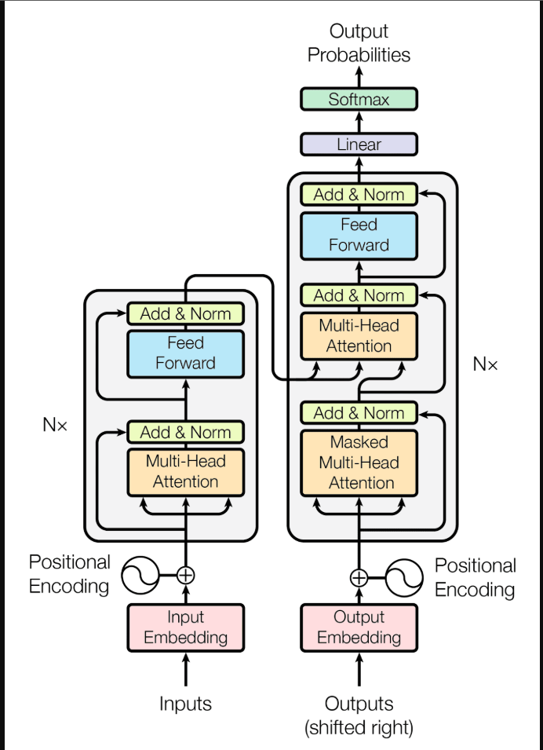

---

## The master map (read this first)

This is a **decoder-only** transformer — the shape used by GPT, Claude, and modern LLMs. It's the version you've been learning (causal masking, next-token prediction). Keep this picture in your head; every step below points back to a number here.

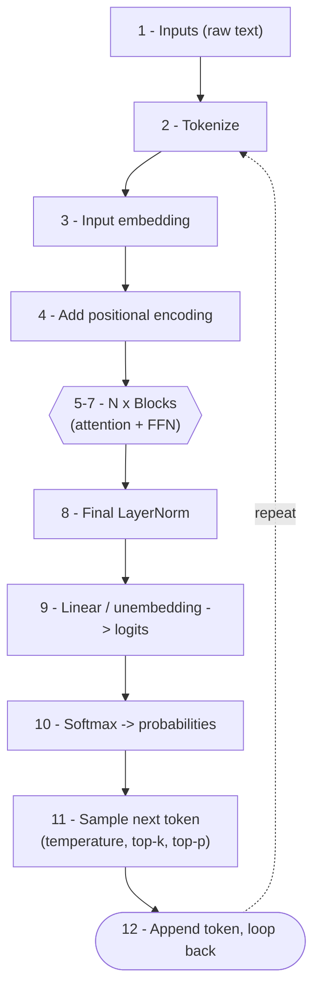

> The **classic** transformer (the "Attention Is All You Need" diagram, with two stacks) is the **encoder-decoder** variant — covered in Step 13, then mapped box-by-box at the end.

---

## Step 0 — Two flavors (so the famous diagram makes sense)

There are two shapes. Knowing which is which stops all the confusion:

- **Decoder-only** (GPT, Claude, Llama, Mistral) — **one** stack of blocks. Reads text left-to-right, predicts the next token. **This is the LLM you've studied.** Uses **causal masking** (a token can only see tokens before it).
- **Encoder-decoder** (the original 2017 model, translation) — **two** stacks. An **encoder** reads the whole input at once (no mask), a **decoder** writes the output one token at a time and *also* peeks at the encoder via **cross-attention**.
- **Encoder-only** (BERT) — just the encoder. Great for understanding/classifying text, not for generating it.

Everything from Step 1–12 below describes the **decoder-only** flow. Step 13 explains the extra encoder machinery from the famous picture.

---

## Step 1 — Inputs (raw text)

**Master map: box ①**

You type a string. That's it — plain text. Nothing numeric yet.

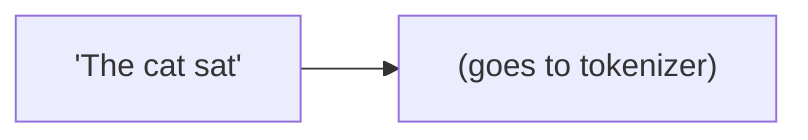

The model can't do math on letters, so the very first job is to turn text into numbers. That's the next step.

---

## Step 2 — Tokenize

**Master map: box ②**

The text is chopped into **tokens** — chunks that are roughly words or word-pieces (e.g. `"sat"`, or `"ing"`). Each token maps to an integer **ID** from a fixed vocabulary.

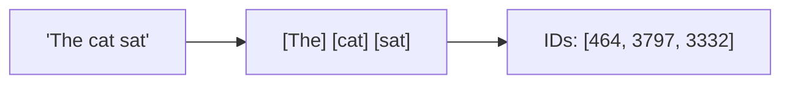

- **Token** = one chunk of text.
- **Token ID** = its index number in the vocabulary (e.g. 50,000 possible tokens).

Output of this step: a list of integers, one per token.

---

## Step 3 — Input embedding

**Master map: box ③**

Each token ID is looked up in a big table (the **embedding matrix**) and replaced by a **vector** — a list of numbers of size `d_model` (e.g. 512).

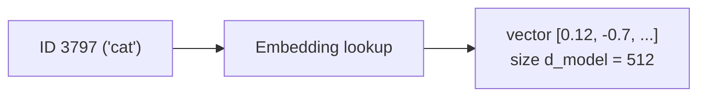

- **Embedding** = the vector that represents a token's meaning.
- These vectors are **learned** during training. Similar words end up with similar vectors.

Output: one 512-number vector per token.

---

## Step 4 — Add positional encoding

**Master map: box ④**

Problem: attention is **order-blind** on its own — without help it would treat *"dog bites man"* and *"man bites dog"* the same. So we inject **position** information.

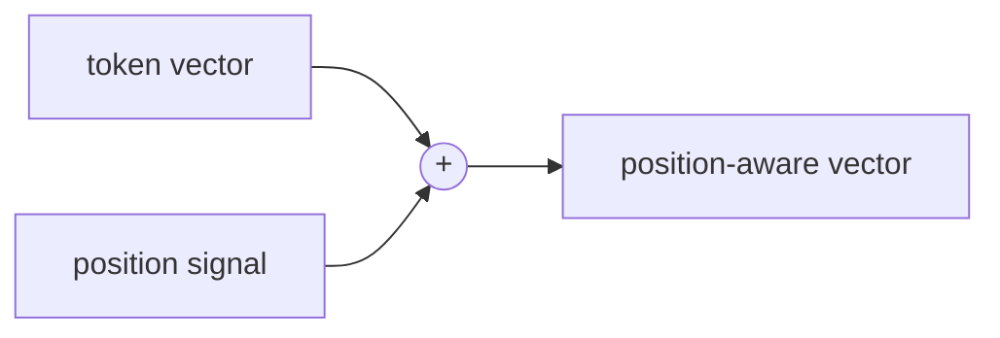

- **Positional encoding** = extra numbers that tell the model *where* each token sits in the sequence.
- Original transformer: a fixed **sinusoidal** pattern **added** to the embedding (that's the wave symbol in the famous diagram).
- Most modern LLMs: **RoPE** (rotary) — applied *inside* attention rather than added here. Same goal, different mechanism.

Output: vectors that carry both **meaning** and **position**. These enter the block stack.

---

## Steps 5–7 — The block stack (N× blocks)

**Master map: box ⑤ (the `N×` group)**

The vectors now flow **up through N identical blocks** (12, 32, 96... depending on model size). Each block does the same two-part routine on the **residual stream** (the main line the vectors ride on).

### Inside one block

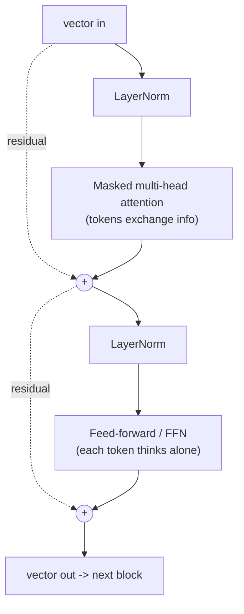

- **Step 5 — Masked multi-head attention:** tokens look at each other and gather context. **Masked** = a token can only see tokens *before* it (causal), never ahead.
- **Add & Norm** after it: `x = x + attention(x)`, then LayerNorm keeps numbers stable. (Modern models normalize *before* each sublayer — "pre-norm.")
- **Step 6 — Feed-forward (FFN):** each token is transformed on its own (expand → activation → compress). *See your FFN notes for the math.*
- **Add & Norm** again: `x = x + ffn(x)`.
- **Step 7 — Repeat:** the output vector feeds into the next block, and this repeats N times.

> **The rhythm:** mix (attention) → think (FFN) → mix → think... Early blocks handle surface/grammar, middle blocks handle syntax/phrases, later blocks handle meaning. Roles **emerge** during training; nobody assigns them. *(See your "blocks" notes.)*

The residual stream stays the **same width** (`d_model`) the whole way up — which is exactly why you can stack any number of blocks.

Output of the stack: one final, richly-refined vector per token position.

---

## Step 8 — Final LayerNorm

**Master map: box ⑧**

After the last block, a final **LayerNorm** cleans up the numbers before the output head. (Standard in decoder-only models like GPT-2 onward.)

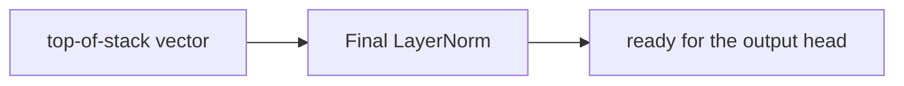

Small but real step — easy to forget it's there.

---

## Step 9 — Linear (unembedding) → logits

**Master map: box ⑨**

We only care about the vector at the **last position** (it holds the model's summary of everything so far, used to predict the next token). A **Linear layer** projects that vector from size `d_model` up to size **vocabulary** (e.g. 50,000).

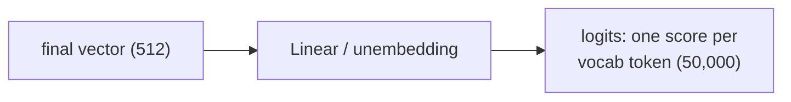

- **Logits** = raw, unnormalized scores — one number for **every possible next token**.
- **Unembedding** = the reverse of embedding: vector → vocabulary scores. Often it **reuses the embedding matrix** (a trick called *weight tying*).

> This is why the model can **never "find nothing"**: it always produces a full set of scores across the entire vocabulary.

---

## Step 10 — Softmax → probabilities

**Master map: box ⑩**

**Softmax** squashes the raw logits into a **probability distribution** — all positive, summing to 1.

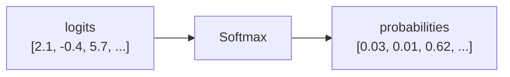

- Now every possible next token has a probability.
- A confident model = one token near 1.0. An unsure model = probability spread out (this is where **hallucinations** come from — it samples from a weak distribution anyway).

---

## Step 11 — Sample the next token

**Master map: box ⑪**

Pick one token from that probability distribution. The **sampling controls** shape *how* you pick:

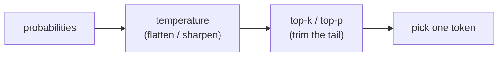

- **Temperature** — high = flatter/more random, low = sharper/more predictable.
- **Top-k** — only consider the k most likely tokens.
- **Top-p** — only consider the smallest set of tokens whose probability adds up to p.
- *(See your sampling notes for detail.)*

Output: **one** chosen token — the next word.

---

## Step 12 — The autoregressive loop

**Master map: box ⑫**

The chosen token is **appended** to the input, and the whole thing runs again to produce the *next* token. Repeat until a stop token or a length limit.

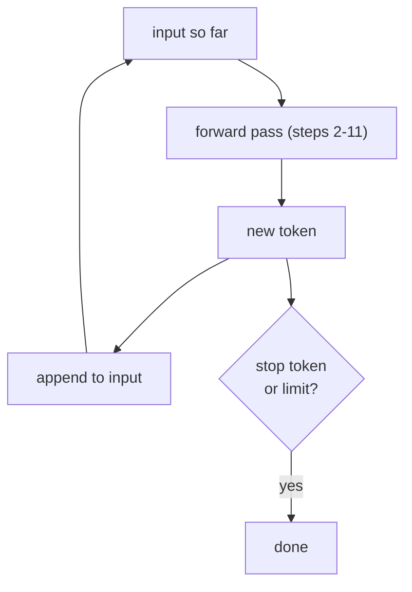

- **Autoregressive** = each new token is generated using all the tokens before it, including the ones the model itself just produced.
- This is why generation feels "one word at a time" — it literally is.

> **Important:** this loop is **inference** — weights are frozen, forward pass only, **no loss, no backprop**. The model re-reads the growing transcript each turn; it isn't learning. *(See your inference-vs-training notes.)*

---

## Step 13 — What the famous (encoder-decoder) diagram adds

The classic picture has **two** stacks. Here's the extra machinery that a decoder-only model **doesn't** have:

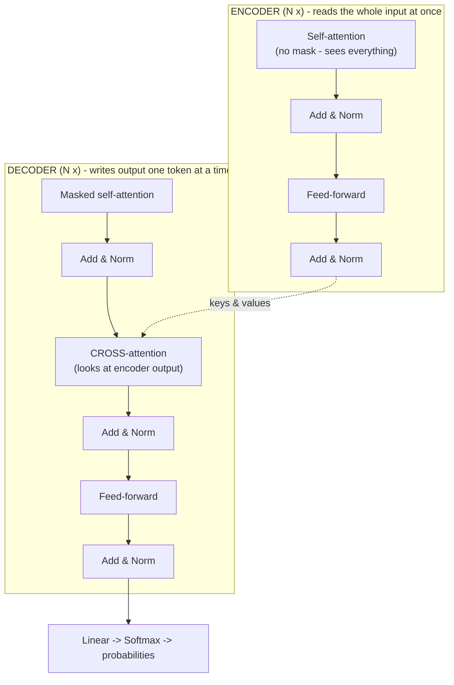

- **Encoder** — reads the entire input sentence at once, no causal mask (it's allowed to see the whole thing). Produces a set of context vectors.
- **Decoder** — like the decoder-only stack, but with **one extra sublayer per block: cross-attention**.
- **Cross-attention** — the decoder tokens attend to the **encoder's** output (not just to each other). This is how a translation model "looks at" the source sentence while writing the translation.
- **"Outputs (shifted right)"** in the image — a **training-time** setup: the decoder is fed the correct answer shifted by one, so at each position it learns to predict the *next* token. At **inference**, that shift becomes the autoregressive loop from Step 12 (feed back what you just generated).

> Decoder-only LLMs simply **drop the encoder and the cross-attention**, keeping only masked self-attention + FFN. Same core, fewer parts.

---

## Step 14 — Inference vs training (the two machines)

Everything above (Steps 1–12) is the **forward pass = inference = running the model**. There is a whole separate machine that *created* the weights:

| | **Inference (prompting)** | **Training** |
|---|---|---|
| Direction | Forward pass only | Forward pass **+ backprop** |
| Weights | **Frozen** (read-only) | **Being updated** |
| Loss computed? | **No** (no correct answer to compare to) | **Yes** (cross-entropy vs known next token) |
| Speed | Fast | Slow, done once by the lab |
| Analogy | Running a compiled binary | Compiling the binary |

> Training (loss → backpropagation → gradient descent, then pretraining → fine-tuning → RLHF) is your **next topic** — it's what gives the weights their values. This doc is the *forward pass* only.

---

## Map back to YOUR uploaded diagram

The image you shared is the **encoder-decoder** version. Here's every labeled box mapped to a step:

| Box in the famous diagram | Step here | Notes |
|---|---|---|
| **Inputs** | ① | Raw source text (encoder side) |
| **Input Embedding** | ③ | Encoder token embeddings |
| **Positional Encoding** (both sides) | ④ | The wave symbol; added to embeddings |
| **Multi-Head Attention** (left/encoder) | ⑤ | Self-attention, **no mask** |
| **Add & Norm** (everywhere) | ⑤/⑥ | Residual add + LayerNorm |
| **Feed Forward** (both) | ⑥ | The FFN |
| **Nx** (both) | ⑦ | Stack the block N times |
| **Outputs (shifted right)** | ⑫ / Step 13 | Training-time teacher forcing; loop at inference |
| **Output Embedding** | ③ | Decoder token embeddings |
| **Masked Multi-Head Attention** (right/decoder) | ⑤ | Self-attention **with causal mask** |
| **Multi-Head Attention** (middle of decoder) | Step 13 | **Cross-attention** to encoder output |
| **Linear** | ⑨ | Unembedding → logits |
| **Softmax** | ⑩ | Logits → probabilities |
| **Output Probabilities** | ⑩→⑪ | Distribution you sample from |

---

## One-page ordered cheat sheet

1. **Inputs** — raw text.
2. **Tokenize** — text → token IDs.
3. **Embed** — IDs → meaning vectors (`d_model`).
4. **+ Positional encoding** — add "where" to "what."
5. **Attention** (masked, multi-head) — tokens gather context. *+ Add & Norm.*
6. **FFN** — each token thinks alone (expand→activate→compress). *+ Add & Norm.*
7. **Repeat** steps 5–6 across **N blocks** (surface → syntax → meaning).
8. **Final LayerNorm** — stabilize.
9. **Linear / unembedding** — vector → logits (one score per vocab token).
10. **Softmax** — logits → probabilities.
11. **Sample** — temperature / top-k / top-p → pick one token.
12. **Loop** — append token, go back to step 2 until stop.

*Weights are frozen the whole time (inference). Loss and backprop belong to training — that's the next doc.*

---

*End of walkthrough.*
