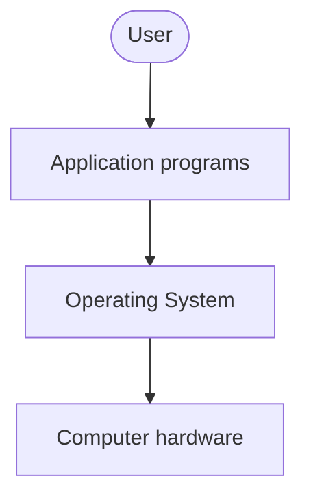

# 01 — Introduction to Operating Systems

**Application software** performs specific tasks for the user.

**System software** operates and controls the computer system and provides a platform to run application software.

An **operating system** is a piece of software that manages all the resources of a computer system — both hardware and software — and provides an environment in which the user can execute programs conveniently and efficiently, hiding the underlying hardware complexity and acting as a resource manager.

## Why do we need an OS?

**What if there were no OS?**

- Bulky and complex apps — hardware-interaction code would have to live inside every application.
- Resource exploitation by a single app.
- No memory protection.

**What is an OS made up of?** A collection of system software.

## Functions of an OS

- Access to the computer hardware.
- Interface between the user and the hardware.
- **Resource management** (a.k.a. *arbitration*) — memory, devices, files, security, processes, etc.
- **Hides underlying complexity** of hardware (a.k.a. *abstraction*).
- Facilitates execution of application programs by providing isolation and protection.

## The layered picture

The operating system provides the means for proper use of the resources in the operation of the computer system.
