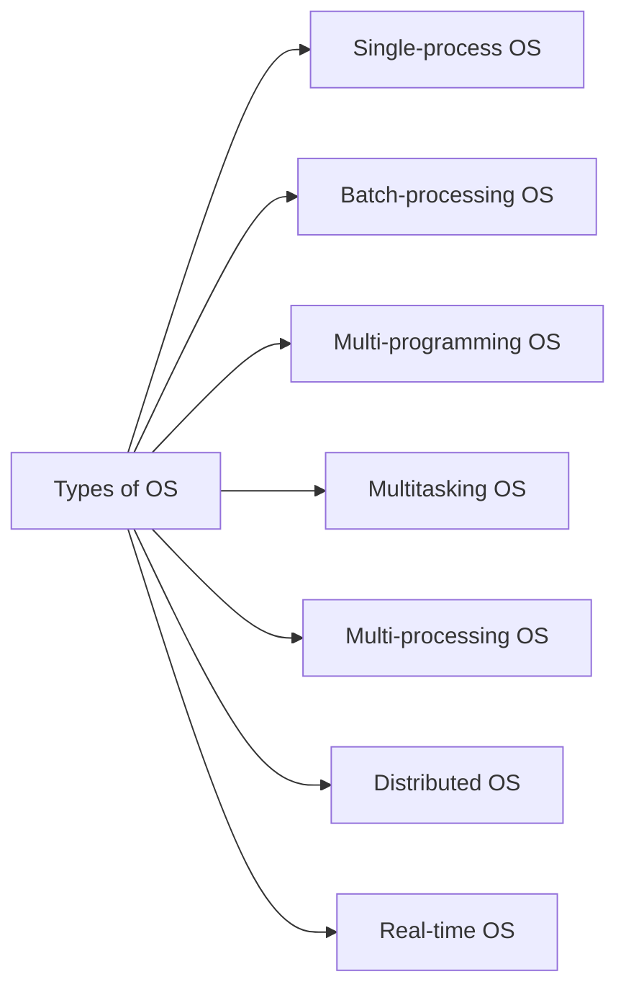
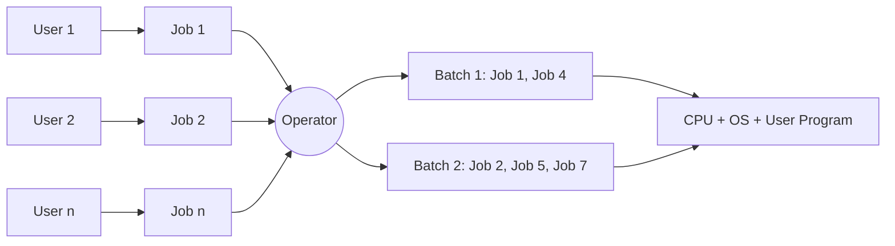

# 02 — Types of Operating Systems

## OS goals

- Maximum CPU utilization
- Less process starvation
- Higher-priority job execution

## The seven types

| Type | Historical example |
| --- | --- |
| Single-process OS | MS DOS, 1981 |
| Batch-processing OS | ATLAS, Manchester Univ., late 1950s – early 1960s |
| Multiprogramming OS | THE, Dijkstra, early 1960s |
| Multitasking OS | CTSS, MIT, early 1960s |
| Multi-processing OS | Windows NT |
| Distributed OS | LOCUS |
| Real-time OS | ATCS |

## Single-process OS

Only one process executes at a time from the ready queue. The oldest style.

## Batch-processing OS

1. User prepares a job using punch cards.
2. Submits the job to the computer operator.
3. Operator collects jobs from different users and sorts them into batches with similar needs.
4. Operator submits batches to the processor one by one.
5. All jobs of one batch execute together.

**Drawbacks**

- Priorities cannot be set if a high-priority job arrives mid-batch.
- Starvation possible — a batch may take a long time to complete.
- CPU may become idle during I/O.

## Multiprogramming OS

Increases CPU utilization by keeping multiple jobs (code and data) in memory so the CPU always has one to execute when another gets busy with I/O.

- Single CPU
- Context switching for processes
- Switch happens when the current process goes to a wait state
- CPU idle time reduced

## Multitasking OS

A logical extension of multiprogramming.

- Single CPU
- Able to run more than one task simultaneously
- Uses context switching and time sharing
- Increases responsiveness
- CPU idle time further reduced

## Multi-processing OS

More than one CPU in a single computer.

- Increases reliability — if one CPU fails, another can work
- Better throughput
- Less process starvation — if one CPU is busy, another can run other processes

## Distributed OS

- OS manages many bunches of resources: ≥1 CPUs, ≥1 memory, ≥1 GPUs, etc.
- **Loosely connected autonomous**, interconnected computer nodes.
- A collection of independent, networked, communicating, and physically separate computational nodes.

## Real-Time OS (RTOS)

- **Real-time** error-free computations within tight time boundaries.
- Air Traffic Control systems, robots, etc.
