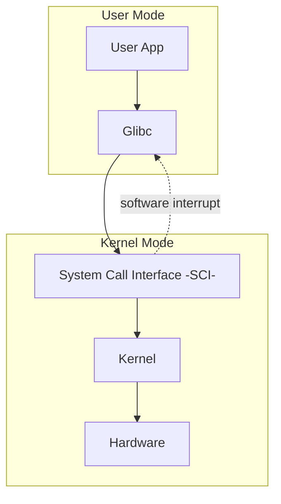

# 05 — System Calls

**How do apps interact with the kernel?** Through *system calls*.

## Example — `mkdir laks`

- `mkdir` indirectly calls the kernel and asks the file-management module to create a new directory.
- `mkdir` is just a wrapper around the actual system calls.
- It interacts with the kernel via system calls.

## Example — creating a process

- User executes a process. *(user space)*
- Gets a system call. *(user space)*
- `exec` system call to create the process. *(kernel space)*
- Return to user space.

> **Transitions from user space to kernel space are done by software interrupts.**

System calls are implemented in C.

A **system call** is a mechanism by which a user program can request a service from the kernel that it does not have permission to perform itself. User programs typically don't have permission to access I/O devices or communicate with other programs directly.

**System calls are the only way a process can move from user mode into kernel mode.**

## The path an app takes

## Types of system calls

**1) Process control**
- end, abort
- load, execute
- create process, terminate process
- get / set process attributes
- wait for time
- wait event, signal event
- allocate and free memory

**2) File management**
- create file, delete file
- open, close
- read, write, reposition
- get / set file attributes

**3) Device management**
- request device, release device
- read, write, reposition
- get / set device attributes
- logically attach or detach devices

**4) Information maintenance**
- get / set time or date
- get / set system data
- get / set process, file, or device attributes

**5) Communication management**
- create / delete communication connection
- send / receive messages
- transfer status information
- attach / detach remote devices

## Windows vs Unix system calls

| Category | Windows | Unix |
| --- | --- | --- |
| Process control | `CreateProcess()`, `ExitProcess()`, `WaitForSingleObject()` | `fork()`, `exit()`, `wait()` |
| File management | `CreateFile()`, `ReadFile()`, `WriteFile()`, `CloseHandle()`, `SetFileSecurity()`, `InitializeSecurityDescriptor()`, `SetSecurityDescriptorGroup()` | `open()`, `read()`, `write()`, `close()`, `chmod()`, `umask()`, `chown()` |
| Device management | `SetConsoleMode()`, `ReadConsole()`, `WriteConsole()` | `ioctl()`, `read()`, `write()` |
| Information management | `GetCurrentProcessID()`, `SetTimer()`, `Sleep()` | `getpid()`, `alarm()`, `sleep()` |
| Communication | `CreatePipe()`, `CreateFileMapping()`, `MapViewOfFile()` | `pipe()`, `shmget()`, `mmap()` |
