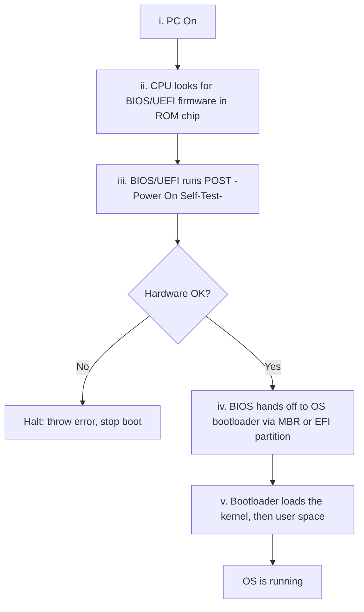

# 06 — What Happens When You Turn On Your Computer?

The boot sequence, step by step.

## Step-by-step

**i.** PC is switched on.

**ii.** The CPU initializes itself and looks for a firmware program (**BIOS**) stored in the **BIOS chip** — a ROM chip on the motherboard that allows access to and setup of the computer at the most basic level. On modern PCs, the CPU loads **UEFI** (Unified Extensible Firmware Interface) instead.

**iii.** The CPU runs the BIOS, which tests and initializes system hardware. BIOS loads configuration settings; if something isn't right (e.g., missing RAM) an error is thrown and the boot process stops. This is called **POST** (Power-On Self-Test).

> UEFI can do a lot more than just initialize hardware — it's really a tiny OS. Intel CPUs, for example, have the **Intel Management Engine**, which powers features like Intel's Active Management Technology for remote management of business PCs.

**iv.** The BIOS hands off responsibility for booting to your OS's **bootloader**. It looks at the **MBR** (Master Boot Record) — a special boot sector at the beginning of a disk. The MBR contains code that loads the rest of the OS, known as the *bootloader*. The BIOS executes this bootloader, which takes over and begins booting the actual operating system.

In other words: **BIOS or UEFI examines a storage device to find a small program (in the MBR or on an EFI system partition) and runs it.**

**v.** The bootloader is a small program with the large task of booting the rest of the operating system — it boots the kernel first, then user space. Examples:

- Windows uses **Windows Boot Manager** (`Bootmgr.exe`).
- Most Linux systems use **GRUB**.
- macOS uses **`boot.efi`**.
