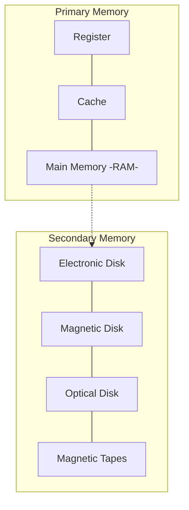

# 08 — Storage Devices Basics

## The memory hierarchy

Closer to the top = faster, smaller, more expensive.

## What is each layer?

1. **Register** — the smallest unit of storage; part of the CPU itself. May hold an instruction, a storage address, or any data (bit sequence, individual character). Used to quickly accept, store, and transfer data and instructions being used immediately by the CPU.
2. **Cache** — additional memory that temporarily stores frequently used instructions and data for quicker processing by the CPU.
3. **Main memory** — RAM.
4. **Secondary memory** — storage media on which the computer can store data and programs.

## Comparison

**1. Cost**
- Primary storage is costly.
- Registers are the most expensive (expensive semiconductors and labour).
- Secondary storage is cheaper than primary.

**2. Access speed**
- Primary is faster than secondary.
- Registers > cache > main memory.

**3. Storage size**
- Secondary has more space.

**4. Volatility**
- Primary memory is **volatile**.
- Secondary is **non-volatile**.
