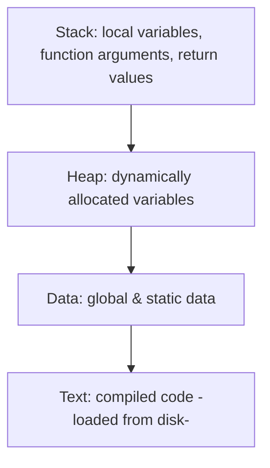

# 09 — Introduction to Process

## Basics

- **What is a program?** Compiled code, ready to execute.
- **What is a process?** A program under execution.
- **How does the OS create a process?** By converting a program into a process. Steps:
  1. Load the program and static data into memory.
  2. Allocate runtime stack.
  3. Allocate heap memory.
  4. Perform I/O tasks.
  5. OS hands off control to `main()`.

## Architecture of a process

Memory layout, top to bottom: **Stack → (free space) → Heap → Data → Text**.

## Attributes of a process

- A feature that allows identifying a process uniquely.
- **Process table** — all processes are tracked by the OS using a table-like data structure. Each entry is a **Process Control Block (PCB)**.
- **PCB** — the data structure that stores information/attributes of a process: process id, program counter, process state, priority, etc.

## PCB structure

| Field | Meaning |
| --- | --- |
| Process ID | Unique identifier |
| Program Counter (PC) | Next-instruction address of the program |
| Process state | Current state (see next chapter) |
| Priority | Scheduling priority — determines when the process gets CPU time |
| Registers | Snapshot of CPU registers for this process |
| List of open files | Files the process has open |
| List of open devices | Devices the process has open |

**Registers in the PCB** — it's a data structure. When a process is running and its time slice expires, the current values of process-specific registers are stored in the PCB and the process is swapped out. When the process is scheduled again, register values are read from the PCB back into the CPU registers. That's the main purpose of the register field in the PCB.
