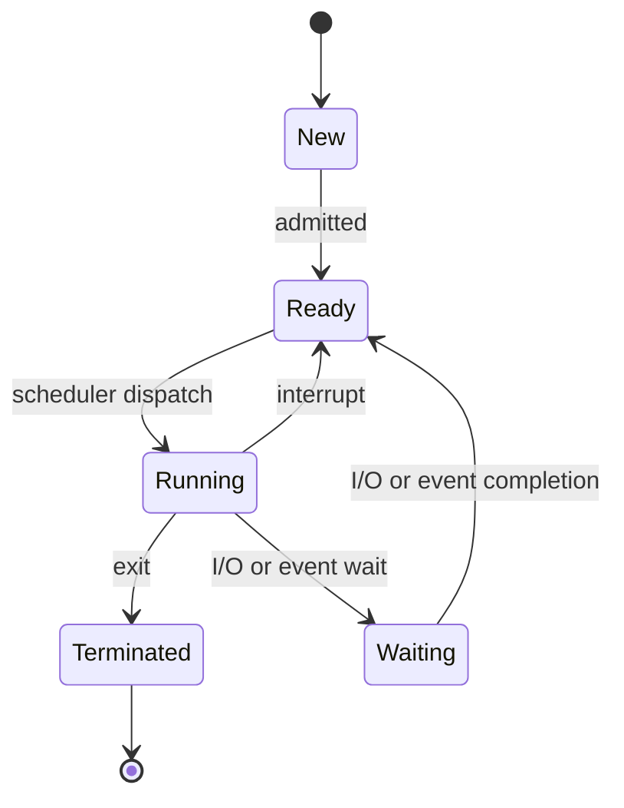

# 10 — Process States and Process Queues

## Process states

As a process executes, it changes state. Each process may be in one of the following states:

- **New** — the OS is about to pick the program and convert it into a process, or the process is being created.
- **Ready** — the process is in memory, waiting to be assigned to a processor.
- **Run** — instructions are being executed; the CPU is allocated.
- **Waiting** — waiting for I/O.
- **Terminated** — execution finished; the PCB entry is removed from the process table.

## Process queues

**a. Job queue**
- Holds processes in the **New** state.
- Present in secondary memory.
- The **Job Scheduler / Long-Term Scheduler (LTS)** picks processes from the pool and loads them into memory for execution.

**b. Ready queue**
- Holds processes in the **Ready** state.
- Present in main memory.
- The **CPU Scheduler / Short-Term Scheduler (STS)** picks processes from the ready queue and dispatches them to the CPU.

**c. Waiting queue**
- Holds processes in the **Wait** state.

## Related concepts

- **Degree of multi-programming** — the number of processes in memory. The LTS controls this.
- **Dispatcher** — the module of the OS that gives control of the CPU to a process selected by the STS.
