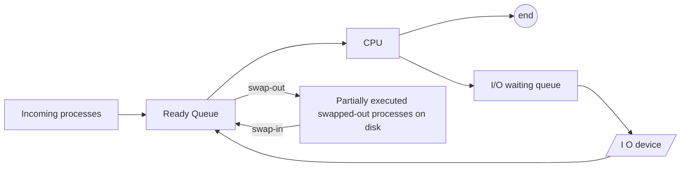

# 11 — Swapping, Context Switching, Orphan and Zombie Processes

## 1. Swapping

- Time-sharing systems may have a **Medium-Term Scheduler (MTS)**.
- The MTS removes processes from memory to reduce the degree of multi-programming.
- These removed processes can later be reintroduced into memory and continue execution from where they left off — this is called **swapping**.
- Swap-out and swap-in are done by the MTS.
- Swapping is necessary to improve process mix, or when memory requirements have overcommitted available memory and memory must be freed up.
- **Swapping** is a mechanism in which a process can be temporarily moved from main memory to secondary storage (disk) to make room for other processes; later, the system swaps it back into main memory.

## 2. Context switching

- Switching the CPU to another process requires performing a **state save** of the current process and a **state restore** of a different process.
- The kernel saves the context of the old process in its PCB and loads the saved context of the new process scheduled to run.
- It's **pure overhead** — the system does no useful work while switching.
- Speed varies by machine, depending on memory speed, number of registers to copy, etc.

## 3. Orphan process

- A process whose parent has been terminated but which is still running.
- Orphan processes are adopted by the **init process**.
- **init** is the first process of the OS.

## 4. Zombie process (Defunct process)

- A process whose execution is completed but which still has an entry in the process table.
- Zombies usually occur for child processes, because the parent still needs to read the child's exit status. Once the parent calls `wait()`, the zombie is eliminated from the process table — this is called **reaping** the zombie.
- It happens because the parent may call `wait()` on the child much later than the child actually terminates.
- Since the process-table entry can only be removed after the parent reads the exit status, the child remains a zombie until then.
