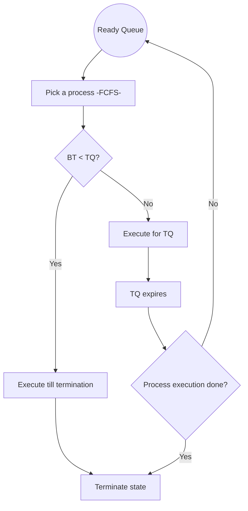

# 13 — CPU Scheduling: SJF, Priority, Round Robin

## 1. Shortest Job First (SJF) — Non-preemptive

- The process with the least burst time is dispatched first.
- Requires estimating BT for each ready process beforehand. Perfect estimation is essentially impossible.
- Run the lowest-BT process to completion, then choose the next lowest-BT process at that instant.
- Suffers from the convoy effect if the very first process in ready state has a large BT.
- Process starvation is possible.
- **Criteria:** `AT + BT`.

## 2. SJF — Preemptive

- Less starvation.
- No convoy effect.
- Gives a **smaller average WT** for a given set of processes, because scheduling a short job before a long one reduces the short job's WT more than it increases the long job's WT.

## 3. Priority Scheduling — Non-preemptive

- Priority is assigned to a process when it is created.
- SJF is a special case of priority scheduling with priority inversely proportional to BT.

## 4. Priority Scheduling — Preemptive

- A running process is preempted if a higher-priority process arrives.
- May cause indefinite waiting (starvation) for low-priority processes — they may never execute. This applies to both preemptive and non-preemptive priority scheduling.
- **Solution: Ageing.** Gradually increase the priority of processes that have waited a long time. E.g., raise priority by 1 every 15 minutes.

## 5. Round Robin Scheduling (RR)

- Most popular.
- Like FCFS, but preemptive.
- Designed for time-sharing systems.
- **Criteria:** `AT + Time Quantum (TQ)` — does not depend on BT.
- No process waits forever → very low starvation. No convoy effect.
- Easy to implement.
- If TQ is small, context switches happen more often → more overhead.

