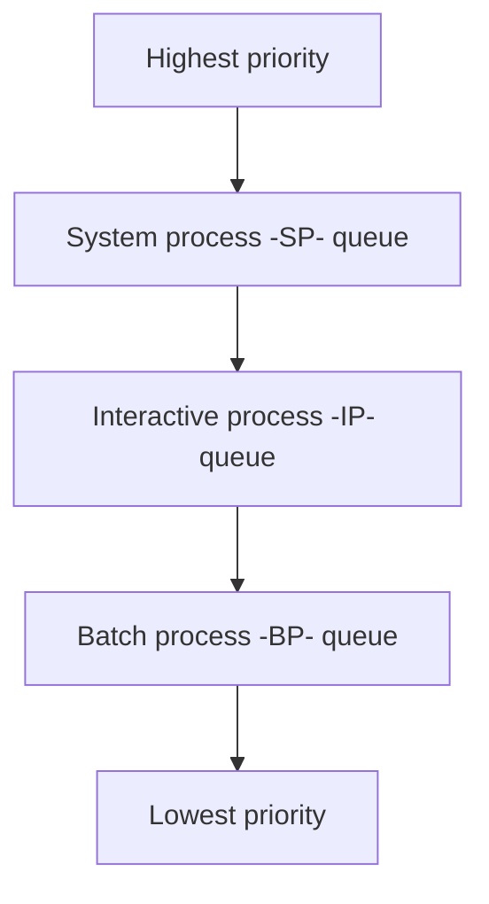
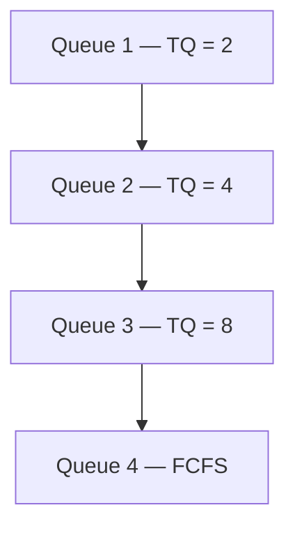

# 14 — MLQ and MLFQ

## 1. Multi-Level Queue Scheduling (MLQ)

- The ready queue is divided into multiple queues based on priority.
- A process is **permanently** assigned to one queue (inflexible), based on some property — memory, size, priority, or process type.
- Each queue has its own scheduling algorithm. E.g., System processes → RR, Interactive processes → RR, Batch processes → FCFS.

- **System process** — created by the OS (highest priority).
- **Interactive process (foreground)** — needs user input (I/O).
- **Batch process (background)** — runs silently, no user input.

**Scheduling between sub-queues** uses fixed-priority preemptive scheduling — e.g., the foreground queue has absolute priority over the background queue. If an interactive process arrives while a batch process is running, the batch process is preempted.

**Problems**
- Only after all processes from the top-level ready queue complete are further-level queues scheduled → starvation for low-priority processes.
- Convoy effect is present.

## 2. Multi-Level Feedback Queue Scheduling (MLFQ)

- Multiple sub-queues, but now processes can **move between queues**.
- The idea is to separate processes by their BT characteristics. A process that uses too much CPU time is moved to a lower-priority queue, keeping I/O-bound and interactive processes in higher-priority queues.
- A process that waits too long in a lower-priority queue may be moved up — this form of **ageing** prevents starvation.
- Less starvation than MLQ.
- Flexible.
- Can be configured to match a specific system design.

**Sample MLFQ design**

## 3. Comparison of scheduling algorithms

| | FCFS | SJF | PSJF | Priority | P-Priority | RR | MLQ | MLFQ |
| --- | --- | --- | --- | --- | --- | --- | --- | --- |
| Design | Simple | Complex | Complex | Complex | Complex | Simple | Complex | Complex |
| Preemption | No | No | Yes | No | Yes | Yes | Yes | Yes |
| Convoy effect | Yes | Yes | No | Yes | Yes | No | Yes | Yes |
| Overhead | No | No | Yes | No | Yes | Yes | Yes | Yes |
