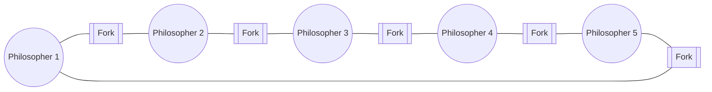

# 18 — The Dining Philosophers Problem

> **Note.** In the source PDF this is labelled LEC-20; LEC-18 and LEC-19 aren't present in the source. Numbering here is sequential within our chapter list.

## Setup

1. We have **5 philosophers**.
2. They spend their life in only **two states**: *thinking* and *eating*.
3. They sit on a circular table with 5 chairs (1 each). In the centre is a bowl of noodles, and the table is laid with **5 single forks**.
4. **Thinking state** — the philosopher doesn't interact with others.
5. **Eating state** — when hungry, the philosopher tries to pick up the two forks adjacent to them (left and right). They can pick one fork at a time.
6. A philosopher can't pick up a fork that's already taken.
7. When a philosopher holds both forks at once, they eat without releasing them.

## Semaphore-based solution

- Each fork is a **binary semaphore**.
- A philosopher calls `wait()` to acquire a fork.
- Releases a fork by calling `signal()`.
- Declared as: `Semaphore fork[5]{1};`

## Why the naïve semaphore solution can deadlock

Although the semaphore solution ensures no two neighbours eat simultaneously, it **can still deadlock**:

- Suppose all 5 philosophers become hungry at the same time and each picks up their **left fork**.
- All fork semaphores are now 0.
- When each philosopher tries to grab their **right fork**, everyone waits forever → **deadlock**.

## Methods to avoid the deadlock

We must add rules to make the solution deadlock-free:

- **Allow at most 4 philosophers** to be sitting simultaneously.
- Allow a philosopher to pick up a fork only if **both** forks are available, and do so inside a critical section (atomically).
- **Odd-even rule.** An odd-numbered philosopher picks up the left fork first, then the right. An even-numbered philosopher picks up the right fork first, then the left.

**Bottom line:** semaphores alone are not enough for this problem. We must add enhancement rules to make the solution deadlock-free.
