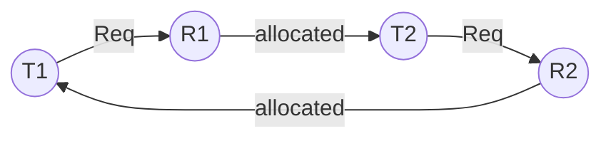

# 19 — Deadlock — Part 1

## Setup

In a multi-programming environment, several processes compete for a finite number of resources. A process requests a resource (R); if R is not available (taken by another process), the process enters the waiting state. Sometimes that waiting process is never able to change state because the resource it requested is busy forever — this is **deadlock (DL)**.

**Two or more processes are waiting on some resource's availability, which will never be available because it's held by another process** — the processes are said to be in deadlock.

- DL is a bug in the process/thread synchronization method.
- In DL, processes never finish executing, and system resources are tied up, preventing other jobs from starting.

**Examples of resources:** memory space, CPU cycles, files, locks, sockets, I/O devices. A single resource type can have multiple instances (e.g., a system with 2 CPUs).

## How a process/thread uses a resource

- **Request** — request the resource; if free, lock it, else wait.
- **Use** — use the resource.
- **Release** — release the instance and make it available to others.

## Deadlock visualization

Circular waiting → deadlock.

## Necessary conditions for deadlock

All **four** must hold simultaneously:

- **Mutual exclusion** — only one process at a time can use the resource; other requesting processes must wait until it's released.
- **Hold and Wait** — a process holds at least one resource while waiting to acquire additional resources currently held by others.
- **No preemption** — resources must be voluntarily released by the process after execution (no forced preemption).
- **Circular wait** — a set {P0, P1, …, Pn} of waiting processes exists such that P0 waits for a resource held by P1, P1 waits for one held by P2, and so on, cyclically.

## Methods for handling deadlocks

- Use a protocol to **prevent** or **avoid** deadlocks, ensuring the system never enters a deadlocked state.
- Allow the system to enter a deadlocked state, **detect** it, and **recover**.
- **Ignore** the problem and pretend deadlocks never occur — the **Ostrich algorithm** (a.k.a. deadlock ignorance).

## Deadlock Prevention

Ensure at least one of the four necessary conditions cannot hold.

### a. Mutual Exclusion

- Use locks only for non-sharable resources.
- Sharable resources (like read-only files) can be accessed by multiple processes/threads.
- However, we can't prevent DL by denying mutual exclusion, because some resources are intrinsically non-sharable.

### b. Hold and Wait

To ensure H&W never occurs, guarantee that whenever a process requests a resource, it holds no other resource.

- **Protocol A** — each process requests and is allocated all its resources before execution begins.
- **Protocol B** — allow a process to request resources only when it holds none. It can request additional resources only after releasing all currently allocated ones.

### c. No Preemption

- If a process is holding some resources and requests another that cannot be immediately allocated, then all currently held resources are preempted. The process restarts only when it can regain its old resources plus the newly requested one. *(Livelock may occur.)*
- Alternatively: if a process requests resources, first check if they're available. If yes, allocate. If not, check if they're held by another process waiting for more resources. If so, preempt the desired resource from the waiting process and give it to the requester.

### d. Circular Wait

- Impose a proper **ordering** on resource allocation.
- If P1 and P2 both need R1 and R2, both must lock R1 before R2. Whichever process locks R1 first gets R2.
