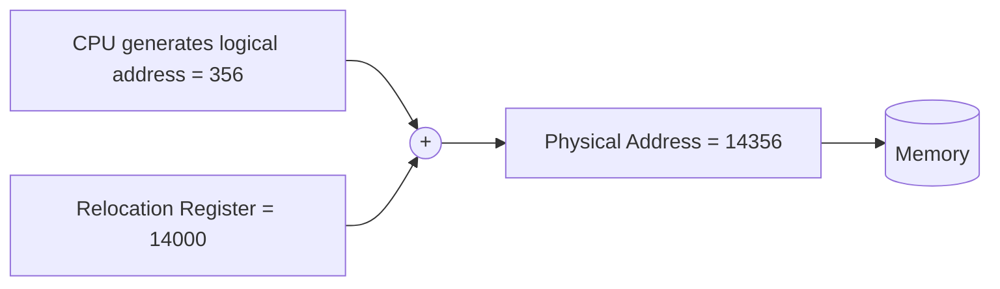
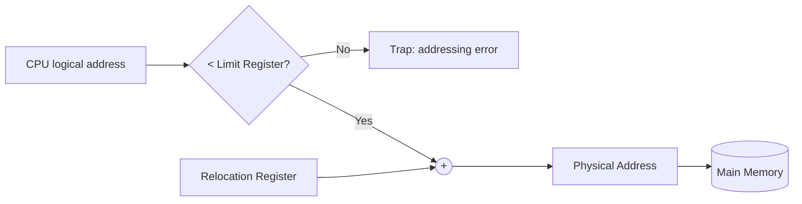

# 21 — Memory Management Techniques and Contiguous Memory Allocation

## Setup

In a multi-programming environment, multiple processes sit in the ready queue in main memory to keep CPU utilization high and the computer responsive. To realize this performance, we must **share** main memory — which means we must **manage** it across all processes.

## Logical vs Physical Address Space

### Logical address

- Generated by the **CPU**.
- The address of an instruction or data used by a process.
- User can access the logical address of the process.
- The user has *indirect* access to the physical address through the logical address.
- Doesn't exist physically — hence also called the **virtual address**.
- The set of all logical addresses generated by a program is the **Logical Address Space**.
- **Range:** 0 to *max*.

### Physical address

- Loaded into the memory-address register of physical memory.
- User can *never* access the physical address of a program.
- Located in the memory unit — a real location in main memory.
- Accessed by the user indirectly, not directly.
- The set of all physical addresses corresponding to logical addresses is the **Physical Address Space**.
- Computed by the **Memory Management Unit (MMU)**.
- **Range:** `R + 0` to `R + max`, for base value `R`.

The runtime mapping from virtual to physical address is done by the **MMU** (a hardware device). The user's program generates the logical address and thinks it's running in that space, but execution requires physical memory.

## Logical-to-physical translation (simplified)

## Memory mapping and protection

- The OS provides the concept of a **Virtual Address Space (VAS)**.
- To separate memory space, we need to determine the range of legal addresses a process may access and ensure it can only access those.
- The **relocation register** contains the value of the smallest physical address (base address `R`).
- The **limit register** contains the range of logical addresses (e.g., relocation = 100040 and limit = 74600).
- Each logical address must be **less than** the limit register.
- The MMU dynamically maps the logical address by **adding the relocation register value**.
- When the CPU scheduler picks a process, the dispatcher loads relocation and limit registers with the correct values as part of the context switch. Since every generated address is checked against these, we protect the OS and other users' data from being modified by the running process.
- Any attempt by a user-mode program to access OS memory or another user's memory causes a **trap** — the OS treats it as a fatal error.

## Address translation

## Allocation methods on physical memory

- Contiguous allocation
- Non-contiguous allocation

## Contiguous Memory Allocation

Each process is contained in a single contiguous block of memory.

### a. Fixed Partitioning

The main memory is divided into partitions of equal or different sizes.

**Limitations**

1. **Internal fragmentation** — if the process is smaller than the partition, part of the partition is wasted and unused.
2. **External fragmentation** — total unused space across various partitions can't be used to load new processes because it's not contiguous.
3. **Limit on process size** — if a process is larger than the largest partition, it can't be loaded. So process size is capped by the largest partition.
4. **Low degree of multi-programming** — fixed, low degree because partition sizes can't adapt to process sizes.

### b. Dynamic Partitioning

Partition size is not declared initially — it's decided at the time a process is loaded.

**Advantages over fixed partitioning**

- No internal fragmentation.
- No limit on process size.
- Better degree of multi-programming.

**Limitation**

- **External fragmentation.** Example: three completed regions total 8 MB of free space, but a new 8 MB process still can't be loaded because that space isn't contiguous.
