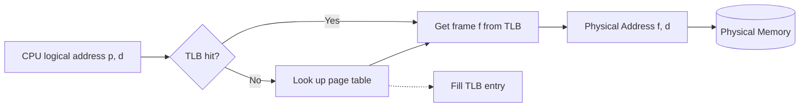

# 23 — Paging (Non-Contiguous Memory Allocation)

## Motivation

The main **disadvantage of dynamic partitioning is external fragmentation**.

- Can be removed by compaction, but with overhead.
- We need a more dynamic, flexible, optimal mechanism for loading processes into partitions.

## Idea behind Paging

- Suppose we have only two small non-contiguous free holes in memory, each 1 KB.
- If the OS wants to allocate RAM to a 2 KB process using contiguous allocation, it can't — that's external fragmentation.
- **What if we divide the process into 1 KB blocks?** That's paging.

## Paging

- **Paging is a memory-management scheme that permits the physical address space of a process to be non-contiguous.**
- It avoids external fragmentation and the need for compaction.
- Divide physical memory into fixed-size blocks called **frames** and divide logical memory into blocks of the same size called **pages** — so **page size = frame size**.
- Page size is usually determined by the processor architecture — traditionally uniform, e.g., 4,096 bytes. Modern designs often support two or more page sizes.

## Page Table

- A data structure that stores which page maps to which frame.
- **The page table contains the base address of each page in physical memory.**

Every address generated by the CPU (logical address) is split into two parts:

- a **page number (p)** — used as an index into the page table to get the base address of the corresponding frame,
- a **page offset (d)** — added to the frame base to find the physical address.

```mermaid
flowchart LR
    subgraph L[Logical Memory - Process P1]
      P0[Page 0]
      P1[Page 1]
      P2[Page 2]
      P3[Page 3]
    end
    subgraph PT[Page Table]
      T0["0 -> 1"]
      T1["1 -> 4"]
      T2["2 -> 3"]
      T3["3 -> 7"]
    end
    subgraph PM[Physical Memory - frame numbers]
      F0[Frame 0]
      F1[Frame 1: Page 0]
      F2[Frame 2]
      F3[Frame 3: Page 2]
      F4[Frame 4: Page 1]
      F5[Frame 5]
      F6[Frame 6]
      F7[Frame 7: Page 3]
    end
    L --> PT --> PM
```

## Page-table storage details

- The page table is stored in main memory at process creation, and its base address is kept in the process control block (**PCB**).
- A **Page Table Base Register (PTBR)** points to the current page table. Changing page tables at context switch only requires updating this one register.

## How Paging avoids external fragmentation

Non-contiguous allocation of a process's pages is allowed into any random free frames in physical memory — so no need for a single contiguous free block.

## Why paging is slow, and how we make it fast

**Why it's slow:** there are too many memory references to access the desired location in physical memory (one to consult the page table, one for the actual data).

## Translation Lookaside Buffer (TLB)

- **Hardware support to speed up paging.**
- A high-speed hardware cache.
- Stores (key, value) pairs — page number → frame number.
- The page table lives in main memory, so translation is slow. When we retrieve a physical address using the page table, we insert the mapping into the TLB so the next translation for that page can skip the page-table lookup entirely.

- **TLB hit** — the TLB already contains the mapping for the requested logical address.
- **Address Space Identifier (ASIDs)** — stored in each TLB entry. ASIDs uniquely identify a process and provide address-space protection, allowing the TLB to hold entries for several different processes at once. When translating a virtual page number, the TLB checks that the ASID of the currently executing process matches the ASID on the entry. If not, it's treated as a TLB miss.
