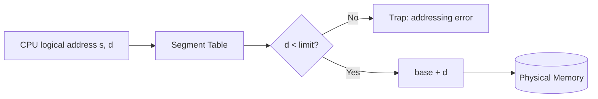

# 24 — Segmentation (Non-Contiguous Memory Allocation)

## Motivation

An important aspect of memory management, which becomes unavoidable with paging, is separating the **user's view** of memory from the **actual physical memory**.

**Segmentation is a memory-management technique that supports the user's view of memory.**

## Basics

- A logical address space is a collection of **segments**, based on the user's view of logical memory.
- Each segment has a **segment number** and an **offset**: `<segment-number, offset>` written as `{s, d}`.
- A process is divided into **variable-size segments** based on user view.

## Paging vs Segmentation — the philosophical difference

- **Paging** is closer to the operating system than to the user. It divides all processes into fixed-size pages, even though a process may have related parts of functions that could live in the same page.
- The OS doesn't care about the user's view of the process. It may split a single function across different pages, and those pages may or may not be loaded at the same time. This can reduce efficiency.
- **Segmentation** divides the process into segments, where each segment contains the same type of functions — e.g., the `main` function in one segment, library functions in another. Matches how programmers think.

## Segmentation hardware

Each entry in the segment table stores `<limit, base>`.

## Advantages

- No internal fragmentation.
- One segment has a contiguous allocation, so working within a segment is efficient.
- Segment table is generally smaller than a page table.
- More efficient in practice because the compiler keeps same-type functions in the same segment.

## Disadvantages

- **External fragmentation.**
- Different segment sizes are inconvenient at swap time.

## Modern reality

Modern system architectures provide **both segmentation and paging** in a hybrid approach.
