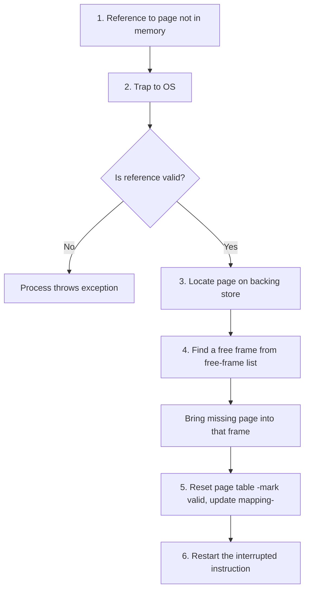

# 25 — Virtual Memory, Demand Paging, Page Faults

## What is Virtual Memory?

**Virtual memory** is a technique that allows the execution of processes that are **not completely in memory**. It gives users the illusion of having a very large main memory by treating a part of secondary memory as main memory — called **swap space**.

**Advantage:** programs can be larger than physical memory.

## Motivation for partial-in-memory execution

Instructions must be in physical memory to be executed — but this limits program size to the size of physical memory. In many cases, the entire program isn't needed at once. Executing a program only partially in memory gives real benefits:

- Programs are no longer constrained by the size of physical memory.
- Each user program takes less physical memory, so more programs can run concurrently → **higher CPU utilization and throughput**.
- Running a program that's not entirely in memory benefits both the system and the user.

Programmers get a very large virtual memory even though only smaller physical memory is available.

## Demand Paging

**Demand Paging** is a popular method of virtual-memory management.

- In demand paging, the least-used pages of a process are stored in secondary memory.
- A page is copied to main memory when its demand arises, or a **page fault** occurs. Various **page-replacement algorithms** decide which page to replace.
- Rather than swapping the entire process, we use a **Lazy Swapper**. A lazy swapper never swaps a page into memory unless it will be needed.
- Since we're now working at page level rather than whole processes, "swapper" is technically imprecise — a **pager** manipulates individual pages of a process.

## How Demand Paging works

- When a process is to be swapped in, the pager guesses which pages will be used.
- Instead of swapping in the whole process, the pager brings only those pages into memory — avoiding reading pages that won't be used anyway.
- This decreases swap time and the amount of physical memory needed.

## Valid–Invalid bit scheme

The page table uses a valid/invalid bit to distinguish between pages in memory and pages on disk:

- **Bit = 1** — the associated page is legal and in memory.
- **Bit = 0** — the page is either invalid (not in the logical address space of the process) or valid but currently on disk.

If a process never attempts to access an invalid-bit page, the process executes successfully without needing pages from swap.

## What if the process tries to access a page not in memory?

Access to a page marked invalid causes a **page fault**. Paging hardware notices the invalid bit and traps to the OS.

## Page-fault handling procedure

**Steps in words**

1. Check an internal table (in the PCB) to determine whether the reference was valid or an invalid memory access.
2. If invalid, throw an exception. If valid, the pager will swap the page in.
3. Find a free frame from the free-frame list.
4. Schedule a disk operation to read the desired page into the newly allocated frame.
5. When the disk read completes, update the page table to indicate the page is now in memory.
6. Restart the instruction that was interrupted by the trap. The process can now access the page as though it had always been in memory.

## Pure Demand Paging

- In the extreme case, we can start executing a process with **no pages** in memory. When the OS sets the instruction pointer to the first instruction of the process — which isn't in memory — the process immediately faults for the page, which is brought in.
- Rule: **never bring a page into memory until it is required.**
- Reasonable performance in demand paging relies on the **locality of reference**.

## Advantages of Virtual Memory

- The degree of multi-programming increases.
- Users can run large apps with less real physical memory.

## Disadvantages of Virtual Memory

- The system can become slower — swapping takes time.
- **Thrashing** may occur (see next chapter).
