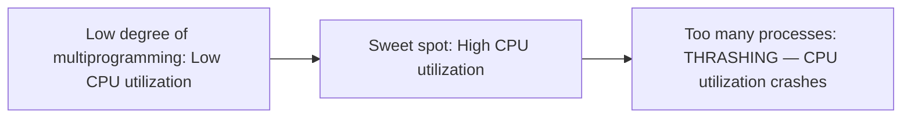

# 27 — Thrashing

## What is Thrashing?

If a process doesn't have the number of frames it needs to hold pages in active use, it will quickly page-fault. At that point, it must replace some page. But since all its pages are in active use, whichever page it replaces will be needed again right away — so it faults again, and again, and again, constantly bringing back pages it just evicted.

**This high paging activity is called Thrashing.**

**A system is thrashing when it spends more time servicing page faults than executing processes.**

## The classic CPU-utilization curve

CPU utilization rises with the degree of multiprogramming — up to a point — then drops sharply as thrashing sets in.

## Techniques to handle thrashing

### i. Working Set Model

- Based on the concept of the **Locality Model**.
- Principle: if we allocate enough frames to a process to accommodate its current locality, it will only fault when it moves to a new locality. But if the allocated frames are fewer than the size of the current locality, the process is bound to thrash.

### ii. Page-Fault Frequency

1. Thrashing has a **high page-fault rate**.
2. We want to **control** the page-fault rate.
3. When it's too high, the process needs more frames. If it's too low, the process may have too many frames.
4. Establish **upper and lower bounds** on the desired page-fault rate.
5. If the page-fault rate exceeds the upper limit, allocate the process another frame. If it drops below the lower limit, remove a frame from the process.
6. By controlling the page-fault rate, **thrashing can be prevented**.
